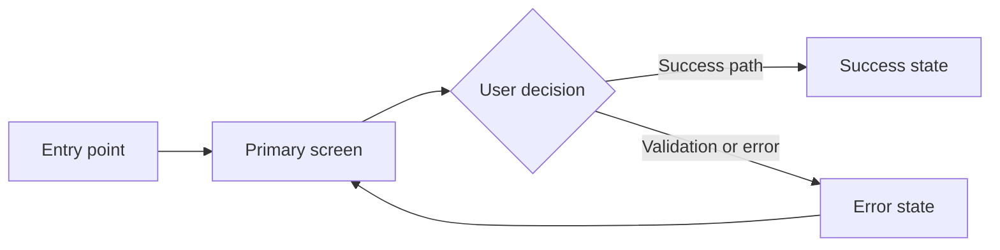

# <STORY-ID> — UX Wireframes

## User flow



Replace the example with the approved story flow, including alternate and failure paths.

## Screen inventory

- Screen/state:
- User goal:
- Supported acceptance criteria:
- Desktop/mobile variants:

## Low-fidelity wireframes

Use labelled box diagrams for each screen and material state. Keep them structural:

```text
┌──────────────────────────────────────────────┐
│ Header / navigation                          │
├──────────────────────────────────────────────┤
│ Page title                                   │
│ Supporting content                           │
│                                              │
│ [Primary input or content region]            │
│                                              │
│ [Secondary action]          [Primary action] │
├──────────────────────────────────────────────┤
│ Status, validation, or help region           │
└──────────────────────────────────────────────┘
```

## Interaction annotations

- Entry and exit behavior:
- Control behavior:
- Loading, empty, success, validation, error, and permission states:
- Responsive changes:

## Accessibility annotations

- Heading and landmark structure:
- Labels and descriptions:
- Keyboard order and focus movement:
- Screen-reader announcements:
- Contrast, target size, and reduced-motion requirements:

## Design-system mapping

- Existing components/tokens:
- New component needs:
- Content and localization notes:

## Assumptions and open Product Owner decisions
