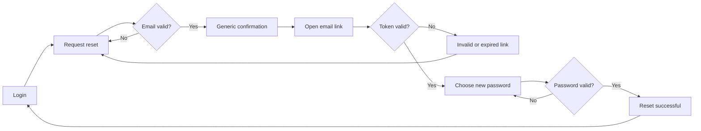

# US-001 — Password Reset Wireframes

## User flow



## Screen 1 — Request reset

```text
┌──────────────────────────────────────────┐
│ Wambe                                    │
├──────────────────────────────────────────┤
│ Reset your password                      │
│ Enter the email used for your account.   │
│                                          │
│ Email                                    │
│ [____________________________________]   │
│ [Validation message / reserved space]    │
│                                          │
│ [Back to login]         [Send reset link]│
└──────────────────────────────────────────┘
```

## Screen 2 — Choose a new password

```text
┌──────────────────────────────────────────┐
│ Choose a new password                    │
│                                          │
│ New password                             │
│ [____________________________________]   │
│ • Required length  • Required complexity │
│                                          │
│ Confirm password                         │
│ [____________________________________]   │
│                                          │
│                         [Reset password] │
└──────────────────────────────────────────┘
```

## Screen 3 — Result states

```text
┌──────────────────────────────────────────┐
│ Success                                  │
│ Your password has been reset.            │
│                              [Log in]     │
├──────────────────────────────────────────┤
│ Invalid or expired link                  │
│ Request a new link to continue.           │
│                    [Request another link]│
└──────────────────────────────────────────┘
```

## Interaction and accessibility annotations

- The confirmation is identical for known and unknown email addresses.
- Validation errors are linked to inputs and announced to assistive technology.
- Focus moves to the result heading after submission.
- Password requirements are visible before typing and update without relying on color.
- Mobile uses the same content order with full-width controls.

## Open Product Owner decision

Confirm whether a successful reset invalidates all existing sessions.
