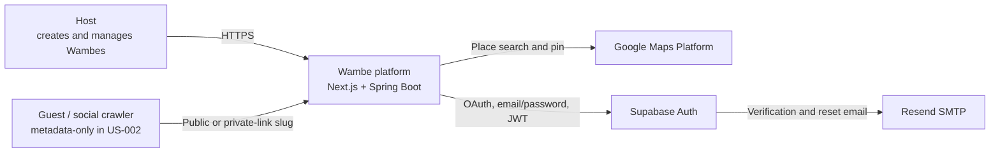
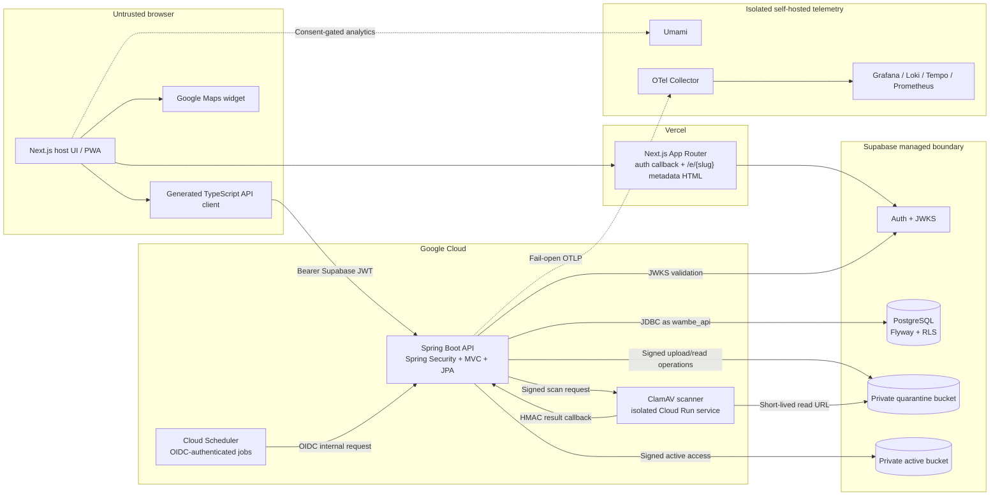
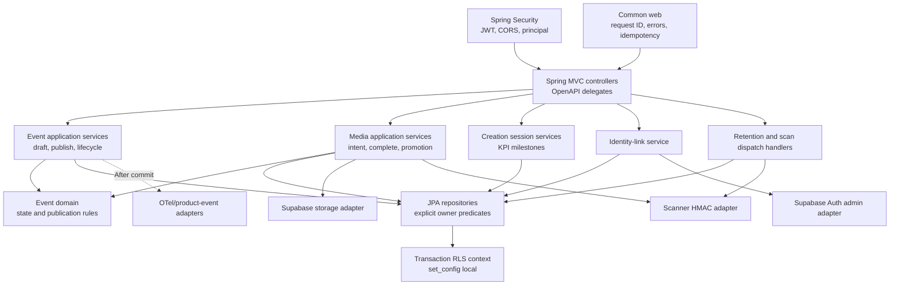
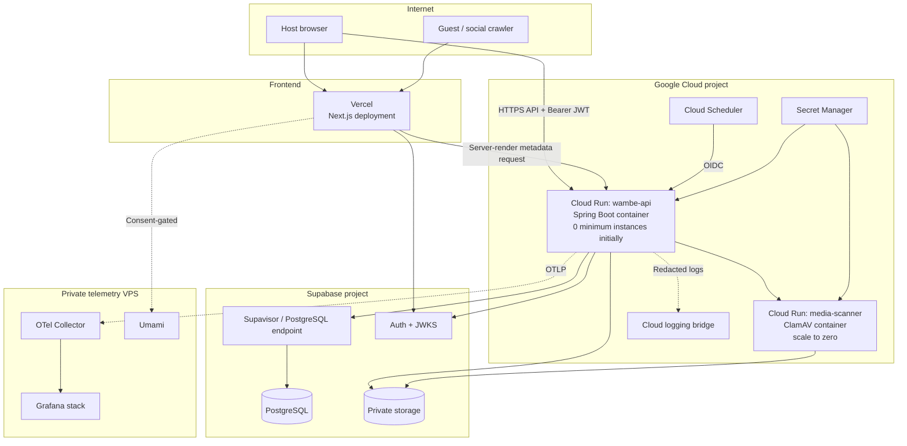
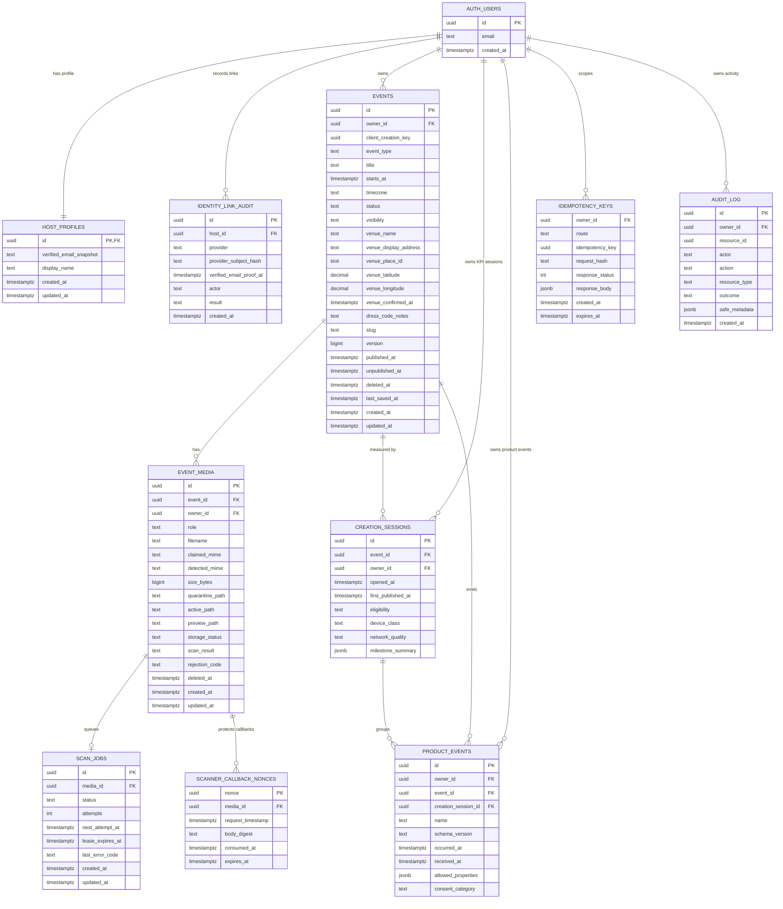
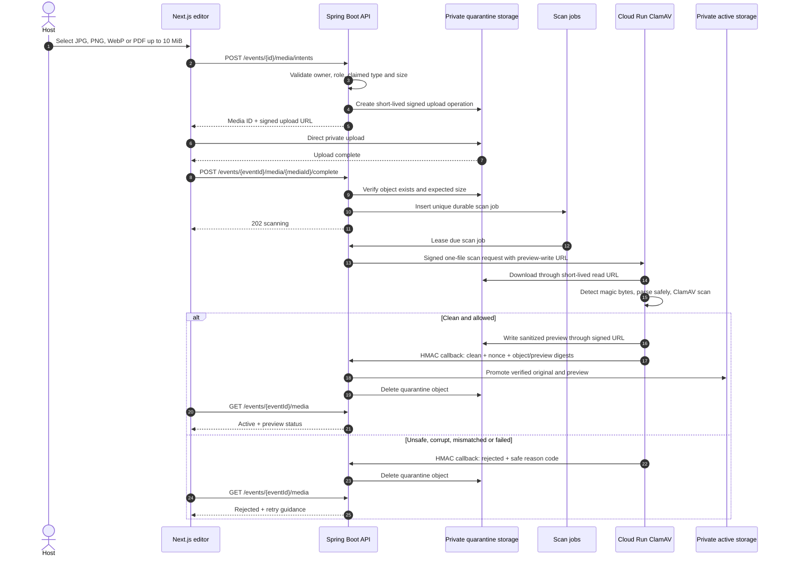
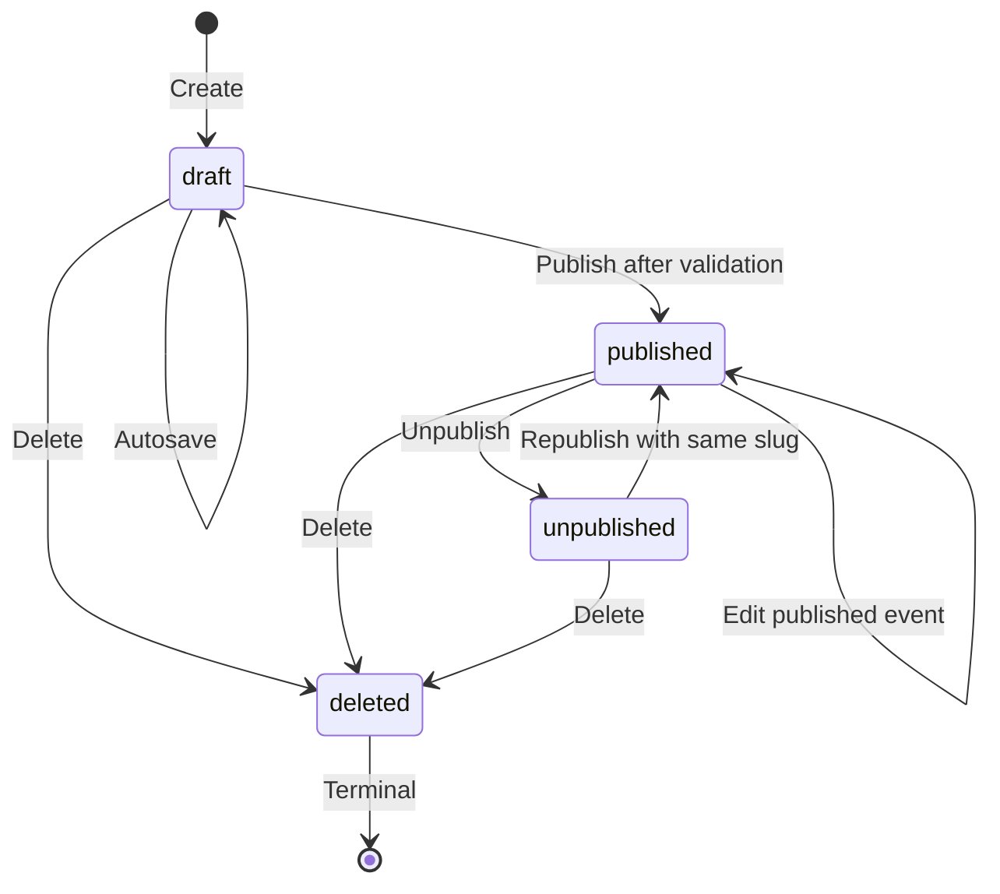
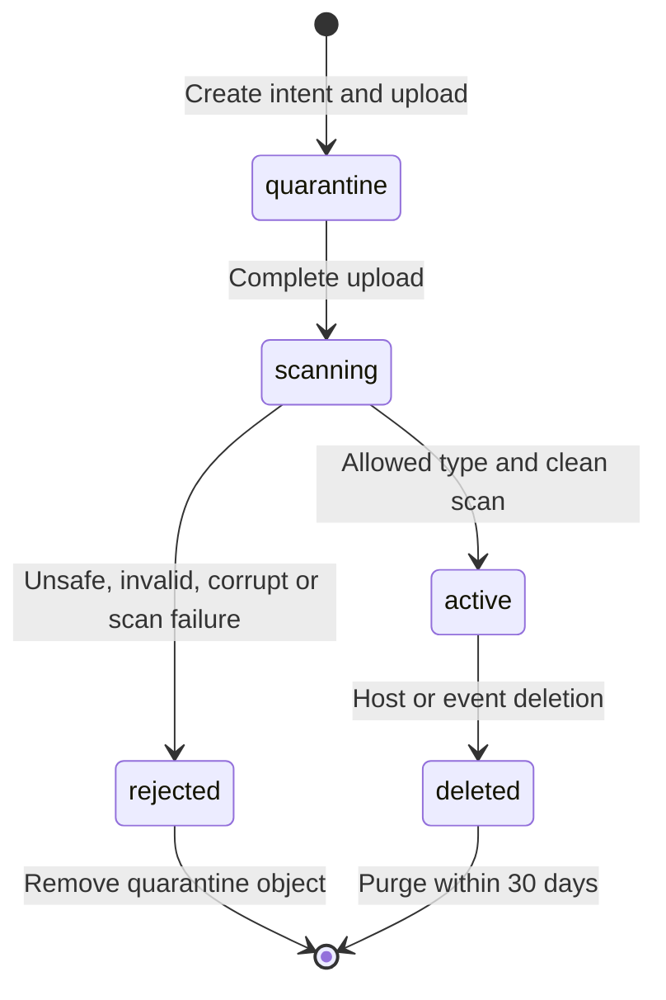
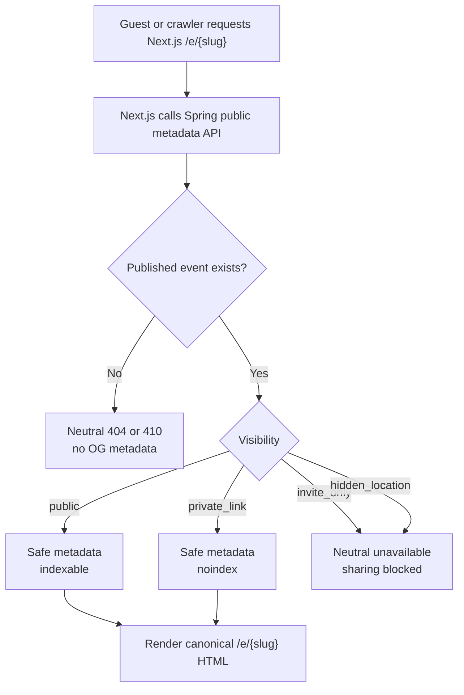

# US-002 Architecture Diagrams

Story: **Create and publish a Wambe event**  
Architecture status: **Approved by the Product Owner on 2026-07-13**  
Companion visual board: [`ARCHITECTURE_DIAGRAMS.html`](./ARCHITECTURE_DIAGRAMS.html)  
Contracts: [`contracts/openapi-v1.yaml`](./contracts/openapi-v1.yaml) and
[`contracts/product-events-v1.schema.json`](./contracts/product-events-v1.schema.json)

These diagrams elaborate the architecture decisions in `ARTIFACTS.md`. The contracts and
architecture text remain authoritative if a diagram becomes stale.

## 1. System context



**Boundary:** RSVP, guest authentication, invitations, QR passes, payments, and full
guest event pages are outside US-002.

## 2. Container and trust-boundary view



**Rules:** the browser never receives service-role, database, scanner, or telemetry
credentials. The scanner has no database credentials. Spring is stateless and does not
store Supabase refresh tokens.

## 3. Spring Boot component view



Controllers stay thin. Application services own `@Transactional` boundaries. JPA
entities use `@Version`; Hibernate uses `ddl-auto=validate`; Flyway exclusively owns
schema and RLS migrations.

## 4. Deployment view



Development, staging, and production use separate Supabase, Vercel, and Google Cloud
environments. API and scanner revisions roll back independently.

## 5. Logical database ERD

The ERD is implementation-directed but not a substitute for Flyway migrations. UUIDs,
timestamps, enum/check constraints, foreign keys, indexes, and RLS policies must be
defined by migration.



### Required keys and indexes

- Unique `events.slug` where slug is not null.
- Partial unique `(events.owner_id, events.client_creation_key)` where the client key is
  not null.
- Unique `scan_jobs.media_id`.
- Unique `(idempotency_keys.owner_id, route, idempotency_key)`.
- Unique `scanner_callback_nonces.nonce`.
- Index `(events.owner_id, status, updated_at)`.
- Index pending `scan_jobs` by `next_attempt_at`.
- Index abandoned drafts by `last_saved_at` and deleted media by `deleted_at`.
- `auth.users` is Supabase-managed; Flyway owns Wambe application tables and policies.
- RLS compares owner columns with transaction-local
  `current_setting('app.current_user_id', true)`.

## 6. Authentication sequence

```mermaid
sequenceDiagram
    autonumber
    actor Host
    participant Web as Next.js / Supabase SSR
    participant Auth as Supabase Auth
    participant API as Spring Boot API
    participant JWKS as Supabase JWKS
    participant DB as PostgreSQL + RLS

    Host->>Web: Choose Google OAuth or email/password
    Web->>Auth: Start PKCE sign-in / registration
    Auth-->>Web: Authorization code or verified session
    Web->>Auth: Exchange code with PKCE verifier
    Auth-->>Web: Short-lived access token + refresh session
    Web-->>Host: Authenticated host UI

    Host->>API: API request with Bearer access token
    API->>JWKS: Resolve/cache signing key when required
    JWKS-->>API: Public signing keys
    API->>API: Validate signature, issuer, expiry and audience
    API->>DB: BEGIN; set_config(owner ID, transaction-local)
    API->>DB: Owner-scoped query under RLS
    DB-->>API: Host-owned result
    API-->>Host: Response

    alt Access token expired
        API-->>Host: 401
        Host->>Web: Ask Supabase client to refresh
        Web->>Auth: Refresh session
        Auth-->>Web: New access token
        Web-->>Host: Updated client session
        Host->>API: Retry once with new Bearer token
    end
```

Spring does not process passwords, own login callbacks, store refresh tokens, or accept
anon/service-role tokens on host endpoints.

## 7. Draft, autosave, and publish sequence

```mermaid
sequenceDiagram
    autonumber
    actor Host
    participant UI as Next.js editor
    participant API as Spring Boot API
    participant Idem as Idempotency service
    participant DB as PostgreSQL
    participant Telemetry as OTel exporter

    Host->>UI: Open creation form
    UI->>API: POST /events + Idempotency-Key
    API->>Idem: Claim owner + route + key + request hash
    API->>DB: Transaction: create draft and creation session
    DB-->>API: Event version 1 + session ID
    API-->>UI: 201 EventWithSession

    loop Debounced autosave
        UI->>API: PATCH /events/{id} + If-Match + same-operation key
        API->>Idem: Detect replay or claim key
        API->>DB: Owner-scoped update with optimistic version
        alt Current version
            DB-->>API: Updated event and incremented version
            API-->>UI: 200 saved event
        else Stale version
            DB-->>API: Version conflict
            API-->>UI: 409 EVENT_VERSION_CONFLICT + current state
        end
    end

    Host->>UI: Publish
    UI->>API: POST /events/{id}/publish + If-Match + key
    API->>DB: BEGIN + transaction-local owner context
    API->>DB: Validate required fields, future time, venue and media
    API->>DB: Assign immutable slug; set published_at and status
    API->>DB: Complete creation session; write product event and audit
    API->>DB: COMMIT
    API-->>UI: 200 canonical URL + share eligibility
    API-->>Telemetry: Export trace/metrics after commit and fail open
```

The transaction is all-or-nothing. A failed validation or database write leaves the
event unpublished. A replay with the same key and request hash returns the cached result.

## 8. Media upload and malware-scanning sequence



Callbacks are at-least-once, timestamped, nonce-protected, and idempotent. Publication is
blocked while attached media is not clean and active.

## 9. Event and media lifecycle states

### Event lifecycle



The slug is assigned once on first publication and remains stable through unpublish and
republish. Deleted is terminal.

### Media lifecycle



## 10. Visibility and metadata decision flow



Full guest access enforcement is a downstream story. US-002 must not leak protected-mode
metadata while that capability is absent.

## Diagram-to-decision traceability

| View | Primary decisions/contracts |
|---|---|
| System context | Scope boundary, ADR-001–006 |
| Containers | ADR-001, ADR-002, ADR-004, ADR-006 |
| Spring components | ADR-008, ADR-010, implementation slices S-01–S-08 |
| Deployment | ADR-001, ADR-004, ADR-006, rollout/rollback plan |
| ERD | Architecture data model, ADR-008, ADR-010, Flyway migrations |
| Authentication | ADR-002, OpenAPI `bearerAuth`, AC-001/AC-011 |
| Draft/publish | OpenAPI event endpoints, ADR-008, AC-002–005/AC-014 |
| Media scan | ADR-004, media endpoints, AC-006 |
| Lifecycles | Event/media invariants, AC-007–010 |
| Visibility flow | ADR-007, public metadata endpoint, AC-013 |

