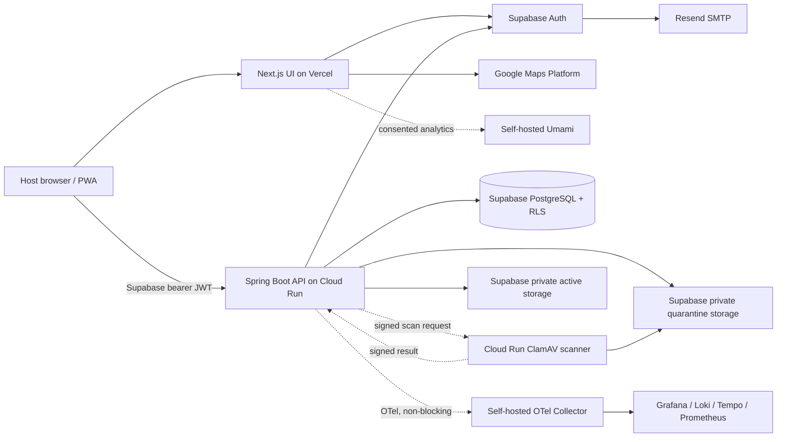
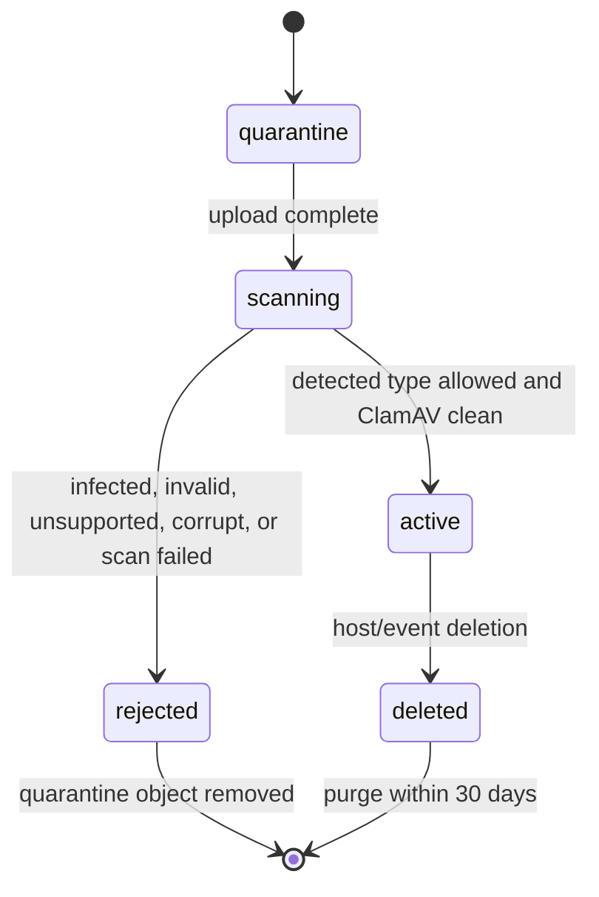

# US-002 — Create and publish a Wambe event

## Intake

### Problem

Nigerian celebration hosts currently coordinate invitations through fragmented
WhatsApp messages, image flyers, map links, and repeated follow-up calls. Creating and
sharing a complete digital event presence is slower and less reliable than the behavior
Wambe needs to replace. Guests consequently receive incomplete or inconsistent event
information, while hosts lack one authoritative link they can update and redistribute.

The current process is typically: design or receive an invitation image, send it through
WhatsApp, separately send venue directions and dress-code/Aso-Ebi information, then
answer recurring guest questions. Wambe's proposed process is for an authenticated host
to enter the event once, publish it, and share one mobile-friendly Wambe link.

### Target users and stakeholders

- **Primary user:** A host organizing a private or semi-private Nigerian celebration,
  initially a wedding, birthday, naming ceremony, anniversary, graduation, or
  housewarming.
- **Beneficiary:** Invited guests who need trustworthy event details from a shared link.
- **Business stakeholders:** Product Owner/founders, product and engineering leads,
  product designer, growth/partnerships, and pilot event planners.
- **Operational stakeholders:** Support and trust/safety staff responsible for event
  issues, image misuse, and privacy complaints.

### Desired outcome and success measures

An authenticated host can create and publish a beautiful, culturally relevant Wambe
event from a mobile device and immediately receive a link suitable for WhatsApp sharing.

- **Primary KPI:** Median elapsed time from starting event creation to successful
  publication is under 180 seconds.
- **Measurement:** Emit server- or analytics-validated `event_creation_started` and
  `event_published` timestamps tied to an event ID; report the median for eligible,
  first-time creation sessions.
- **Monitoring:** Review the creation funnel at least weekly during pilots, segmented by
  device, connection quality, event type, and completion outcome.
- **Diagnostic measures:** Creation completion rate, validation failure rate, invitation
  upload failure rate, publish failure rate, and share action rate.
- **Business value:** Establishes Wambe's acquisition product and the invitation-sharing
  loop from hosts to guests, creating the foundation for RSVP, premium access control,
  and later monetization.

There is no measured Wambe production baseline yet. The under-180-second target comes
from the approved product strategy and must be validated with pilot telemetry and
observed usability sessions. Analytics may miss abandoned sessions when consent,
connectivity, or client delivery fails; publication timestamps should therefore be
server-authoritative where possible.

### Scope, constraints, dependencies, and priority

- **Priority:** Highest-priority MVP foundation.
- **In scope at intake:** Authenticated-host creation; event type; title; date/time;
  venue; visibility; invitation image upload; dress-code/Aso-Ebi images and notes;
  publishing; a unique event link; and a WhatsApp-friendly share action/preview.
- **Product constraints:** Responsive web/PWA first; mobile-first and share-first;
  premium, joyful, culturally native presentation; no native-app dependency.
- **Scope boundaries:** Guest RSVP and host attendance management are separate stories.
  QR passes, ticketing, AI Aso-Ebi Studio, public discovery, and the vendor marketplace
  are excluded.
- **Dependencies:** Host authentication, event persistence, media upload and storage,
  venue/map integration, unique slug/link generation, share metadata/image previews,
  privacy controls, and product analytics.
- **Data and privacy:** Event visibility and venue information can be sensitive.
  Publishing must preserve the host's selected visibility; uploaded invitation and
  Aso-Ebi media require file validation, access controls consistent with visibility,
  and a deletion path. Analytics should minimize personal data and distinguish guests
  from authenticated users in later stories.
- **Data quality limits:** Client timestamps, duplicate creation attempts, interrupted
  mobile sessions, prefilled drafts, and staff-assisted pilot events can distort the
  creation-time KPI. The requirements stage must define session eligibility and
  exclusions before implementation.

### Open questions

None at intake. The Product Owner made these decisions (authentication amended on
2026-07-12 while requirements were pending):

- Hosts may authenticate with Google OAuth or an email address and password. Email is
  the login identifier; separate usernames are not used. Accounts with the same
  verified email must be linked rather than duplicated.
- Event creation supports public, private-link, invite-only, and hidden-location
  visibility modes.
- A venue map pin is required before publication.
- Invitation and Aso-Ebi uploads support JPG, PNG, WebP, and PDF files up to 10 MB each.
  The service must validate the actual file type and scan uploads.
- The 180-second KPI runs from opening the creation form to successful publication. It
  includes media upload time but excludes authentication, resumed drafts, and
  staff-assisted drafts.
- Abandoned drafts and their media are deleted after 30 days. Published media remains
  until the host deletes it; deletion must purge it from active backend storage within
  30 days.

## Requirements

### User story and business value

**Primary user story:** As an authenticated celebration host, I want to create, save,
publish, and share one culturally relevant event page so that guests receive consistent
event information without scattered messages.

**Current process:** The host distributes an invitation image, map link, and cultural
details separately, then manually corrects or repeats information. There is no
authoritative version or measurable creation funnel.

**Proposed process:**

1. The host signs in with Google OAuth or a verified email address and password.
2. The host starts an event and the system creates an autosaved draft.
3. The host enters required details and optionally adds invitation and Aso-Ebi media.
4. The host selects one of the four approved visibility modes.
5. The system validates the event and media, then publishes a unique Wambe link.
6. The host invokes a WhatsApp-friendly share action.
7. The host may update, unpublish, or delete the event.

The host owns event content, map pin, visibility, publication, and deletion decisions.
Wambe owns validation, safe media handling, link generation, retention enforcement, and
KPI instrumentation. Guest authorization for invite-only and hidden-location events is
a downstream dependency and must not be represented as complete in this story.

This story establishes Wambe's acquisition foundation, tests the under-180-second
promise, and supplies event records needed by guest pages, RSVP, and access control.

### In scope / out of scope

**In scope**

- Google OAuth plus email/password authentication, email verification, password reset,
  and safe linking of methods that resolve to the same verified email.
- Start, autosave, resume, edit, publish, update, unpublish, and delete an event.
- Required publication fields: event type, title, start date/time, venue address, venue
  map pin, and visibility.
- Optional invitation upload and optional dress-code/Aso-Ebi images and notes.
- Public, private-link, invite-only, and hidden-location configuration and persistence.
- Unique event slug/link, WhatsApp-friendly sharing, and social-link preview metadata.
- Media validation/scanning, approved retention behavior, and creation-funnel analytics.

**Out of scope**

- Guest event-page experience and guest-side enforcement of invite-only or
  hidden-location access.
- RSVP, guest lists, approvals, reminders, broadcasts, and QR passes.
- Ticketing, payments, public discovery feeds, AI Aso-Ebi generation, memories, vendor
  marketplace, native applications, and planner accounts.
- Event duplication, multi-day schedules, recurring events, and collaborative editing.

### Functional and non-functional requirements

| ID | Requirement | Business value / success trace |
|---|---|---|
| FR-001 | A host can register and sign in using Google OAuth or email/password. Email/password registration requires email verification and supports password reset. If either method returns the same verified email, the system links it to one account without silently merging accounts based on an unverified email. Separate usernames are not supported. | Balances fast onboarding, broad access, and account recovery while preventing duplicate identities. |
| FR-002 | An authenticated host can start an event draft; the system assigns an event ID, records ownership, and autosaves valid changes. | Prevents mobile interruption from losing work; trace: draft-save failures. |
| FR-003 | Creation supports event type, title, start date/time, venue address, map pin, visibility, invitation media, and dress-code/Aso-Ebi images and notes. | Creates one culturally relevant source; trace: completion rate. |
| FR-004 | Publication requires event type, title, a future start date/time, venue address, valid map coordinates, and one visibility mode. Invitation and Aso-Ebi content remain optional. | Keeps publication lean enough for the 180-second KPI. |
| FR-005 | Hosts can upload JPG, PNG, WebP, or PDF invitation/Aso-Ebi files up to 10 MB each. The system verifies actual type, rejects unsafe/invalid files, scans accepted files, and reports actionable failures without discarding the draft. | Protects users; trace: upload failure rate. |
| FR-006 | Hosts can select and persist exactly one mode: public, private-link, invite-only, or hidden-location. The product identifies invite-only and hidden-location enforcement as dependent on guest-access capabilities until delivered. | Preserves the approved privacy model without overstating access control. |
| FR-007 | Hosts select a map pin and confirm the corresponding address/pin before publication. Both display address and coordinates are retained. | Enables later one-tap navigation; trace: venue-validation failures. |
| FR-008 | Successful publication assigns a unique, stable, non-guessable link identifier and returns the shareable Wambe URL. Updating and republishing retains the URL. | Establishes one authoritative link and acquisition loop. |
| FR-009 | A published event offers a WhatsApp share action containing its Wambe URL and supplies preview metadata suitable for link unfurling. | Trace: share-action rate. |
| FR-010 | Owners can edit drafts or published events, unpublish events, and delete events. Unpublished events are no longer presented as published; deleted events are unavailable through active product surfaces. | Gives hosts control over corrections and sensitive content. |
| FR-011 | The system records creation start, draft-save outcomes, validation failures, upload outcomes, server publication, and share actions with event/session correlation and no unnecessary personal data. | Enables the primary KPI and funnel diagnostics. |
| FR-012 | KPI reporting measures eligible first-time sessions from form open to server-confirmed publication, including uploads but excluding authentication, resumed drafts, and staff-assisted drafts. | Makes the under-180-second target reproducible. |
| NFR-001 | Creation and management work as a responsive web/PWA on mobile and desktop without a native app. | Meets the mobile-first constraint. |
| NFR-002 | Keyboard operation, visible focus, labelled controls, associated errors, and contrast meet WCAG 2.2 AA. | Reduces avoidable creation failure and supports inclusive use. |
| NFR-003 | Authorization prevents one host from reading or changing another host's drafts or management data. Sensitive tokens are excluded from analytics. | Protects host and event data. |
| NFR-004 | Draft saves and publication are idempotent against retries, expose clear progress/failure states, and avoid duplicate events from repeated submissions. | Supports unreliable mobile networks and data quality. |
| NFR-005 | Publication time uses a server-authoritative timestamp; client analytics may enrich but cannot override it. | Protects KPI integrity. |

### Business rules and dependencies

**Business rules**

- BR-001: Only the owning authenticated host may manage an event.
- BR-002: A draft is not shareable as a published event.
- BR-003: One event has exactly one active visibility mode.
- BR-004: Public means configured for unrestricted guest viewing and possible future
  discovery; this story does not provide a discovery feed.
- BR-005: Private-link means configured for non-guessable-link access and no discovery
  indexing.
- BR-006: Invite-only and hidden-location settings are stored, but guest authorization
  and venue redaction remain downstream. Releases must not expose protected details
  while enforcement is absent.
- BR-007: Abandoned drafts and associated media are deleted after 30 days.
- BR-008: Published media remains until host deletion, then is purged from active
  backend storage within 30 days. Backup expiry follows the documented operational
  retention schedule and cannot restore deleted content to active service.
- BR-009: Updating a published event does not change its Wambe URL.
- BR-010: The KPI timer starts when the creation form opens.

**Core data:** Host ID and verified email state; event ID, owner, fields, status,
visibility, stable link identifier, and lifecycle timestamps; venue address and
coordinates; media metadata, scan status, storage reference, and deletion timestamps;
dress-code/Aso-Ebi content; creation-session eligibility, milestones, outcomes, and
non-sensitive device/network dimensions.

**Dependencies:** Google OAuth configuration; secure password hashing, email
verification, password reset delivery, account linking, and session handling; event
persistence and ownership authorization; object storage, preview processing, file
validation, and malware scanning; map search/pin selection; public URL routing and
social previews; product analytics and consent handling; downstream
guest-page/access-control stories.

**Assumptions and weak evidence:** The 180-second target is strategic rather than
baseline-derived. Hosts' reliable email access is unvalidated for the initial beachhead.
WhatsApp preview behavior depends on external caching and cannot be guaranteed for every
share attempt.

### Acceptance criteria

- **AC-001 — Authenticate:** Given a host completes valid Google OAuth, when the
  provider response is verified, then the host receives a session for the corresponding
  account. Given a host registers with email/password, when the email is verified, then
  the host can sign in and reset a forgotten password. Given Google OAuth and
  email/password resolve to the same verified email, then both methods access one
  linked account; an unverified-email match is not silently merged.
- **AC-002 — Save and resume:** Given an authenticated host starts an event, when they
  enter valid information and leave, then an owned draft is autosaved and resumes from
  the last confirmed save.
- **AC-003 — Required fields:** Given a required field is absent or invalid, when the
  host attempts to publish, then publication is blocked and each issue is identified at
  the relevant field.
- **AC-004 — Lean publication:** Given all required fields are valid and optional media
  is absent, when the host publishes, then publication succeeds.
- **AC-005 — Map pin:** Given a venue address without valid coordinates, when the host
  attempts to publish, then publication is blocked until a map pin is confirmed.
- **AC-006 — Safe media:** Given a supported file no larger than 10 MB whose detected
  type and scan are valid, when uploaded, then it attaches to the draft. An oversized,
  mismatched, unsupported, corrupt, or unsafe file is rejected with an actionable error
  while the draft remains usable.
- **AC-007 — Visibility:** Given each approved mode in turn, when the host saves and
  publishes, then exactly that mode is persisted and returned to authorized management
  views.
- **AC-008 — Stable publication:** Given a valid draft, when publication succeeds, then
  the host receives one unique Wambe URL. Later updates retain the same URL.
- **AC-009 — Share:** Given a published event, when the host chooses WhatsApp sharing,
  then the share payload contains the canonical URL and the URL supplies configured
  preview metadata.
- **AC-010 — Lifecycle:** Given an owned published event, when the host updates,
  unpublishes, or deletes it, then the requested state persists and active surfaces no
  longer treat an unpublished/deleted event as published.
- **AC-011 — Authorization:** Given one host attempts to read or mutate another host's
  draft or management endpoint, then access is denied without revealing protected data.
- **AC-012 — Retention:** Given a draft has been abandoned for 30 days, then it and its
  media are removed. Given published media is deleted, then it is absent from active
  service immediately and purged from active backend storage within 30 days.
- **AC-013 — KPI:** Given an eligible first-time session, when publication succeeds,
  then analytics can calculate form-open-to-server-publication elapsed time including
  uploads. Resumed and staff-assisted sessions are marked ineligible.
- **AC-014 — Retry safety:** Given a save or publish request is retried, when the
  duplicate operation arrives, then it creates neither a duplicate event nor duplicate
  publication transition.

### Open questions

These are delegated to later stages and do not change approved product scope:

- UX: autosave feedback/cadence, mobile layout, PDF preview treatment, and visibility
  explanations.
- Architecture/security: OAuth library/provider configuration, password policy and
  hashing, session policy, account-linking safeguards, map provider, slug/token design,
  scanning service, media processing, and backup expiry.
- Analytics/privacy: consent implementation, staff-assisted-session marking, network
  quality classification, and minimum retained dimensions.
- Release planning: US-002 must not expose invite-only event content or hidden venue
  data before downstream guest-access enforcement is production-ready.

## UX

### User journey and flows

**Evidence status:** No application UI, design system, prototype, analytics baseline, or
host-interview evidence exists in the repository. This flow is a design hypothesis from
approved requirements and the product paper and requires testing with real hosts.

**Primary first-time journey**

1. **Authenticate:** From the landing page, choose `Continue with Google` or `Continue
   with email`. Email registration, verification, sign-in, and reset are outside the
   timed creation funnel.
2. **Start:** Select `Create a Wambe`. Opening the editor starts the eligible KPI timer
   and creates an autosaved draft.
3. **Step 1 — Basics:** Choose event type, enter title, and select start date/time.
4. **Step 2 — Venue:** Search/type the address, select or position the map pin, and
   confirm the venue summary.
5. **Step 3 — Invitation & style:** Optionally upload invitation and Aso-Ebi media and
   add optional dress-code/Aso-Ebi notes. The host may skip this step.
6. **Step 4 — Privacy & publish:** Select visibility, review essential details, resolve
   blocking validation, and publish.
7. **Success & share:** See the canonical link, choose `Share on WhatsApp` or `Copy
   link`, and optionally view or edit the event.

**Returning-host and lifecycle flows**

- `My Wambes` separates drafts and published events, showing title, date, status, and
  last saved/updated time.
- Opening a draft resumes the last confirmed save and marks the session ineligible for
  the first-time creation KPI.
- Published-event management offers `View`, `Edit`, `Share`, `Unpublish`, and `Delete`.
- Updates preserve the link. Unpublish confirmation explains that the link stops
  presenting the event as published. Delete confirmation explains immediate removal
  from active service and the backend purge period.

**Flow principles and rationale**

- Four short steps reduce cognitive load while preserving visible progress.
- Required fields precede optional enrichment; `Skip for now` is explicit.
- Back navigation never discards confirmed saves. `Exit` returns to `My Wambes`.
- Each step has one primary action: `Continue`, then `Publish Wambe`.
- Publication errors return the host to the first invalid step and summarize all
  blockers without erasing input.

### Screens, components, content, and states

**Information architecture and screen inventory**

1. **Authentication:** sign-in/register choice; email registration and verification;
   email sign-in; password reset request and confirmation.
2. **My Wambes:** empty state with `Create your first Wambe`; draft and published event
   cards.
3. **Creation/editor shell:** compact header, `Exit`, four-step progress, event
   title/draft label, and persistent autosave status.
   - Step 1: event-type selector, title, date, and time.
   - Step 2: address search/input, map, pin selection, confirmed venue card.
   - Step 3: invitation and Aso-Ebi uploaders, image/PDF cards, notes.
   - Step 4: visibility cards, essential-details review, edit links, publish.
4. **Publication success:** celebration confirmation, canonical link, WhatsApp share,
   copy link, view, and edit.
5. **Published-event management:** status, summary, stable link/share actions, edit,
   unpublish, and delete.

**Reusable components:** App header, labelled stepper, field group, event-type tile,
date/time controls, address search, map-pin confirmation, visibility choice card, upload
zone, upload/scan progress card, media preview, inline alert, persistent status, review
summary, confirmation dialog, event status badge/card, and share-link panel. Use native
controls where they improve mobile input; custom cards retain native selection semantics.

**Content guidance**

- Tone is warm, direct, and celebratory without culture-exclusive slang. Suggested
  success copy: `Your celebration has a digital home.`
- Use familiar words first: `Who can see this event?` rather than `Visibility`;
  `Invitation & Aso-Ebi (optional)` rather than unexplained jargon.
- Visibility descriptions:
  - **Public:** `Anyone with the link can view. May be eligible for future discovery.`
  - **Private link:** `Only people you share the link with can open it.`
  - **Invite-only:** `Only invited guests can access it. Guest access setup is required
    before sharing.`
  - **Hidden location:** `Guests see the venue only after access is approved. Guest
    access setup is required before sharing.`
- Show upload limits before selection: `JPG, PNG, WebP or PDF · up to 10 MB`.
- Use unambiguous month names and `Africa/Lagos` context where needed. Preserve Nigerian
  names, punctuation, and diacritics without truncating stored values.

**State model and behavior**

- **Initial/empty:** Show only the current task, concise help, and one clear next action.
  Optional sections are explicitly labelled.
- **Autosave:** Persistent status cycles through `Saving…`, `Saved`, and `Couldn't save`.
  Save after a short idle period and on step navigation. Failure offers `Retry` and does
  not rely only on a transient toast.
- **Loading:** Use stable skeletons for draft load and button progress for actions.
  Disable only the operation in progress and announce meaningful status changes.
- **Upload:** Show per-file validating, scanning, uploaded, and failed states. One failed
  file does not remove the draft or successful uploads. PDFs show a first-page thumbnail
  when available and a labelled PDF card otherwise.
- **Map:** Preserve typed address on search/map failure and offer retry. Address entry is
  incomplete until a pin is confirmed.
- **Validation:** Validate after interaction and on continuation. Show messages by fields;
  publishing errors also appear in a linked summary that receives focus.
- **Authentication/permission:** OAuth cancellation returns to auth choice. Verification
  and reset disclose resend timing. Unauthorized access uses a neutral error that does
  not reveal event ownership/content.
- **Success:** Publication gets a dedicated success screen. Copy-link feedback changes
  briefly to `Copied` and is announced.
- **Destructive actions:** Separate unpublish and delete confirmations; deletion names
  the event and explains removal timing. Colour is not the only warning.
- **Offline/network interruption:** Preserve entered client values for retry, label them
  `Not saved`, and warn before leaving with unsaved changes.

**Visual direction and design-system impact**

- Approved direction: **premium editorial with warm celebratory accents**—elegant
  display type for short headings, highly legible UI sans serif, generous ivory/neutral
  space, deep ink text, and restrained coral/gold accents.
- Define semantic canvas/surface/text/muted, brand/action/focus,
  success/warning/danger tokens; 4/8-based spacing; radius, type, elevation, focus, and
  motion tokens before high-fidelity work.
- Decorative accent colours must not carry meaning unless contrast passes WCAG 2.2 AA.
  Uploaded invitation artwork remains the visual focus.
- Publish-success motion is optional and brief; reduced-motion users receive a static
  confirmation.

### Responsive and accessibility requirements

**Responsive behavior**

- Design mobile-first from 320 CSS px. Narrow layouts are single-column; controls are
  full-width; map/media previews use available width; the action area remains reachable
  without obscuring focused fields.
- Mobile progress reads `Step 2 of 4` plus the current label, not unlabeled dots.
- At 768–1023 CSS px, use a constrained single-column editor with wider map/media
  previews. At 1024 CSS px and above, use persistent host navigation plus a two-column
  editor: the task form remains at a readable width and a contextual event preview sits
  beside it. `My Wambes` may use a responsive card grid. Desktop must preserve the same
  four steps, required fields, order, and autosave behavior as mobile.
- Touch targets are at least 44×44 CSS px. Support 200% text zoom, browser zoom, long
  event names, and validation messages without horizontal scrolling.
- English is the MVP content language, but layout/data fields tolerate longer translated
  strings. Do not embed essential text in decorative images.

**Accessibility and inclusive interaction**

- Meet WCAG 2.2 AA. Every flow is keyboard-operable without traps; focus follows task
  order and visible focus is never removed.
- On step change, focus the step heading. On publish failure, focus the error summary;
  its links focus corresponding fields. Dialog close returns focus to its trigger.
- Inputs have persistent labels, programmatic descriptions, required/optional state, and
  associated errors. Placeholder text is not a label.
- The stepper exposes current/total progress. Autosave, upload/scan, copy, and publication
  outcomes use restrained live announcements.
- Event-type and visibility cards expose single-select semantics, selected state, and
  descriptions. Map-pin selection has searchable address and keyboard alternatives;
  coordinates are not the only confirmation.
- Meaningful media previews have editable alt descriptions; decorative previews have
  empty alternatives. PDF cards expose filename, type, size, and status.
- Colour is never the only status cue. Text, controls, and focus indicators meet AA.
- Support reduced motion, magnification, forced-colour modes, and platform text scaling.
  Celebration effects never block completion or sharing.

### Wireframes or prototype links

Complete durable wireframe deliverables:

- [Read the user-flow diagram, complete screen/state inventory, annotations, and AC trace](WIREFRAMES.md).
- [Open the complete responsive wireframe board](WIREFRAMES.html).

The complete board covers authentication, password recovery, permission handling,
loading/empty/populated dashboards, all four creation steps, validation, map, upload,
autosave/offline, publication, sharing, management, unpublish, deletion, and responsive
desktop parity. It contains 39 mobile/material-state frames and eight desktop frames.

Visual wireframe artifact:
[Open the responsive mobile and desktop wireframes](UX_WIREFRAMES.html).

Polished companion concept:
[Open the premium responsive visual concept](UX_VISUAL_CONCEPT.html).

The self-contained HTML board includes six mobile artboards (authentication, all four
creation steps, and publication success) plus desktop `My Wambes` and two-column editor
views. It reflows below 900 and 620 CSS px and was visually verified in a browser.
The separate visual concept preserves that structural artifact while adding a more
finished token-driven direction, responsive editor, invitation preview, authentication,
and publication-success compositions. No external prototype or final brand asset exists.
Supporting low-fidelity hierarchy:

```text
AUTH
[Wambe]
Create and share your celebration in minutes
[ Continue with Google ]
──────── or ────────
Email address
[ Continue with email ]
Already have an account? Sign in
```

```text
MOBILE EDITOR — STEP 2
[Exit]  Create your Wambe                 [Saved]
Step 2 of 4  Venue
[ Basics ]—[ Venue ]—[ Style ]—[ Privacy ]

Where is the celebration?
[ Search or enter address              ]
[              MAP + PIN               ]
[ Confirmed venue: name/address        ]

[ Back ]                       [ Continue ]
```

```text
PRIVACY & PUBLISH
Step 4 of 4  Privacy & publish
Who can see this event?
( ) Public             Anyone with the link…
( ) Private link       Only people you share…
( ) Invite-only        Guest access setup required
( ) Hidden location    Approval required to reveal venue

Review
Title · Date/time · Venue · Invitation/style
[Edit links for each section]

[ Back ]                  [ Publish Wambe ]
```

```text
SUCCESS
Your celebration has a digital home.
[ canonical Wambe link                     ] [Copy]
[ Share on WhatsApp ]
[ View event ]  [ Edit event ]
```

`WIREFRAMES.md` and `WIREFRAMES.html` are the structural review source of truth; the
earlier `UX_WIREFRAMES.html` is preserved for comparison and
`UX_VISUAL_CONCEPT.html` remains the visual-direction companion. None are production UI.

### Risks and open decisions

**Usability validation**

- Test a clickable mobile prototype with at least five target hosts spanning weddings
  and birthdays before implementation lock; do not count product-team participants.
- Ask each participant to authenticate, create a realistic event without invitation
  media, add optional media in a second task, choose privacy, recover from one injected
  error, publish, and share.
- Proposed signals: at least 4/5 complete core publication without facilitator help;
  median eligible task time is under 180 seconds; all explain their chosen visibility;
  nobody loses data during recovery. These are design-validation thresholds, not
  replacements for production KPIs.
- Capture step time, backtracking, skipped optional content, field errors, upload/map
  failures, visibility comprehension, and share completion. Revise when the same
  blocking issue affects two or more participants.

**Risks**

- Four steps may exceed 180 seconds on slow networks, especially with media. Keep media
  optional and segment upload/network time.
- Authentication adds conversion friction even though it is outside the creation KPI;
  monitor Google OAuth and email/password funnels separately.
- Map pinning may be difficult for venues with incomplete Nigerian addressing. Test
  landmarks, search terms, and pin adjustment with real venues.
- Visibility labels create false confidence before invite-only/hidden-location
  enforcement exists. Hide those options behind capability readiness or prevent sharing
  protected content until enforcement is available.
- Premium editorial styling can harm legibility if decorative typography, colour, or
  motion is overused. Accessibility tokens and hierarchy take precedence.
- WhatsApp caching is external; UX promises a stable link, not guaranteed immediate
  preview refresh.

**Open decisions for later stages**

- Brand/PO: final logo, typeface licensing, palette values, imagery rules, and whether
  this direction advances to a Figma prototype.
- Architecture/security: auth/session behavior, account linking, map/upload services,
  offline persistence boundary, and gating for protected visibility modes.
- Analytics/privacy: consent presentation and exact event properties.
- Content/research: whether English-only MVP language is sufficient after host testing.

## Architecture

### Context and selected approach

**Impact level:** High. This story establishes Wambe's greenfield application,
authentication, data model, media-security boundary, public-link contract, deployment
shape, and implementation conventions. No application source or existing design system
exists in the repository.

**Selected approach:** Use a split full-stack architecture. The responsive frontend uses
the current stable Next.js App Router and TypeScript on Vercel. A Java backend uses the
current stable Spring Boot release with Spring MVC, Spring Security OAuth2 Resource
Server, Bean Validation, Spring Data JPA/Hibernate, and Flyway, deployed as a container
to Google Cloud Run. The Java service owns `/api/v1`, business rules, transactions,
idempotency, jobs, media orchestration, and contract conformance. This choice also
supports the Product Owner's goal of practising production Java.

Supabase provides PostgreSQL, Auth, and private object storage. Google Maps Platform
supplies address search and pin selection. Resend is configured as Supabase custom SMTP
for verification and password-reset mail.

Uploaded files move through private `quarantine` storage and are scanned asynchronously
by ClamAV on a scale-to-zero Google Cloud Run service before promotion to private
`active` storage. Low pilot volume should fit Cloud Run's free monthly compute allowance,
but a billing account and cost alerts are required and free operation is not guaranteed.

The Product Owner selected full self-hosted telemetry from launch. A provider-neutral,
isolated VPS runs containerized Umami for consent-gated web/product analytics plus an
OpenTelemetry Collector and Grafana/Loki/Tempo/Prometheus stack for operational
telemetry. Authoritative funnel and KPI milestones are also recorded transactionally in
Supabase so telemetry downtime cannot corrupt the under-180-second measure.

**Architecture rationale:** A modular Spring Boot service gives the Java backend one
deployable boundary without adding microservices or a message broker. Next.js remains
focused on presentation, Supabase authentication UI/callbacks, metadata rendering, and
generated API-client use. Versioned contracts prevent the split deployment from
drifting. Java packages remain modular so later service extraction does not shape the
MVP prematurely.

**System context**



**Architecture diagram artifacts**

- [`ARCHITECTURE_DIAGRAMS.md`](./ARCHITECTURE_DIAGRAMS.md) — reviewable Mermaid source
  for the system context, containers, Spring components, deployment, ERD, authentication,
  draft/publish, media scanning, lifecycle, and visibility views.
- [`ARCHITECTURE_DIAGRAMS.html`](./ARCHITECTURE_DIAGRAMS.html) — responsive rendered
  visual board containing the same architecture views and decision traceability.
- The OpenAPI contract, product-event JSON Schema, and this Architecture section remain
  authoritative if a diagram becomes stale.

**Boundary decisions**

- The browser never receives a Supabase service-role key or telemetry infrastructure
  credentials.
- Supabase Auth owns password hashing, Google OAuth, email verification, reset tokens,
  refresh rotation, and identity records. Wambe owns the verified-email account-linking
  policy and audit.
- Next.js owns sign-in/register UX, PKCE callback, and token refresh. The generated
  client sends the short-lived Supabase access token to Spring as
  `Authorization: Bearer`; Spring is stateless and never stores refresh tokens.
- Spring Security validates issuer, signature, expiry, and `aud=authenticated` against
  Supabase JWKS, maps JWT `sub` to the host UUID, and rejects anon/service-role tokens
  from host endpoints.
- Public `/e/{slug}` is metadata-only in this story; the full guest event page remains a
  downstream story.
- Public and private-link events may expose safe metadata and share actions. Invite-only
  and hidden-location events may be configured and published for host management, but
  sharing is blocked until guest-side enforcement is available, per PO decision.
- The `US-001-password-reset` story is a demo/reference, not an implementation
  dependency. US-002 owns the production authentication foundation.

### Components, interfaces, and data

| Component | Responsibility | Trust boundary |
|---|---|---|
| Next.js host web/PWA | Approved responsive screens, Supabase Auth/PKCE integration, token refresh, generated API client, local unsaved-value protection, Google Maps widget, upload progress, share/copy, accessibility | Untrusted client; validates for UX only |
| Spring Boot `/api/v1` | JWT validation, owner authorization, authoritative validation, transactions, idempotency, state transitions, signed storage access, scan dispatch/result handling | Trusted Cloud Run Java boundary |
| Supabase Auth | Google OAuth, email/password, verification, reset, sessions, provider identities | Managed identity provider |
| PostgreSQL + Flyway/RLS | System of record, migrations, owner isolation, events, media, jobs, KPI sessions, audit | Private managed data boundary accessed through pooled JDBC |
| Supabase Storage | Private quarantine and active objects; signed, short-lived access only | Private media boundary |
| Cloud Run scanner | Downloads one quarantined object, validates magic bytes, scans with ClamAV, creates PDF/image preview, returns signed result | Isolated untrusted-content processor |
| Metadata route `/e/{slug}` | Canonical URL, OG tags, indexing policy, visibility-safe redaction | Public boundary |
| Retention/dispatch jobs | Retry pending scans, delete abandoned drafts, purge deleted media, expire idempotency records | Cloud Scheduler OIDC to internal Spring handlers using the narrowly privileged jobs role |
| Telemetry adapters | Non-blocking delivery to Umami and OTel; PII allowlist and consent | Separate self-hosted boundary |

**Planned repository/module layout**

```text
apps/
  web/                         # Next.js frontend on Vercel
services/
  wambe-api/                   # Spring Boot API on Cloud Run
    src/main/java/com/wambe/api/
      config/                  # Security, CORS, JPA, telemetry
      common/                  # Errors, request IDs, idempotency
      auth/                    # Verified identity linking only
      event/                   # API, application, domain, persistence
      media/                   # Upload intents and media lifecycle
      scanner/                 # Dispatch and signed callback
      session/                 # Creation sessions/product events
      retention/               # Scheduled handlers
      integration/             # Supabase, storage, telemetry
    src/main/resources/db/migration/  # Flyway-only schema/RLS
  media-scanner/               # Separate ClamAV Cloud Run image
packages/
  wambe-api-client/            # Generated TypeScript client
contracts/                     # Architecture-owned OpenAPI/JSON Schema
```

Controllers remain thin, application services own transactions, domain types own state
rules, repositories require owner scope, and integrations sit behind interfaces. Avoid a
single catch-all `EventService`.

**Primary data model — version 1**

- `host_profiles`: `id` (FK to `auth.users`), normalized verified email snapshot,
  display name, created/updated timestamps.
- `identity_link_audit`: host ID, provider, provider subject hash, verified-email proof
  timestamp, actor, result, created timestamp. Supabase remains the identity source of
  truth; this table is audit-only.
- `events`: ID, owner ID, nullable draft fields (`event_type`, title, starts_at,
  timezone), status (`draft`, `published`, `unpublished`, `deleted`), visibility,
  venue display address/place ID/latitude/longitude/confirmation timestamp,
  dress-code notes, immutable nullable slug, optimistic `version`, server
  `published_at`, `unpublished_at`, `deleted_at`, `last_saved_at`, created/updated
  timestamps, and optional client creation key.
- `event_media`: ID, event/owner ID, role (`invitation`, `aso_ebi`), filename, claimed
  and detected MIME, byte size, quarantine/active/preview paths, storage status
  (`quarantine`, `scanning`, `active`, `rejected`, `deleted`), scan result/reason,
  deleted/created/updated timestamps.
- `scan_jobs`: media ID (unique), status, attempts, next attempt, lease expiry, last
  error, created/updated timestamps. The database row is the durable retry queue.
- `creation_sessions`: ID, event/owner ID, server-opened timestamp, first-publish
  timestamp, eligibility (`eligible_first_time`, `resumed_draft`, `staff_assisted`),
  device class, coarse network quality, and milestone summary.
- `product_events`: generated ID, owner/event/session correlation, allowed event name,
  allowlisted properties, server timestamp, server-added consent category. No email,
  address, tokens, filenames, or free text.
- `idempotency_keys`: owner, route, key, request hash, cached status/body, created
  timestamp, expiry.
- `scanner_callback_nonces`: nonce, media ID, request timestamp, body digest, consumed
  timestamp, and expiry. The nonce is uniquely inserted/consumed before a callback can
  change media state, then purged by retention.
- `audit_log`: owner/actor, action, resource type/ID, outcome, timestamp, and safe
  metadata for publish, unpublish, delete, link identity, scan result, and retention.

Draft-only fields are nullable in storage. Publication performs one authoritative
transaction that enforces required fields, a future time, confirmed valid coordinates,
visibility, and clean-or-absent optional media.

**Data invariants and indexes**

- Every Spring repository query includes the authenticated owner ID. For database
  defense-in-depth, each transactional request executes
  `set_config('app.current_user_id', ownerId, true)` and RLS policies compare owner ID
  with that transaction-local value. Session-scoped `SET` is forbidden because HikariCP
  reuses connections.
- Spring request traffic uses a least-privilege `wambe_api` database role with RLS.
  Retention/dispatch uses a separate narrowly privileged `wambe_jobs` role or reviewed
  `SECURITY DEFINER` functions.
- Unique indexes protect slug, nullable `(owner_id, client_creation_key)`, media scan
  job, `(owner_id, route, idempotency_key)`, and scanner callback nonce.
- Index `(owner_id, status, updated_at)` for My Wambes, slug for metadata lookup,
  pending scan jobs by next attempt, abandoned drafts by `last_saved_at`, and deleted
  media by `deleted_at`.
- Event status transitions are `draft → published ↔ unpublished → deleted`; deleted is
  terminal. Slug is assigned once at first publish and never changed.
- All timestamps are UTC; `Africa/Lagos` is the default display timezone.
- Latitude is `[-90, 90]`, longitude is `[-180, 180]`, and venue confirmation records
  the host-confirmed address/pin pair.
- Flyway migrations under the Java service are the only schema/RLS migration source.
  Hibernate uses `ddl-auto=validate`; parallel Supabase dashboard/CLI schema changes are
  prohibited to prevent drift.

**Media lifecycle**



The scanner, not the upload-intent endpoint, verifies magic bytes because direct uploads
bypass application memory. Scanner requests use a short-lived signed read URL and, when
needed, a signed quarantine preview-write URL. The scanner creates a sanitized
image/PDF preview, then sends an HMAC-signed callback containing media ID, timestamp,
nonce, result, detected MIME, object digest, and preview digest/path. Spring verifies and
atomically consumes the nonce before promoting the clean original and preview to active
storage. The scanner has no database or storage service key.

### API, event, and integration contracts

Architecture-owned contracts:

- `contracts/openapi-v1.yaml` — OpenAPI 3.1 HTTP contract.
- `contracts/product-events-v1.schema.json` — versioned first-party analytics event
  envelope and allowlisted names.
- This Architecture section — version 1 relational model, status transitions, retention,
  and integration semantics.

Breaking changes require `/api/v2` or a new event schema version. Additive optional
fields may remain in v1.

**Authentication**

- The web application uses Supabase's SSR client and PKCE flow for Google OAuth and
  email/password registration, verification, sign-in, refresh, sign-out, and reset.
- `/auth/callback` exchanges OAuth/verification codes and validates state/PKCE.
- `POST /api/v1/auth/link-identity` accepts the provider being confirmed, requires
  idempotency and a recent authenticated session, then verifies the linked provider and
  matching verified email against Supabase Admin identity data. It never accepts a
  client assertion as proof, auto-links an unverified email, or stores provider tokens;
  it writes an audit record.
- Next.js obtains the short-lived Supabase access token and the generated TypeScript
  client sends it as `Authorization: Bearer` to the Java API. Spring Security validates
  Supabase issuer/JWKS, expiry, signature, and authenticated audience, maps `sub` to the
  owner UUID, and keeps no server session or refresh token.
- Spring returns `401` for expired/invalid access tokens; the frontend refreshes through
  Supabase once and retries once. Neutral authentication/authorization errors do not
  disclose account or event existence.
- Spring API CORS allowlists production, named preview/staging, and local frontend
  origins; allows only required methods/headers; and does not allow credentialed
  cross-origin cookies. CSRF is disabled for stateless bearer-authenticated
  `/api/v1/**`; Next.js auth callbacks still require PKCE/state and same-origin handling.

**Host event HTTP surface**

| Method | Path | Contract behavior |
|---|---|---|
| `POST` | `/api/v1/events` | Create draft and first-time creation session. Requires `Idempotency-Key` and `clientCreationKey`. |
| `GET` | `/api/v1/events` | Owner-scoped list with status cursor pagination. |
| `GET` | `/api/v1/events/{eventId}` | Owner management representation; cross-owner returns neutral `404`. |
| `PATCH` | `/api/v1/events/{eventId}` | Partial autosave. Requires `If-Match` event version and `Idempotency-Key`; returns incremented version. |
| `POST` | `/api/v1/events/{eventId}/publish` | Transactionally validate and publish; assign slug once; idempotent replay returns same result. |
| `POST` | `/api/v1/events/{eventId}/unpublish` | Transition published to unpublished; retain slug. |
| `DELETE` | `/api/v1/events/{eventId}` | Soft-delete immediately from active surfaces and schedule media purge. |
| `POST` | `/api/v1/events/{eventId}/media/intents` | Validate declared size/type/role and return a short-lived signed quarantine upload URL. |
| `POST` | `/api/v1/events/{eventId}/media/{mediaId}/complete` | Verify object presence/size, enqueue one durable scan job, return `202`. |
| `GET` | `/api/v1/events/{eventId}/media` | Return per-file upload/scan/preview status for polling. |
| `DELETE` | `/api/v1/events/{eventId}/media/{mediaId}` | Detach immediately and schedule object purge. |
| `POST` | `/api/v1/creation-sessions/{sessionId}/events` | Accept allowlisted milestone events with client occurrence time; server adds authoritative receipt time. |
| `GET` | `/api/v1/public/events/{slug}/metadata` | Return only visibility-safe metadata needed by Next.js `/e/{slug}` rendering; no auth. |
| `POST` | `/api/v1/internal/scanner/callback` | HMAC/timestamp/nonce-authenticated clean or rejected scan result; single-use and idempotent. |
| `POST` | `/api/v1/internal/jobs/scan-dispatch` | Cloud Scheduler OIDC trigger that leases and dispatches due scan jobs. |
| `POST` | `/api/v1/internal/jobs/retention` | Cloud Scheduler OIDC trigger for draft/media/idempotency/nonce retention. |

Next.js `GET /e/{slug}` is public metadata-only HTML backed by the Java public-metadata
endpoint. Public events may emit safe title, date, invitation preview, and venue
metadata. Private-link emits `noindex`. Invite-only and hidden-location events emit no
shareable page while the capability gate is closed; requests return a neutral
unavailable response and the host share UI remains disabled. Unpublished/deleted slugs
return `404`/`410` without OG content.

**Common contract semantics**

- JSON request/response uses camelCase; PostgreSQL uses snake_case.
- Errors use `{ "error": { "code", "message", "fieldErrors", "requestId" } }`.
  Messages are safe for hosts; internal detail remains in redacted logs.
- Validation failure is `422`; stale `If-Match` is `409 EVENT_VERSION_CONFLICT`; reused
  idempotency key with a different body is `409 IDEMPOTENCY_CONFLICT`; scan pending is
  represented in the resource, not as an error.
- Each mutating endpoint accepts a UUID `Idempotency-Key`. Keys are scoped to owner and
  route, bound to a request hash, replay cached results for 24 hours, and never permit a
  second event or publish transition.
- Lists use opaque cursor pagination with a maximum page size of 50.
- Upload URL expires after 10 minutes; maximum object size is 10 MiB; allowed final
  detected types are JPEG, PNG, WebP, and PDF.

**Product event contract v1**

Envelope fields are `schemaVersion`, `name`, `eventId`, `creationSessionId`, `occurredAt`,
`receivedAt`, `eligibility`, `deviceClass`, `networkQuality`, and allowlisted
`properties`. Names:

`event_creation_started`, `draft_save_succeeded`, `draft_save_failed`,
`validation_failed`, `media_upload_succeeded`, `media_upload_failed`,
`event_publish_succeeded`, `event_publish_failed`, `share_clicked`, and
`event_lifecycle_changed`.

`event_publish_succeeded.receivedAt` is not the KPI endpoint; the authoritative end is
the event transaction's `published_at`. The KPI is
`published_at - creation_sessions.opened_at` for `eligible_first_time` sessions only.
The server creates the draft/session as soon as the creation form opens and sets
`creation_sessions.opened_at` from server receipt time. Client occurrence timestamps are
diagnostic only and never replace either KPI boundary.

**Integration contracts**

- **Google Maps:** browser key restricted by production/preview origins; Places search
  and pin UI return place ID, formatted address, latitude, and longitude. Spring stores
  values but does not trust client confirmation without numeric/range validation.
- **Supabase Storage:** both buckets are private. The browser receives operation-scoped
  signed URLs only. Active media is delivered by short-lived signed URL or server image
  proxy; protected media is never a public object.
- **Cloud Run scanner:** request and callback use HMAC SHA-256, timestamp, nonce, and
  body digest; five-minute validity; maximum one file/request; 60-second scan target.
  The service scales to zero and is limited to two concurrent scans per instance.
- **Resend SMTP:** templates cover verification and reset only in this story. Delivery
  webhook events are optional diagnostics and contain no password/reset token.
- **Telemetry:** application spans/logs export asynchronously over authenticated OTLP;
  Umami loads only after analytics consent. Telemetry exporters have a 500 ms enqueue
  budget and may drop data rather than delay user operations.

### Quality attributes, resilience, security, cost, and observability

**Consistency and resilience**

- Event publish, slug assignment, version increment, `published_at`, creation-session
  completion, audit entry, and authoritative product event commit in one PostgreSQL
  transaction. If any fails, the event remains safely unpublished.
- Spring application services own `@Transactional` boundaries; JPA entities use
  `@Version`; Hibernate schema generation is disabled. The transaction interceptor sets
  the RLS owner context before repository access and uses transaction-local scope only.
- Idempotency handling stores/replays response state by owner/route/key/request hash.
  Post-commit scan dispatch and telemetry use transactional after-commit hooks; no
  `@Async` work runs inside the publish transaction.
- Autosave uses optimistic concurrency (`If-Match`) and field-level merge in the UI.
  A stale version returns current server state for explicit reconciliation rather than
  overwriting newer data.
- Scan completion is at-least-once; unique media job and terminal-state checks make
  duplicate callbacks harmless. Jobs retry at 1, 5, and 20 minutes, then fail visibly.
- User actions never wait for telemetry, email webhook processing, retention, or
  non-essential preview generation.
- The browser preserves unsaved form values locally for the current device/session, but
  local data is not an authoritative event record and is cleared after confirmed save,
  sign-out, or deletion.

| Operation | Client/server budget | Retry policy |
|---|---|---|
| Draft autosave | 15 s client / 10 s server | Exponential backoff with jitter and same idempotency key; max 3 automatic attempts |
| Publish/unpublish/delete | 30 s client / 20 s server | User retry with same key; server transaction and cached replay |
| Direct media upload | 120 s per 10 MiB file | One resumable/user retry to same media intent when storage supports it |
| Scan | 60 s scanner target; UI polls every 2–10 s for up to 5 min | Durable job retry; no publication with non-clean attached media |
| Maps search | 8 s | One automatic retry for network failure, then user retry |
| Telemetry enqueue | 500 ms maximum | Bounded local batch; drop on continued failure |

**Security and privacy**

- Spring service/repository owner checks plus transaction-local PostgreSQL RLS enforce
  tenant isolation. Automated tests must prove cross-owner denial and prove pooled
  connections never inherit a previous request's owner context.
- Supabase service-role, Resend, Google Maps server key, scanner HMAC, OTLP credentials,
  and telemetry admin credentials remain server-only and are rotated independently.
- OAuth uses PKCE/state on the Next.js origin. Spring is a stateless bearer-token resource
  server with explicit CORS and no API session cookies. Internal scanner/job endpoints
  are excluded from browser CORS and require Cloud Run IAM/OIDC or HMAC authentication.
- Passwords are never processed or stored by Wambe application tables. Supabase Auth
  owns hashing and reset token security.
- Identity linking requires recent reauthentication, verified matching email, explicit
  host action, audit entry, and no silent unverified merge.
- Upload names are display metadata only and are never storage paths. Storage paths use
  owner/event/media UUIDs; content disposition escapes filenames.
- Quarantine and active storage are private, uploads are size-limited at storage and API
  layers, scanner verifies detected type, and unsafe objects are deleted.
- Google Maps browser key is origin/API restricted; telemetry contains no email, exact
  address, coordinates, tokens, filenames, free-text notes, or invitation content.
- Private-link pages are `noindex`; protected modes expose no public metadata while
  capability-gated. Logs redact authorization, cookies, signed URLs, reset links, and
  query strings containing secrets.
- Host deletion is immediate at active surfaces; active storage purge completes within
  30 days. Backup expiration is documented by operations and deleted content may not be
  restored to active service.

**Performance, accessibility, and scale targets**

- Mobile editor LCP target is ≤2.5 s at p75 on representative mid-tier mobile/4G after
  initial production tuning; interaction latency target is ≤200 ms at p75 for local UI.
- Draft save API target is ≤1 s p95 and publish ≤2 s p95 excluding client media upload
  and external scan completion.
- Cloud Run minimum instances may remain zero during pilots for cost control. If Java
  cold starts prevent the publish latency target, set the API service to one minimum
  instance before considering service decomposition.
- The MVP is sized for 5,000 hosted events in year one, average burst of 20 API requests
  per second, and two concurrent scans per scanner instance. PostgreSQL indexes plus
  stateless Next.js and Spring Cloud Run instances permit scale-out before service
  extraction.
- Media is compressed/thumbnail-generated after clean scan; responsive images avoid
  sending originals to editor previews.
- WCAG 2.2 AA, focus management, reduced motion, keyboard semantics, and the complete
  `WIREFRAMES.md` states are implementation contracts, not optional polish.

**Observability and MVP measurement**

- `requestId` propagates through browser-visible errors, Spring MDC/logs, database audit,
  scanner request/callback, and OTel traces. IDs are random and contain no user data.
- RED metrics: route request rate, error rate, and duration. Background metrics: scan
  queue age/failure, retention outcomes, email request failures, and telemetry drops.
- Product dashboard: eligible creation count, median/p75 time-to-publish, completion,
  validation failure, upload failure, publish failure, and share-action rates segmented
  by device, coarse network quality, and whether media was used.
- Alerts: sustained publish error >5% for 10 minutes, auth callback failure >5%, oldest
  scan job >10 minutes, scanner rejection/failure anomaly, retention job failure, and
  database/storage quota warning.
- Self-hosted telemetry runs on one isolated, backed-up VPS for pilot simplicity with
  Docker Compose, TLS, private admin access, encrypted volumes, seven-day raw log/trace
  retention, and thirty-day aggregates. Operations may split analytics and observability
  later. Wambe remains functional if the VPS is unavailable.

**Cost controls and constraints**

- Vercel, Supabase, Resend, and Cloud Run may begin within starter/free allowances, but
  architecture does not promise zero cost. Configure budget alerts and quota dashboards
  before pilot.
- Cloud Run scales to zero, caps instance/concurrency, and rejects files over 10 MiB.
  ClamAV image/signature refresh and cold-start latency are accepted MVP trade-offs.
- Google Maps requests are restricted by origin/API/quota; address selection should
  debounce and use session tokens where supported.
- Full self-hosted telemetry creates a non-zero VPS, backup, patching, and support cost.
  This is a deliberate PO choice and the largest avoidable operations cost in this MVP.
- Storage lifecycle jobs, preview compression, short telemetry retention, and no duplicate
  media copies beyond quarantine/active transition control variable cost.

### Migration, rollout, rollback, and validation plan

**Environment and migration strategy**

- Separate Supabase, Vercel, and Google Cloud development, staging, and production
  environments. Preview deployments use non-production Supabase/Java API and restricted
  Google/telemetry credentials.
- Flyway under the Spring service exclusively owns ordered SQL schema/RLS migrations.
  Hibernate validates but never creates/updates schema. Migrations include
  rollback/forward-fix notes; destructive changes use expand-migrate-contract and no
  production down migration may discard host data.
- Seed staging with synthetic hosts/events/media only. Never copy production invitation
  files, exact addresses, or credentials into lower environments.
- Contract CI validates OpenAPI/JSON Schema, generated types, database migrations, RLS,
  and backward compatibility before deployment.

**Rollout sequence**

1. Create Supabase schema, RLS, indexes, private buckets, Auth providers, Resend SMTP,
   and least-privilege service credentials.
2. Deploy the Cloud Run scanner with EICAR and clean-file validation, cost caps, signed
   callbacks, and no public administrative surface.
3. Deploy self-hosted telemetry privately; verify Wambe operations continue when it is
   blocked.
4. Deploy Spring API v1 to Cloud Run behind `host_creation_enabled=false`; run JWT,
   CORS, pooled-connection RLS, contract, idempotency, state-transition, retention
   dry-run, and metadata-redaction tests.
5. Generate the TypeScript client from OpenAPI and deploy Next.js against the staging
   Java API plus contract fixtures.
6. Enable internal/founder accounts, then 10 pilot events, then a percentage rollout.
   Keep `protected_visibility_share_enabled=false` until downstream access control ships.
7. Review KPI/data quality, error budget, scanner cost/latency, and host feedback before
   broad beta.

**Rollback**

- Disable `host_creation_enabled` to stop new drafts while preserving read/manage access.
- Use Vercel instant rollback for frontend regressions and Cloud Run revision rollback
  independently for Java API or scanner regressions.
- Disable media uploads separately if scanner/storage fails; hosts retain draft editing
  and may publish only with no pending/failed media.
- Database rollback is forward-fix using compatible columns/views. Feature code supports
  the previous schema during expand/contract windows.
- Telemetry can be disabled at the exporter/feature-flag level without product outage.
- Never roll back by restoring deleted host/media content to active service.

**Required architecture validation evidence**

- OpenAPI request/response and generated-type compatibility tests.
- Spring Security/JWT/CORS tests plus an RLS matrix proving owner, other owner, jobs role,
  and pooled-connection context isolation.
- Duplicate draft/save/publish test proving one event, one slug, one transition.
- State-machine tests for publish, update, unpublish, republish, delete, and terminal
  deletion.
- Google Maps coordinate validation and map-failure UX contract test.
- Clean JPG/PNG/WebP/PDF promotion; mismatched magic bytes, oversized, corrupt, and EICAR
  rejection; duplicate/expired scanner callback rejection.
- OG snapshot tests for public/private-link and no-metadata tests for protected,
  unpublished, and deleted events.
- Retention job dry-run and fixture test for 30-day abandoned drafts/media purge.
- Telemetry PII test and failure-injection proving collector/Umami outage does not slow
  or fail draft save/publish.
- Responsive/accessibility tests against `WIREFRAMES.md`, including keyboard, focus,
  zoom, reduced motion, loading, error, offline, and destructive-dialog states.
- Pilot measurement confirms authoritative session eligibility and
  `published_at - opened_at` calculation before reporting the 180-second KPI.

### Alternatives, risks, and ADRs

**ADR-style decisions — status: Accepted by the Product Owner on 2026-07-13**

| ADR | Decision and rationale | Alternatives not selected | Reversibility |
|---|---|---|---|
| ADR-001 | Split Next.js/TypeScript frontend on Vercel and modular Spring Boot Java API on Cloud Run; supports the PO's Java practice goal while preserving a single backend service and versioned boundary | Next.js BFF would reduce deployments but not meet the Java goal; microservices/NestJS add unnecessary runtimes; backendless access weakens authoritative transitions | Medium; OpenAPI isolates clients from backend runtime |
| ADR-002 | Supabase PostgreSQL/Auth/Storage; Next.js owns Auth/PKCE/refresh and Spring Security validates short-lived bearer JWTs | AWS-native stack has higher setup/ops; custom auth is unsafe; forwarding cookies/refresh tokens to Java creates avoidable session coupling | High vendor migration cost; mitigated by PostgreSQL, JWT standards, OpenAPI, and storage adapters |
| ADR-003 | Google Maps Platform for search/pin; selected for Nigerian venue familiarity and direct directions | Mapbox offers styling but adds no approved value; provider abstraction now adds complexity | Medium; persist provider-neutral address/coordinates plus place ID |
| ADR-004 | Private quarantine → scale-to-zero Cloud Run ClamAV → private active storage | Managed free scanners conflict with 10 MiB/production use; Railway ClamAV is not reliably free; skipping scan violates approved FR-005 | Medium; scanner callback contract permits managed replacement |
| ADR-005 | Resend through Supabase custom SMTP | Supabase default email is suitable for testing but weaker for production deliverability; Postmark not selected | Low; Auth templates and SMTP adapter remain portable |
| ADR-006 | First-party KPI events in PostgreSQL plus self-hosted Umami and OTel/Grafana on one isolated pilot VPS | Platform logs alone do not provide selected full telemetry; managed PostHog/Sentry not selected; no telemetry violates KPI/monitoring | Medium; app adapters and OTel are portable |
| ADR-007 | Publish all visibility configurations, but block share/public metadata for invite-only and hidden-location until guest enforcement exists | Warning-only sharing risks privacy; hiding modes conflicts with approved configuration requirement | Low; capability flag enables sharing later |
| ADR-008 | UUID idempotency keys, request hashes, optimistic event versioning, and transactional publish | Client-only duplicate prevention fails under retries; pessimistic editor locks harm mobile recovery | Low |
| ADR-009 | `fullstack` implementation with `backend-first` order | Parallel increases contract/media/auth rework; frontend-first delays security and data invariants | Low; frontend starts after v1 contract/staging foundation |
| ADR-010 | Spring Data JPA/Hibernate with Flyway-only migrations, `@Version`, explicit owner predicates, and transaction-local RLS context | jOOQ offers stronger SQL control but is not the selected practice path; Hibernate schema generation risks drift; session-scoped RLS context can leak across Hikari connections | Medium; repositories can move to jOOQ/JDBC behind application services |

**Key risks and mitigations**

- **Greenfield scope concentration:** Authentication, creation, media security, maps,
  lifecycle, telemetry, and visual implementation make US-002 large. Mitigate with the
  slices below, frozen v1 contracts, and deployable vertical checkpoints; do not add
  RSVP or guest page behavior.
- **Split-runtime contract/CORS risk:** Vercel and Cloud Run can drift or reject preview
  origins. Generate the frontend client from canonical OpenAPI, run compatibility tests,
  and explicitly configure production/staging preview origins.
- **JPA/RLS pool leakage:** Session-scoped tenant context on pooled connections could
  expose another host's rows. Use transaction-local `set_config`, explicit owner
  predicates, least-privilege roles, and multi-tenant pool-reuse integration tests.
- **Java learning-curve schedule:** Spring Security, JPA transaction boundaries, Cloud
  Run, and Supabase integration may extend delivery. Keep controllers thin, avoid custom
  auth, generate DTO/client types, and complete backend slices sequentially.
- **Cloud Run Java cold starts:** Scale-to-zero may miss latency targets. Measure first;
  set one minimum API instance if needed rather than weakening contracts.
- **Self-hosted telemetry operations:** Patching, backups, availability, TLS, and storage
  may distract from MVP. Isolate it, cap retention, make exporters fail-open, and assign
  explicit operations ownership.
- **Scanner cold starts/signature freshness:** Cloud Run can delay first scan and stale
  signatures reduce protection. Build signatures into refreshed images plus startup
  update, expose age metric, and fail closed for publication when scan is unavailable.
- **Supabase identity linking:** Incorrect linking can cause account takeover. Require
  verified emails, recent reauthentication, explicit action, provider-subject uniqueness,
  and audit/security tests.
- **Protected-mode expectation gap:** Hosts may assume invite-only access already works.
  Preserve UX capability warnings, disable share, and feature-flag metadata routes.
- **Private-link semantics:** A non-guessable link is bearer access, not authentication.
  Use high-entropy slugs, `noindex`, no logs/query leakage, and document this in content.
- **WhatsApp cache:** Preview updates are externally cached. Keep canonical URL and
  stable metadata; never promise immediate refresh.
- **Nigerian network/address variability:** Direct uploads, map search, and autosave may
  fail. Preserve local input, use idempotent retries, show pin confirmation, and test on
  throttled networks and real venues.
- **Free-tier assumptions:** Vercel/Supabase/Cloud Run/Maps/Resend allowances can change
  or be exceeded. Budget alerts, quotas, and a pre-pilot cost review are release gates.

### Implementation profile, order, and `[FE]` / `[BE]` / `[INT]` slices

**Proposed implementation control**

- `implementation.profile: fullstack`
- `implementation.order: backend-first`
- Backend gate delivers versioned contracts, generated types, staging services, and
  contract fixtures before the frontend gate becomes eligible.

**Backend-first slices**

| Slice | Tag | Deliverable and completion evidence |
|---|---|---|
| S-01 | `[BE]` | Spring Boot service scaffold, package boundaries, Cloud Run container/health, Flyway baseline, JPA entities, database roles, transaction-local RLS, indexes, private buckets, environment validation; migration/pool-isolation tests pass |
| S-02 | `[BE]` `[INT]` | Canonical OpenAPI v1, Spring MVC stubs/delegates, generated TypeScript client package, schema lint and compatibility/drift tests |
| S-03 | `[BE]` | Spring Security Supabase JWT/JWKS validation, principal conversion, explicit CORS, request IDs/errors, internal IAM/HMAC filter, verified identity linking/audit; security tests pass |
| S-04 | `[BE]` | Owner-scoped draft create/list/get/autosave with `@Version`, idempotency, creation sessions and first-party product events; AC-002/011/014 tests pass |
| S-05 | `[BE]` | Spring transactional publish, immutable slug, unpublish, republish, soft delete, protected-share gate, public metadata API; AC-003–005/007–010/014 tests pass |
| S-06 | `[BE]` | Signed quarantine upload, media status, durable scan jobs, separate Cloud Run ClamAV callback, safe promotion/preview, deletion; AC-006/EICAR tests pass |
| S-07 | `[BE]` | Cloud Scheduler/IAM scan retry, 30-day draft cleanup, 30-day media purge, idempotency expiry and audit; retention fixtures/dry-run pass |
| S-08 | `[INT]` | Micrometer/OTel Java instrumentation, self-hosted telemetry deployment contract, Umami adapter, dashboards/alerts and fail-open test |
| S-09 | `[INT]` | Staging Spring API Cloud Run deployment, synthetic fixtures, frozen v1 contract/client, JWT/CORS/RLS/idempotency/security evidence; frontend handoff accepted |

**Frontend slices after backend approval**

| Slice | Tag | Deliverable and completion evidence |
|---|---|---|
| S-10 | `[FE]` | Premium editorial tokens/component foundation based on `UX_VISUAL_CONCEPT.html`; responsive app shell and WCAG baseline |
| S-11 | `[FE]` | AUTH-01–09 and SYS-01 Supabase SSR/PKCE callbacks, token refresh, Google/email/password/verification/reset states, and Spring bearer-client integration |
| S-12 | `[FE]` | HOME-01–03 and EDIT-00/SAVE-01–04 dashboard, draft resume, autosave/offline/leave protection |
| S-13 | `[FE]` | EDIT-01–05 Basics/Venue, Google Maps pin confirmation, linked validation and failure recovery |
| S-14 | `[FE]` | EDIT-06–09 media upload/scan polling, progress, PDF/image preview, rejection and retry |
| S-15 | `[FE]` | EDIT-10–14 privacy/review/publish, capability-gated protected modes, duplicate-safe progress/failure |
| S-16 | `[FE]` | PUB-01–02 and MAN-01–05 stable link, WhatsApp/copy, management, unpublish/delete dialogs |
| S-17 | `[INT]` | Product event adapter, Next.js metadata/OG route backed by Java metadata API, PWA manifest, generated bearer client, CORS and responsive/accessibility state coverage |
| S-18 | `[INT]` | End-to-end auth → lean publish → share/manage suite, throttled network tests, browser matrix, axe/keyboard/zoom checks against all ACs |

**Contract ownership and change rule**

Architecture owns `contracts/openapi-v1.yaml`, `contracts/product-events-v1.schema.json`,
the status machine, and data invariants. Backend may implement but not silently change
them. Frontend consumes generated types/mocks. A breaking or privacy-affecting contract
change is recorded as a blocker and returns to architecture/PO review.

**PO approval effect:** Approving this architecture accepts ADR-001–010, the selected
vendors and cost trade-offs, `fullstack`, and `backend-first`. The orchestrator should
ready only `implementation_backend`; `implementation_frontend` remains blocked until the
backend gate is approved or waived.

## Implementation — Backend

### Changed files and completed backend/integration slices

- **S-01 — service/data foundation:** added `services/wambe-api/` as a Java 21,
  Spring Boot 4.1 service with layered event, media, identity, scanner, session,
  retention, security, storage, and persistence packages. Added Flyway migrations,
  JPA entities/repositories, transaction-local PostgreSQL RLS, local/staging
  configuration, Cloud Run Dockerfile, Compose PostgreSQL, and service runbooks.
- **S-02 — contract-first boundary:** configured OpenAPI Generator 7.23.0 to generate
  Spring interfaces/models from the approved `contracts/openapi-v1.yaml`. Generated
  and build-verified the frozen TypeScript Fetch client in
  `packages/wambe-api-client/` for the frontend handoff. The approved OpenAPI and
  product-event schemas were not changed.
- **S-03 — trust boundaries:** added Supabase bearer-JWT validation, separate Google
  OIDC/local-key internal-job authentication, scanner HMAC authentication, explicit
  CORS, request IDs, centralized error envelopes, verified identity-link checks, and
  identity/audit records.
- **S-04/S-05 — event lifecycle:** implemented owner-scoped create, list, get,
  autosave/update, publish, unpublish, republish, and soft delete. Mutations use
  idempotency records and optimistic versions; publication uses a locked transaction,
  immutable slug assignment, validation, creation sessions, product events, and audit
  records. Public metadata is exposed only through the database safety function.
- **S-06 — media safety:** implemented signed quarantine upload intents, exact-size
  completion checks, durable scan jobs, a separate Java/ClamAV scanner service,
  single-use callback nonces, magic-byte/type checks, HMAC dispatch/callbacks,
  idempotent quarantine-to-active promotion, preview handling, rejection, and deletion.
- **S-07 — jobs/retention:** added leased scan dispatch with `SKIP LOCKED`, retry state,
  scheduler endpoints, storage-path collection, 30-day stale-draft and deleted-media
  purge, and idempotency/nonce expiry with foreign-key-safe deletion order.
- **S-08/S-09 implementation foundation:** added Actuator health/Prometheus exposure,
  Micrometer OpenTelemetry dependencies, structured request IDs, staging configuration,
  non-root production images, local orchestration, and deployment/rollback notes.
  Real Cloud Run/Supabase and self-hosted dashboard deployment remains environment work
  for operations; it did not require a contract change.

Primary implementation locations are `services/wambe-api/`,
`services/media-scanner/`, `packages/wambe-api-client/`, `compose.yaml`, and
`infra/local/postgres/01-app-role.sql`.

### API, data, migration, and compatibility notes

- The API remains source-compatible with approved OpenAPI v1. Spring server types and
  the TypeScript client are generated from the same file; no endpoint, status, enum,
  privacy rule, or product-event field was silently redefined.
- Flyway `V1__baseline.sql` creates host, event, media, scan, creation-session,
  product-event, idempotency, callback-nonce, and audit structures plus owner/job RLS
  policies. `V2__internal_job_functions.sql` adds safe scanner ownership, scan leasing,
  and retention functions. Migration credentials are intentionally separate from the
  RLS-constrained application login.
- Host access always combines explicit owner predicates with transaction-local
  `app.current_user_id`. Supabase remains the identity and private-storage provider;
  its service-role key is server-only. Local storage is selected only for local/test.
- Verification review found and corrected a production-only bucket error: scanner reads
  now sign the quarantine bucket while user previews sign the active bucket. Unknown
  Supabase object lengths now fail upload completion. Callback processing validates
  preview ownership and prevents a fresh nonce from changing an existing terminal scan
  result. Storage promotion is idempotent so callback retry can reconcile a successful
  object move followed by a database rollback.

### Tests and verification evidence

- `services/wambe-api/.\mvnw.cmd clean verify` — **PASS**, 14 tests, 0 failures,
  0 errors. Evidence covers Flyway startup, reused-pool RLS isolation, event
  create/update/publish and idempotency, validation, security chains, scanner HMAC,
  callback replay/terminal-state protection, and Supabase bucket/size behavior.
- `services/media-scanner/.\mvnw.cmd clean verify` — **PASS**, 1 Spring context test,
  0 failures and 0 errors.
- `npx -y @redocly/cli lint .../contracts/openapi-v1.yaml` — **PASS**, API description
  valid.
- `packages/wambe-api-client/npm install` (including `prepare` TypeScript build) —
  **PASS**, 0 reported npm vulnerabilities.
- `docker build -f services/wambe-api/Dockerfile -t wambe-api:local .` and the
  equivalent `media-scanner:local` build — **PASS**. BuildKit Maven caches and HTTP
  retries were added after Docker Desktop exposed intermittent Maven Central TLS
  `bad_record_mac` failures.
- IDE diagnostics for both Java services — **PASS**, no reported linter errors.

### Observability, limitations, risks, and rollback notes

- Health and Prometheus endpoints, request correlation, structured logs, tracing bridge,
  audit events, and first-party product events are implemented. Grafana/PostHog
  infrastructure, dashboards, and alert routing require deployment configuration and
  are not running in this local workspace.
- Supabase Auth/Storage, Google OIDC, Resend SMTP, Cloud Scheduler, and Cloud Run were
  implemented behind configuration/ports but were not exercised against real staging
  credentials. Staging must run JWT audience/CORS checks, real signed-upload/promotion,
  scheduler identity, and service-role isolation before production promotion.
- The scanner image contains ClamAV and builds successfully; the current automated suite
  does not yet execute an EICAR file through a live `clamd` container. QA/security should
  retain that end-to-end case as release evidence.
- Object storage and PostgreSQL cannot share one atomic transaction. Promotion is
  retry-safe and callback nonces prevent conflicting replay, but operations should alert
  on media left in `scanning` and rerun due scan jobs.
- Roll back by routing Cloud Run traffic to the prior immutable API/scanner revisions.
  Flyway is forward-only; do not delete history or reverse migrations in place. The
  migrations are additive and the previous API can continue to read baseline tables.
## Implementation — Frontend

### Changed files and completed frontend/integration slices

- **S-10 — visual foundation:** created `apps/web/` with Next.js 16.2 App Router,
  React 19 and strict TypeScript. The approved premium-editorial palette, typography,
  spacing, radii, shadows, focus treatment, responsive host shell and reusable controls
  are implemented with CSS custom properties and CSS modules.
- **S-11 — authentication boundary:** added Supabase SSR/browser clients, Next.js proxy
  session refresh/protection, PKCE callback exchange, Google OAuth, email registration,
  verification-pending, password sign-in and neutral reset/error states. Browser calls
  the approved Spring API with a Supabase bearer token and refreshes once on `401`.
- **S-12 — dashboard and durable drafts:** implemented loading, empty and populated
  My Wambes states; create/resume routes; duplicate-safe draft creation; debounced
  autosave; persistent save states; offline/leave protection; idempotent retry; and
  field-aware optimistic-version reconciliation.
- **S-13 — basics and venue:** implemented all approved event types, title and
  Africa/Lagos wall-time handling, future-date checks, address entry, Google Maps pin
  click/drag when configured, keyboard coordinate placement, and explicit pin
  confirmation. An address cannot be confirmed or published without finite coordinates.
- **S-14 — optional media:** implemented invitation/Aso-Ebi selection, MIME and 10 MiB
  client checks, signed quarantine upload, completion, scan polling, active/rejected
  status, removal, independent errors, and pending-scan publication blocking.
- **S-15/S-16 — privacy, publication and management:** implemented four visibility
  choices, protected-mode share warnings, review/error summary, duplicate-safe
  publication, success/copy/WhatsApp states, stable-link management, edit, unpublish,
  republish entry and deletion dialogs with retention messaging.
- **S-17 — integration:** consumes the frozen `@wambe/api-client`; records fail-open
  first-party creation/save/publish milestones; renders safe server-side `/e/{slug}`
  metadata and Open Graph tags; gates indexing from backend metadata; and supplies a
  PWA manifest.
- **S-18 — browser evidence:** added Vitest and Playwright coverage for autosave state,
  the complete lean create/publish journey on desktop and Pixel 7 viewports, and
  automated axe checks on the dashboard.

Primary files are under `apps/web/src/app/`, `apps/web/src/components/`,
`apps/web/src/lib/`, and `apps/web/e2e/`. `apps/web/.env.example` documents the public
environment boundary; `apps/web/README.md` documents local, integrated and verification
workflows.

### Components, states, accessibility, and responsive behavior

- Routes cover the public animated landing page at `/`, `/auth`, `/auth/callback`, `/events`, `/events/new`,
  `/events/{id}/edit`, `/events/{id}`, `/events/{id}/published`, and `/e/{slug}`.
  Components include the host shell, auth panel, dashboard/event cards, four-step editor,
  venue picker, media uploader, publication success panel and lifecycle manager.
- Mobile uses one column, textual step progress and safe-area sticky actions; tablet
  centres the form and expands card grids; desktop adds persistent host navigation and
  a sticky invitation preview without adding required fields.
- Implemented loading, empty, saving, saved, retry, offline, validation, publishing,
  copied, protected-share, upload/scanning/active/rejected, unpublish and destructive
  confirmation states. API errors remain neutral and can expose the backend request ID
  for support without leaking event ownership.
- Semantic labels, native radios, field-associated errors, an error-summary focus
  target, live save/copy regions, keyboard-operable human-readable map controls, native focus-managed
  dialogs, 44-pixel controls, forced-colors support, skip navigation and reduced-motion
  rules support the WCAG 2.2 AA baseline. Automated axe checks pass in desktop and
  mobile browser projects.

### Tests and verification evidence

- `npm run typecheck` — **PASS**, strict TypeScript with no errors.
- `npm run lint` — **PASS**, ESLint with no findings.
- `npm test` — **PASS**, 3 Vitest autosave-state tests.
- `npm run test:e2e` — **PASS**, 6/6 Playwright tests across desktop Chromium and
  Pixel 7 projects. Both complete the lean publish flow; landing and dashboard axe scans
  report no automatically detectable violations.
- `npm run build` — **PASS**, optimized Next.js production build and route generation.
- `npm audit --audit-level=moderate` — **PASS**, 0 known vulnerabilities after pinning
  patched PostCSS 8.5.18 over Next.js's vulnerable nested release.
- IDE diagnostics — **PASS**, no reported linter errors.
- Two architecture-focused review passes found and resolved venue-coordinate,
  autosave/publish race, version reconciliation, idempotency, timezone, fail-open demo,
  media-state and lifecycle-error defects. The final targeted review reports no remaining
  critical/high findings.

### Product Owner experience revision — landing and venue (2026-07-13)

- Replaced the root redirect with a responsive premium-editorial landing page. Its
  CSS-only invitation scene, RSVP cards, celebration ribbon and ambient movement create
  a video-like first impression without adding a media payload or animation dependency.
  Motion uses transforms/opacity and becomes a composed static scene when the user
  prefers reduced motion.
- Removed visible latitude/longitude entry and coordinate strings from the venue flow.
  With Google Maps configured, hosts find a typed address through geocoding, click or
  drag the map pin, optionally fine-tune it with plain-language directional controls,
  and explicitly confirm. Any address edit clears the old pin so stale coordinates
  cannot be paired with new venue text.
- Explicit demo mode offers a clearly labelled sample-pin action for browser testing.
  Production remains fail-closed without a Google Maps key and never silently saves the
  default Lagos map centre as the selected venue.
- Desktop and 390-pixel mobile visual inspection passed. Typecheck, lint, 3 unit tests
  and all 6 responsive Playwright flow/accessibility tests pass.

### Contract assumptions, performance, limitations, risks, and rollback notes

- Generated sources in `packages/wambe-api-client/` remain untouched. Components use a
  small adapter that preserves required bearer, `Idempotency-Key`, `If-Match`, error
  envelope and signed-upload semantics. Retries reuse logical operation keys; server
  event versions remain authoritative.
- Demo storage is enabled only by explicit `NEXT_PUBLIC_DEMO_MODE=true`. Missing
  Supabase configuration now fails closed and protected routes return to auth; missing
  public API configuration returns unavailable rather than fabricating metadata.
- Browser tests use explicit demo mode, so staging must still exercise real Google/email
  auth and verification/reset callbacks, Java CORS/JWT refresh, Supabase signed PUT/scan
  polling, Google Maps browser-key restrictions and the production canonical domain.
  These require environment credentials and belong in the QA/security/operations
  evidence before release.
- The UI provides address geocoding and Google Maps click/drag plus plain-language
  directional fine-tuning without exposing coordinates. A richer Places autocomplete
  dropdown can be added later without changing the approved venue contract; explicit
  finite pin coordinates remain required in the API payload.
- Final licensed brand fonts and analytics-consent placement remain product/brand
  deployment decisions. The implementation uses approved Georgia/system fallbacks and
  first-party product events; telemetry failures never block host actions.
- Roll back by routing Vercel to the prior immutable deployment. The frontend introduces
  no data migration; disabling the host-creation feature or reverting the web revision
  leaves Java API drafts and stable published URLs intact.
## QA

### Acceptance-criteria traceability

### Test matrix and execution evidence

### Defects and regression risk

### Release recommendation

## Security

### Scope and threat scenarios

### Checks and evidence

### Findings and remediation

### Residual risk

## Operations

### CI/CD and environment readiness

### Deployment and rollback

### Monitoring, alerts, and runbooks

### Support ownership and post-release checks

## Final Product Owner Notes
