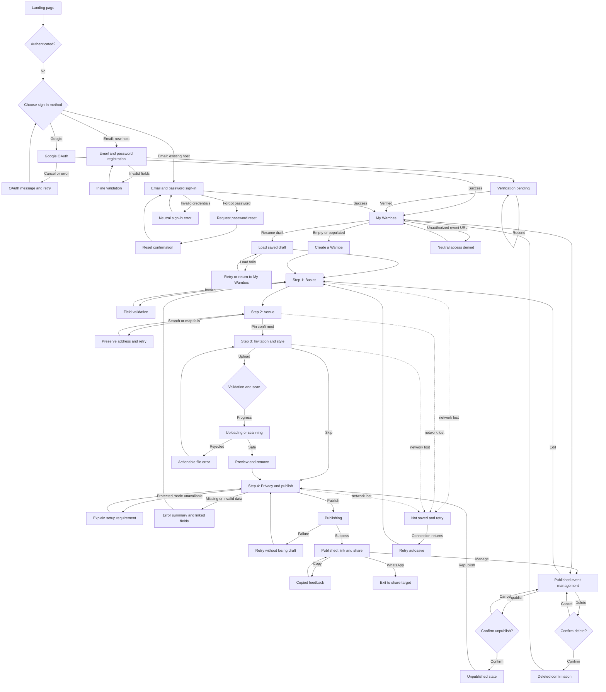

# US-002 — Complete responsive wireframes

These low-fidelity diagrams are the durable structural handoff for the host
authentication, event creation, publication, sharing, and lifecycle flows. They avoid
final visual styling. Open `WIREFRAMES.html` beside this file for the complete browser
board of mobile and desktop frames. `UX_VISUAL_CONCEPT.html` remains the separate visual
direction reference.

## User flow

## Screen and material-state inventory

| ID | Screen/state | Required regions and controls | Primary focus / announcement | AC trace |
|---|---|---|---|---|
| AUTH-01 | Authentication choice | Wambe value statement, Google button, email entry, sign-in link | Heading, then Google button | AC-001 |
| AUTH-02 | Email registration | Email, password, confirm password, terms notice, create-account action | Email field | AC-001 |
| AUTH-03 | Registration validation | Inline email/password errors and error summary | Error summary, then first invalid field | AC-001 |
| AUTH-04 | Verification pending | Masked email, resend, change email, return to sign-in | Verification heading; resend status announced | AC-001 |
| AUTH-05 | Email sign-in | Email, password, sign-in, forgot-password, Google alternative | Email field | AC-001 |
| AUTH-06 | Sign-in error | Neutral credentials error without account disclosure | Error alert | AC-001, AC-011 |
| AUTH-07 | Password-reset request | Email, send-reset action, return to sign-in | Email field | AC-001 |
| AUTH-08 | Password-reset confirmation | Neutral delivery confirmation, return to sign-in | Confirmation heading | AC-001 |
| AUTH-09 | OAuth cancelled/error | Non-destructive message, retry Google, use email | Message heading | AC-001 |
| SYS-01 | Unauthorized/permission denied | Neutral message, return to My Wambes | Message heading | AC-011 |
| HOME-01 | My Wambes loading | Stable header and skeleton event cards | Page heading; busy status announced | NFR-004 |
| HOME-02 | My Wambes empty | Empty-state explanation and Create action | Page heading | FR-002 |
| HOME-03 | My Wambes populated | Draft and published groups, event cards and lifecycle actions | Page heading | FR-002, FR-010 |
| EDIT-00 | Draft loading | Editor shell, progress skeleton, retry-safe state | Editor heading; busy status announced | AC-002 |
| EDIT-01 | Basics/default | Event type, title, date, time, autosave, back/continue | Step heading | FR-003, FR-004 |
| EDIT-02 | Basics validation | Error summary, invalid field messages, retained values | Error summary then first invalid field | AC-003 |
| EDIT-03 | Venue/search | Address search, result list, map region, pin instruction | Address field | FR-007 |
| EDIT-04 | Venue confirmed | Map pin, confirmed address card, change-pin action | Confirmation status announced | AC-005 |
| EDIT-05 | Venue/map error | Retained address, map/search failure, retry, publish-blocking explanation | Error alert | AC-005 |
| EDIT-06 | Style/empty | Optional invitation and Aso-Ebi uploads, notes, skip | Step heading | FR-003, FR-005 |
| EDIT-07 | Upload validating/progress | Per-file progress, cancel, non-blocking editor | File status announced politely | AC-006 |
| EDIT-08 | Upload success | Image/PDF preview, filename/type/size, scan success, remove | Success status announced | AC-006 |
| EDIT-09 | Upload rejected | Actionable size/type/scan error, replace/remove, draft retained | File error alert | AC-006 |
| EDIT-10 | Privacy/default | Four visibility cards with descriptions, review summary, edit links | Step heading | FR-006, AC-007 |
| EDIT-11 | Protected-mode capability | Invite-only/hidden-location setup warning and unavailable-share explanation | Warning heading | BR-006 |
| EDIT-12 | Publish validation summary | Linked errors grouped by step, retained review, publish blocked | Error summary | AC-003, AC-005 |
| EDIT-13 | Publishing | Disabled duplicate submission, progress label, retained review | `Publishing your Wambe` announced | AC-008, AC-014 |
| EDIT-14 | Publish failure | Retry, edit, retained stable draft and error reference | Error alert | AC-008, NFR-004 |
| SAVE-01 | Autosave saving/saved | Persistent status near editor heading | Polite status announcement | AC-002 |
| SAVE-02 | Autosave failed | `Couldn't save`, Retry, unsaved-change warning | Assertive error only once | AC-002, NFR-004 |
| SAVE-03 | Offline/not saved | Offline banner, locally retained values, reconnect/retry | Offline alert | NFR-004 |
| SAVE-04 | Leave with unsaved changes | Stay/leave dialog and consequences | Dialog heading; focus trapped | NFR-004 |
| PUB-01 | Publication success | Canonical link, copy, WhatsApp, view, edit | Success heading | AC-008, AC-009 |
| PUB-02 | Link copied | Same success screen with visible/announced `Copied` feedback | Polite copy announcement | AC-009 |
| MAN-01 | Published management | Status, event summary, canonical link, share, edit, overflow | Page heading | FR-010 |
| MAN-02 | Unpublish confirmation | Named event, consequence, cancel, unpublish | Dialog heading; cancel first | AC-010 |
| MAN-03 | Unpublished event | Status, link unavailable message, edit, republish, delete | Status heading | AC-010 |
| MAN-04 | Delete confirmation | Named event, immediate active removal, 30-day purge, cancel/delete | Dialog heading; cancel first | AC-010, AC-012 |
| MAN-05 | Deleted confirmation | Confirmation and return to My Wambes | Confirmation heading | AC-010, AC-012 |

## Responsive frame mapping

### Mobile: 320–767 CSS px

- One task column with full-width controls and 44×44 CSS px minimum targets.
- Header order is `Exit`, Wambe/editor context, persistent save status.
- Step display is textual (`Step 2 of 4 · Venue`) with a progress bar.
- Bottom actions remain reachable and must not cover focused fields or validation.
- Dialogs occupy the viewport width minus 16 px gutters and retain visible cancel action.
- Maps, upload previews, event summaries, and invitation previews use full available width.

### Tablet: 768–1023 CSS px

- Same field and step order as mobile within a centred form up to 42 rem.
- My Wambes uses a two-column card grid when content fits.
- Map and media regions grow without introducing additional required controls.

### Desktop: 1024 CSS px and above

- Persistent host navigation sits beside the task workspace.
- Editor uses a form column up to 42 rem plus a sticky contextual event preview.
- My Wambes uses up to three event-card columns.
- Error summaries remain above the form; dialogs stay centred and focus-contained.
- Desktop uses the same four steps and state semantics; it does not expose extra required
  fields or a divergent creation path.

## Interaction and accessibility annotations

1. Step navigation saves valid changes before moving. Failed save does not erase entered
   values and exposes Retry.
2. Back keeps data. Exit returns to My Wambes; if values are not saved, show SAVE-04.
3. Step changes focus the new step heading. Validation focuses the summary and supplies
   links to invalid fields.
4. Selected event-type and privacy cards use native radio semantics and visible checked
   indicators in addition to border/colour.
5. Upload status is per-file. A rejected file cannot remove successful files or other
   draft data.
6. Address text alone is incomplete until a pin is confirmed. Map failure preserves text
   and offers retry.
7. Autosave, upload, copy, and publish progress use restrained live regions. Repeated save
   events must not overwhelm screen-reader users.
8. Confirmation dialogs use `role="dialog"`, an accessible name/description, initial
   focus on the safe action, focus containment, Escape-to-cancel, and trigger focus
   restoration.
9. Authentication and permission errors avoid revealing whether an email or event exists.
10. All controls remain keyboard-operable, focus-visible, zoom-safe, reduced-motion safe,
    and distinguishable without colour.

## Assumptions and exclusions

- The board demonstrates structure and states, not final brand styling or production UI.
- Guest event pages, RSVP, guest approval, hidden-location revelation, and invite-only
  enforcement remain downstream stories.
- Protected visibility choices must be capability-gated until their guest-side controls
  are available.
- Actual OAuth, map, upload, analytics-consent, and offline persistence implementation is
  resolved by architecture/security without changing these user-visible outcomes.
