# US-003 Architecture Diagrams

Story: **Secure US-002 staging release**  
Architecture status: **Approved by the Product Owner on 2026-07-14**  
Inherited product contracts:
[`openapi-v1.yaml`](../US-002-create-publish-event/contracts/openapi-v1.yaml) and
[`product-events-v1.schema.json`](../US-002-create-publish-event/contracts/product-events-v1.schema.json)  
New operational contract: [`STAGING_EVIDENCE_SCHEMA.json`](STAGING_EVIDENCE_SCHEMA.json)

These diagrams describe the US-003 security and staging deltas. The Architecture section
of `ARTIFACTS.md` and the versioned contracts remain authoritative.

## 1. Scope and system context

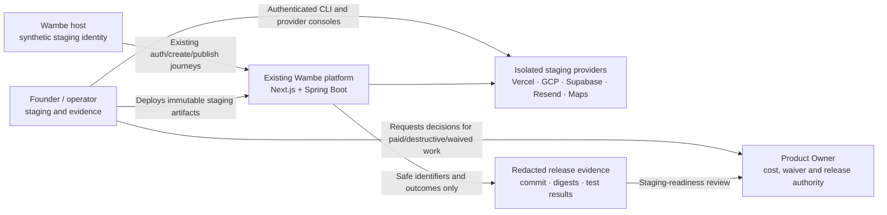

**Boundary:** US-003 changes security controls and staging operations. It adds no host
feature, public API version, product database table, production deployment or custom
operator dashboard.

## 2. Isolated staging deployment and trust boundaries

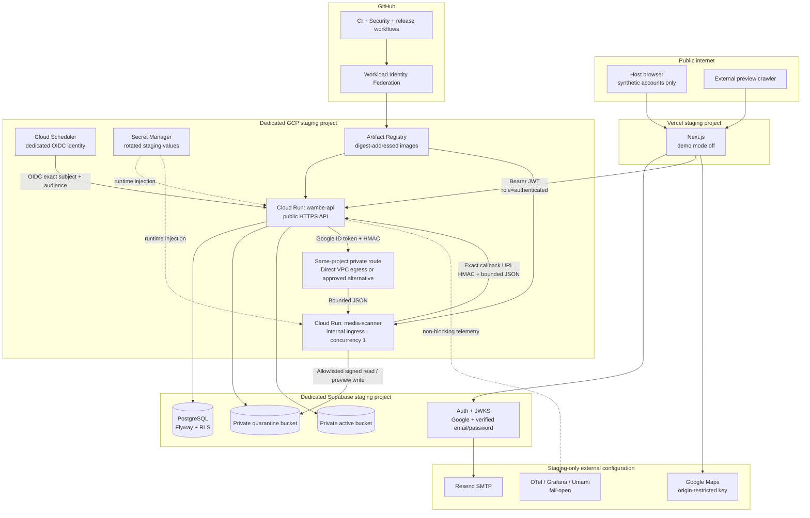

**Separation:** staging and production share no project, database, bucket, OAuth
credential, HMAC secret, service account or real host data. The scanner has no public
invoker: the API service account has scanner-only `roles/run.invoker`, obtains a Google
ID token for the exact scanner audience and sends it separately from the payload HMAC.

## 3. SEC-001 bounded request envelope

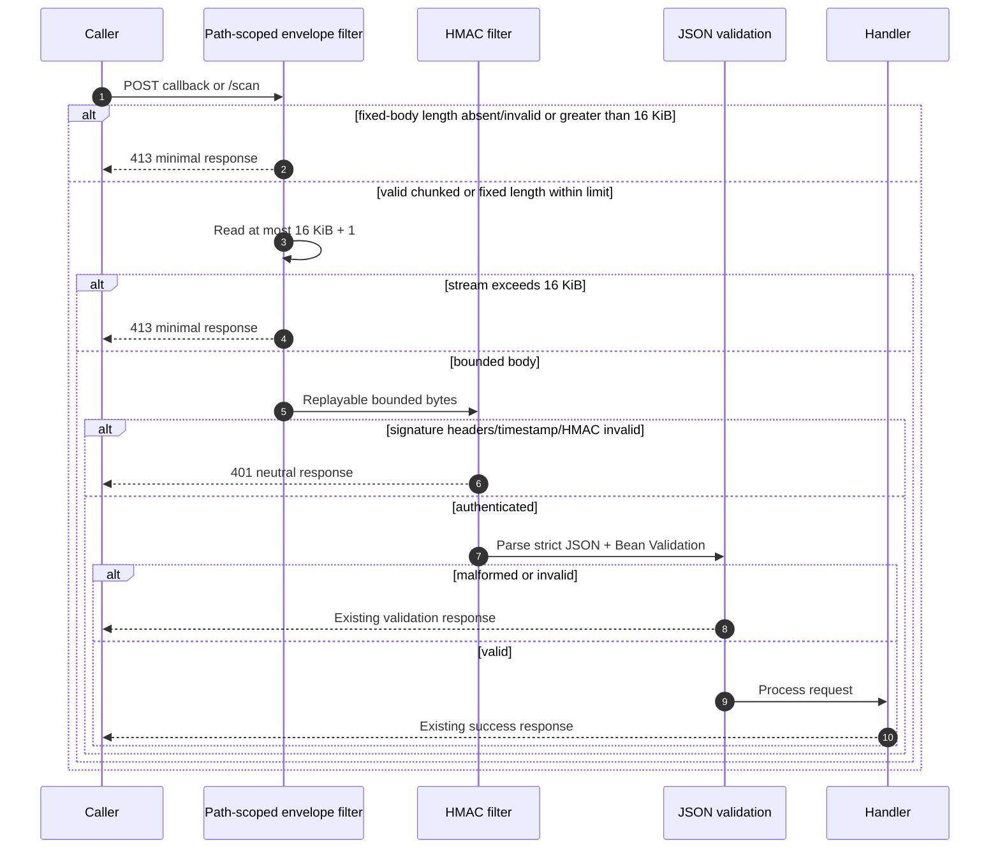

The filter checks `Content-Length` as a fast path but never trusts it as the only limit.
A fixed body without a valid length receives `413`; a valid chunked body uses the bounded
read and receives `413` when over limit. Neither service calls `readAllBytes()` on an
attacker-controlled raw stream.

## 4. SEC-002 deployed-secret startup gate

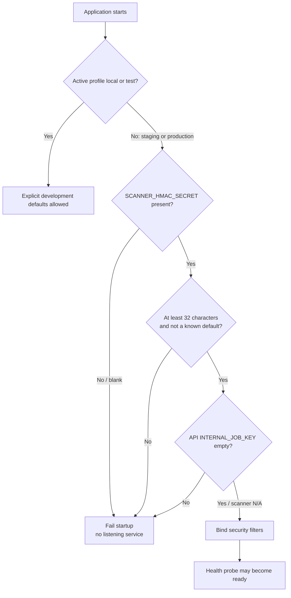

Known local defaults move to explicit `local`/`test` configuration. Secret Manager
injects the same rotated HMAC into API and scanner; logs and health output never reveal
the value.

## 5. SEC-003 host JWT decision

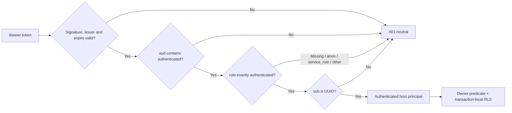

The claim policy applies only to host routes. Scheduler OIDC and scanner HMAC retain
their separate security chains and identities.

## 6. SEC-004 OAuth return-target decision

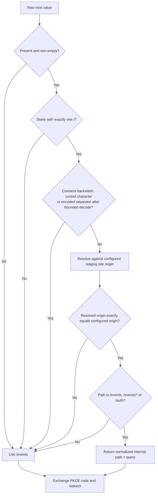

The same pure `safeRedirectPath` function is used before creating OAuth redirect URLs
and again in the callback. The callback is authoritative. Hash fragments are discarded,
and unsafe input is never echoed in error copy.

## 7. SEC-008 scanner destination policy

```mermaid
sequenceDiagram
    autonumber
    participant API
    participant Scanner
    participant Policy as Destination policy
    participant Storage as Supabase storage
    participant Callback as Exact API callback

    API->>Scanner: HMAC-signed ScanRequest
    Scanner->>Policy: Validate readUrl, previewWriteUrl, callbackUrl
    Policy->>Policy: HTTPS only; no userinfo; default port
    Policy->>Policy: exact configured storage host and path prefix
    Policy->>Policy: exact API callback origin and path
    Policy->>Policy: reject IP literals, private/link-local hosts and redirects
    alt any destination rejected
        Scanner-->>API: No outbound request; safe scan failure
    else all destinations accepted
        Scanner->>Storage: GET quarantined object (10 MiB cap)
        Scanner->>Storage: PUT preview when applicable
        Scanner->>Callback: HMAC result callback
    end
```

Application allowlisting and a supported internal API-to-scanner route are required.
Additional egress firewall restriction is optional defence-in-depth; any paid connector,
load balancer or firewall commitment requires a separate Product Owner decision.

## 8. Media retry and idempotency behavior

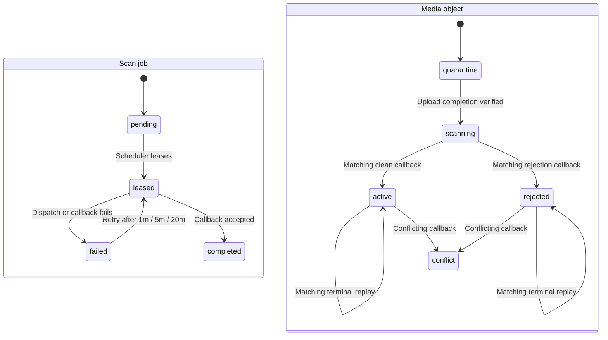

The existing two-minute lease, capped retry schedule, nonce consumption, matching
terminal replay and idempotent storage promotion remain unchanged.

## 9. Evidence data model

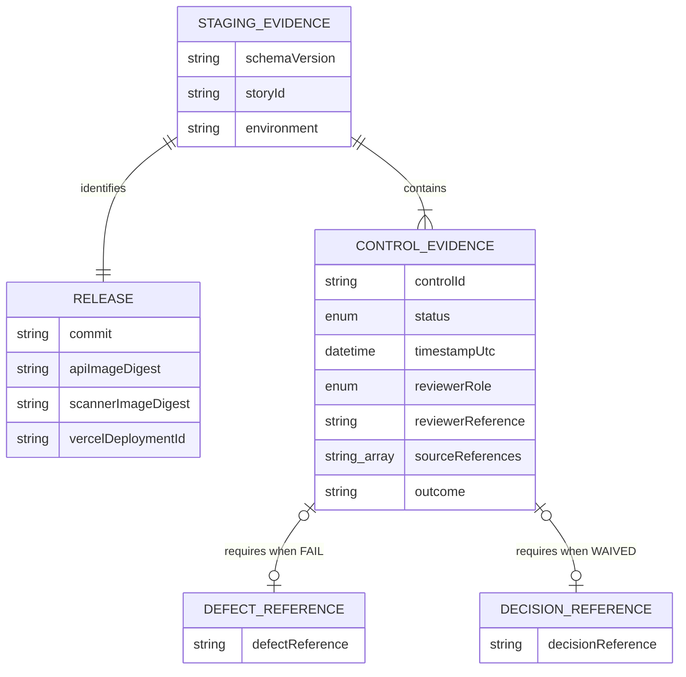

The JSON schema validates structure, not redaction. Review and secret scanning remain
mandatory. A final readiness recommendation cannot contain `NOT_RUN`, `IN_PROGRESS`,
`FAIL` or `BLOCKED` for a release-critical control unless a separate explicit waiver is
recorded.

## 10. Immutable delivery and independent assurance

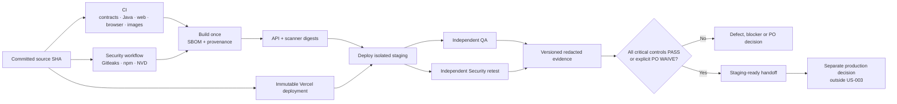

Implementation authors provide evidence but cannot close SEC findings. QA owns
acceptance/regression; Security owns independent SEC-001–004 closure; Operations owns
provider and rollback evidence.

## 11. Rollout and rollback

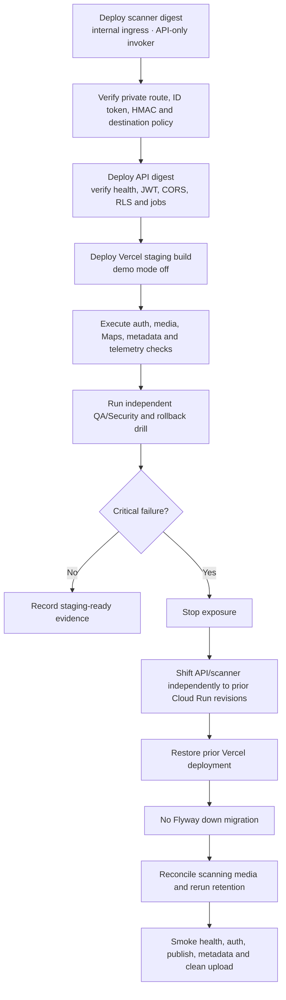

If the HMAC may be compromised, rotate Secret Manager and deploy both Java services
before resuming. A Supabase restore drill uses synthetic data and must prove that deleted
content does not return to an active surface.

## 12. Implementation dependency graph

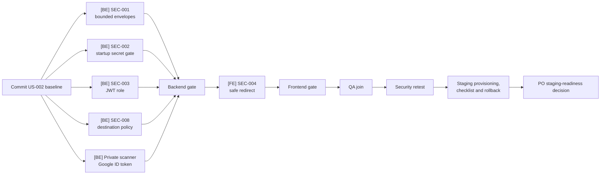

Architecture proposes `fullstack` and `backend-first`: backend closes the two High
findings and stabilizes the trust boundary before the small frontend redirect slice.
