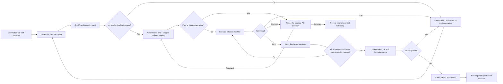

# US-003 — Operational wireframes

This story adds no host-facing screen. The checklist and evidence documents are the
operator interface; the frames below define their information hierarchy and state
semantics without requiring a custom dashboard. Provider consoles remain external.

Visual board: [US-003 staging readiness Canvas](C:/Users/olatu/.cursor/projects/c-Users-olatu-OneDrive-Desktop-wambe/canvases/us-003-staging-readiness.canvas.tsx)

## User flow



## Information architecture and inventory

| Surface/state | Operator goal | Required content | Supports |
|---|---|---|---|
| Readiness overview | Understand whether review can begin | source commit, image digests, critical-check counts, blockers, environment boundary | BR-001/002, FR-013, AC-001/013 |
| Security closure | Track SEC-001–004 independently | finding, owner, implementation evidence, QA result, Security retest, status | FR-001–004/014, AC-002–005 |
| Provider checklist | Execute staging controls safely | prerequisite, action, result, safe evidence reference, reviewer | FR-007–011, AC-007–011 |
| Blocker/PO decision | Stop before paid, destructive or waived work | decision needed, impact, free option, cost unknown/known, safe next action | BR-004, AC-014 |
| Failure/defect | Return failed evidence to implementation | expected/actual, safe error/request ID, owner, severity, retest | BR-002, FR-014 |
| Recovery drill | Prove rollback/restore | before/after revision, duration, migration state, content reconciliation | FR-012, AC-012 |
| Staging-ready summary | Request final review | all statuses, explicit waivers, residual risks, reviewer signatures | AC-013 |
| Host regression | Confirm no UX regression | unchanged auth/editor/share flows and accessibility evidence | NFR-006, AC-015 |

No custom loading or empty screen is required. `NOT_RUN` is the intentional empty state
inside the checklist and must state its prerequisite rather than showing a blank region.

## Desktop operator frame — readiness overview

```text
┌──────────────────────────────────────────────────────────────────────────────┐
│ US-003 · STAGING ONLY                    Commit 8f3…  [Record evidence]       │
├───────────────┬──────────────────────────────────────────────────────────────┤
│ OVERVIEW      │ Readiness: NOT READY · 3 blockers                           │
│ Security      │ ┌────────────┐ ┌────────────┐ ┌────────────┐                 │
│ Providers     │ │ SEC 2 / 4  │ │ 18 / 31   │ │ 3 blockers │                 │
│ Recovery      │ │ retested   │ │ checks pass│ │ need action│                 │
│ Evidence      │ └────────────┘ └────────────┘ └────────────┘                 │
│               │                                                              │
│               │ RELEASE-CRITICAL            PROVIDER EVIDENCE               │
│               │ SEC-001 ........ PASS        Supabase ....... NOT RUN       │
│               │ SEC-002 ........ PASS        Cloud Run ...... BLOCKED       │
│               │ SEC-003 ........ IN REVIEW   Vercel/Maps .... NOT RUN       │
│               │ SEC-004 ........ NOT RUN     Telemetry ...... NOT RUN       │
│               │                                                              │
│               │ [!] PO DECISION: paid restore capability unavailable        │
│               │     [View impact] [Record decision]                          │
│               │                                                              │
│               │ [Export redacted evidence] [Request review — disabled]       │
├───────────────┴──────────────────────────────────────────────────────────────┤
│ Production deployment is outside US-003 and remains unavailable.             │
└──────────────────────────────────────────────────────────────────────────────┘
```

## Mobile operator frame — status and blocker

```text
┌──────────────────────────────────┐
│ US-003 staging                   │
│ NOT READY · 3 blockers           │
├──────────────────────────────────┤
│ Security fixes       IN REVIEW   │
│ Provider checks      NOT RUN     │
│ Rollback             NOT RUN     │
├──────────────────────────────────┤
│ PO DECISION REQUIRED             │
│ Paid restore capability is not   │
│ available on the free plan.      │
│ [Open blocker details]           │
├──────────────────────────────────┤
│ [Production unavailable]         │
└──────────────────────────────────┘
```

On small screens, navigation becomes a single ordered section list. Evidence detail opens
after the status summary; the decision explanation appears before any action. No content
or control is removed relative to desktop.

## Material states

| State | Required presentation | Next safe action |
|---|---|---|
| `NOT_RUN` | Label plus unmet prerequisite/owner | satisfy prerequisite or assign owner |
| `IN_PROGRESS` | owner, start time, non-sensitive progress | wait, cancel safely, or inspect logs |
| `PASS` | evidence source, timestamp and reviewer | continue; immutable evidence remains linked |
| `FAIL` | expected/actual, safe identifier and severity | create defect; return to implementation |
| `BLOCKED` | missing access/capability/decision and impact | pause and request focused PO decision |
| `WAIVED` | PO command, scope, reason and date | continue while preserving residual risk |

Status text is mandatory; colour, icons or position may reinforce but never replace it.
`FAIL`, `BLOCKED`, and `NOT_RUN` disable the staging-ready action for release-critical
items unless an explicit waiver changes the decision state.

## Host-facing behavior

- No new maintenance, security or deployment screen is introduced.
- SEC-001 returns a protocol-level rejection at an internal service boundary.
- SEC-002 is a service-startup safeguard and has no host copy.
- SEC-003 retains the existing neutral unauthorized experience.
- SEC-004 sends unsafe callback targets to the existing safe `/events` destination;
  avoid exposing attacker-controlled values in error copy.
- Existing landing, auth, dashboard, editor, publish, management and metadata states
  retain the approved US-002 responsive design and WCAG 2.2 AA behavior.

Any new maintenance mode, feature-flag UI, changed host error copy or outage screen is a
scope change requiring PO and UX review.

## Interaction and content annotations

- Use direct labels: `Pass`, `Fail`, `Blocked`, `Waived`, `Not run`, `In progress`.
- Never use `Done` for a failed item with an explanation; disposition is not success.
- Every evidence link names the control and date, not the secret-bearing provider URL.
- A paid/destructive prompt leads with impact and free alternative; no preselected
  approval.
- The review action explains exactly which critical items prevent submission.
- Confirmation copy distinguishes **staging-ready** from **production-approved**.
- Timestamps display UTC plus the operator's local timezone where the provider supplies
  both; identifiers remain copyable but redacted when sensitive.
- English is the MVP operator language. Avoid culturally specific host copy because no
  host-facing content changes.

## Keyboard, focus and assistive technology

- One H1 identifies US-003 and environment; section headings follow document order.
- A skip link moves to the first failing/blocking control in any custom surface.
- Tab order follows summary → critical controls → blocker → evidence → review action.
- Status changes announce concise text through a polite live region; a failed deployment
  or secret exposure uses an assertive alert.
- Opening evidence/decision detail moves focus to its heading; closing returns focus to
  the triggering control.
- Disabled review/production actions have adjacent explanatory text and are not the only
  way to discover blockers.
- Text and controls meet WCAG 2.2 AA contrast, 24×24 CSS-pixel minimum targets with
  sufficient spacing, 200% zoom/reflow and visible focus.
- No motion is required. Provider-console animations are not copied into Wambe artifacts.

## Design-system and developer handoff

- Prefer Markdown/checklist and existing GitHub/provider status patterns; do not build a
  bespoke dashboard solely to reproduce these wireframes.
- If a custom evidence viewer becomes necessary, reuse Wambe typography, spacing,
  buttons, focus treatment, status summary and error-summary patterns.
- Store status as a typed enum and derive labels/actions from state; never infer pass
  from the presence of an evidence link.
- Keep evidence metadata separate from secret values. UI receives only redacted display
  models.
- Automated UX checks should assert status text, disabled review rationale, focus return,
  mobile reflow and no regression in existing host journeys.

## Usability validation and success signals

Before UX approval, a lightweight desk check confirms that the founder can answer within
one minute: what blocks staging, who owns it, what evidence exists, and whether an action
requires PO approval. During QA, test one pass, fail, blocked, waived and mixed-state
scenario on desktop and a narrow viewport with keyboard/screen reader.

Success signals are zero ambiguous statuses, zero accidental production actions, no
credential exposure in rendered evidence, and correct identification of every
release-critical blocker. These are design-quality signals, not production KPIs.

## Assumptions and open decisions

- No new host-facing UI is required by approved requirements.
- Provider project names and console layouts are implementation details.
- Architecture decides the exact SEC-001 limit and SEC-008 destination-control approach.
- A custom operator dashboard is explicitly not required; if architecture proposes one,
  it must return to UX/PO because it adds implementation and maintenance scope.
