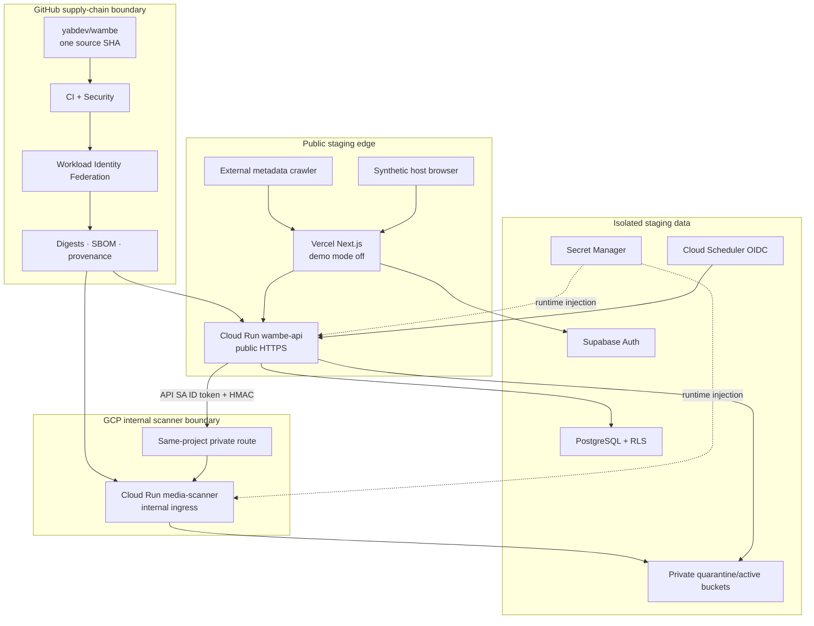
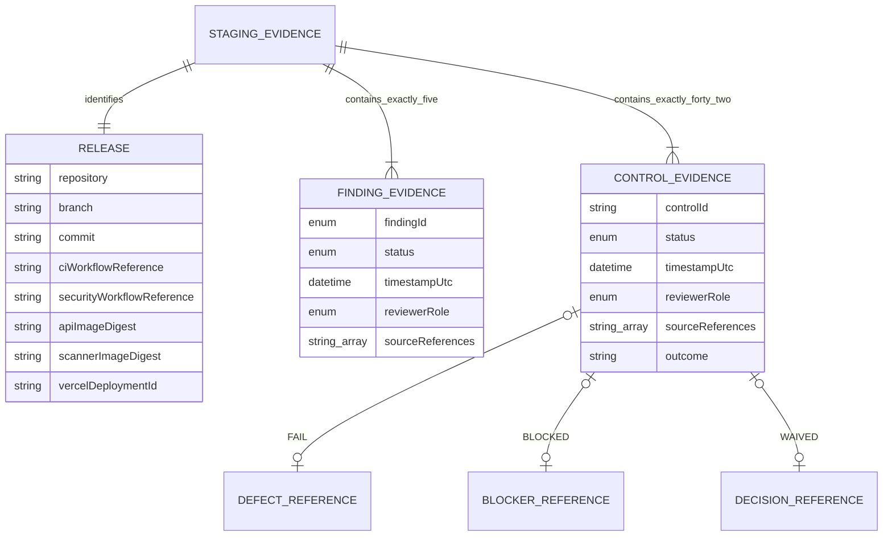
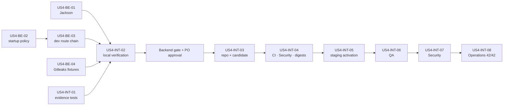

# US-004 — Complete Wambe staging release controls

## Intake

### Problem

US-003 completed its governed workflow with a staging and production no-go. Its local
implementation, QA, Security and Operations work is not represented by an immutable
release candidate in an accessible remote repository, and all 42 controls in
`docs/operations/staging-release-checklist.md` remain `NOT_RUN`.

The configured remote is `https://github.com/yabdev/wambe.git`, but the currently
authenticated GitHub identity cannot resolve it. Consequently QA-001 remains open:
there is no pushed release SHA, exact-SHA CI/Security result, published digest,
attestation or deployable baseline.

Four security findings also block a trustworthy release path:

- **SEC-011:** the API SBOM contains vulnerable `jackson-databind` 2.21.4 and lacks the
  required patched dependency plus API, SBOM, OSV and NVD-backed regression evidence.
- **SEC-012:** scanner internal ingress, absence of a public invoker, the exact API
  service-account invoker and exact-audience Google ID-token path are not deployed or
  proven.
- **SEC-013:** API runtime startup does not independently reject local storage or mixed
  local/test and deployed profiles.
- **SEC-014:** a synthetic deployed-secret test fixture triggers Gitleaks and would
  block the post-commit Security workflow.

The current process therefore stops at validated local automation and an all-`NOT_RUN`
evidence template. It cannot exercise real authentication, RLS, storage/malware,
sharing, Scheduler, observability, rollback or restore boundaries, and it cannot support
a staging-readiness decision.

### Target users and stakeholders

- **Primary beneficiary and operator:** the founder/staging operator, who needs one
  auditable release baseline and an actionable staging-readiness result.
- **Protected users:** Wambe hosts and guests whose identity, event, location and media
  data depend on the staged trust boundaries behaving as designed.
- **Decision authority:** the Product Owner, who alone may approve paid commitments,
  destructive actions, waivers, production actions or scope changes.
- **Assurance stakeholders:** engineering, QA, Security and Operations reviewers who
  must trace findings and controls to independent evidence.
- **External dependencies:** the administrator identities and provider control planes
  for GitHub, Supabase, Google Cloud/Maps, Vercel, Resend, telemetry and NVD analysis.

The founder remains the primary staging operator. A backup contact must be named outside
the public repository or `OPS-007` must receive a separate explicit PO waiver before the
42-control target can be met.

### Desired outcome and success measures

Create a reproducible release baseline in the intended `yabdev/wambe` repository,
remediate and independently close QA-001 and SEC-011 through SEC-014, provision and test
an isolated synthetic-data staging environment, and produce a staging-readiness record
in which every one of the 42 controls is either `PASS` or explicitly `WAIVED` by the
Product Owner. Production promotion remains a separate decision and is not authorized
by this story.

Success is measured as follows:

1. **Release blockers closed:** the baseline count of five selected blockers
   (QA-001 plus SEC-011–014) reaches zero, with QA and Security retest evidence rather
   than implementation self-attestation.
2. **Immutable baseline available:** one pushed commit in the intended repository
   contains the approved release scope; required `CI` and `Security` workflows pass for
   that exact SHA.
3. **Supply chain traceable:** API and scanner image digests, SBOMs and provenance are
   retained and match the artifacts deployed to staging without a rebuild.
4. **Checklist complete:** the baseline of `0/42` reaches `42/42 PASS or PO-WAIVED`,
   with `PASS` and `WAIVED` totals reported separately and no control left `NOT_RUN`,
   `IN_PROGRESS`, `FAIL` or `BLOCKED`.
5. **Staging boundaries exercised:** redacted evidence covers real auth/RLS, storage and
   EICAR paths, scanner IAM, maps/sharing, jobs, observability, alert delivery, rollback
   and restore or records a specific PO waiver.
6. **Evidence is valid and private:** the final evidence instance validates against the
   approved schema and contains no credential, token, signed URL, personal content or
   other restricted value.
7. **Decision is bounded:** the outcome may recommend “staging-ready”; it does not claim
   production capacity, production approval or achievement of the host journey KPI.

Primary monitoring indicators are the selected blocker count, checklist status counts,
required exact-SHA workflow results and schema-validation result. Evidence sources are
GitHub Actions, commit and image metadata, SBOM/provenance and vulnerability reports,
redacted provider/IAM exports, automated and live synthetic test results, safe
request/metric identifiers, and rollback/restore records.

Evidence quality is limited by synthetic identities/content, low staging traffic,
provider free-tier behavior and point-in-time configuration. Screenshots and manual
observations are supporting evidence only; waivers are decisions, not technical passes,
and must remain distinguishable in reporting.

### Scope, constraints, dependencies, and priority

- **Priority:** P0 release blocker for the founder/staging operator.
- **In scope:** recover or establish authorized access to the intended existing
  `yabdev/wambe` remote; commit and push the release candidate; obtain exact-SHA CI and
  Security evidence; remediate and retest QA-001 and SEC-011–014; provision isolated
  staging resources; and execute/evidence all 42 staging controls.
- **Completion rule:** every control must be `PASS` or carry an explicit PO `WAIVE`.
  Discovery of a failed, blocked or paid-only control is progress but does not complete
  the story until the cause is resolved or the PO explicitly waives it.
- **Environment boundary:** staging only, using synthetic data. No production data,
  secret, project, deployment, DNS cutover or promotion is authorized.
- **Cost boundary:** use free or lowest-cost supported options first. Pause before every
  paid commitment and present the capability, cost and no-cost alternatives to the PO.
- **Change-risk boundary:** pause before destructive actions. Rollback and restore tests
  require an approved non-production procedure and redacted evidence.
- **Security/privacy boundary:** secrets are entered only through authenticated provider
  tooling or secret stores, never chat, source, logs or evidence. Do not weaken scanner
  ingress or use broad Gitleaks suppression to bypass a control.
- **Compatibility boundary:** retain the approved US-002 contracts and product behavior.
  Any required contract, architecture or product-scope change returns to the PO through
  the governed stage process.
- **Residual findings:** SEC-005, SEC-006, SEC-007, SEC-009 and SEC-010 are not silently
  added to the selected remediation scope. If one prevents a required control from
  passing, record the dependency and ask the PO whether to expand scope or waive the
  affected control.
- **Access dependencies:** an authenticated identity with access to `yabdev/wambe`, an
  NVD API key, and authenticated control planes for Supabase, Google Cloud/Maps, Vercel,
  Resend and telemetry.
- **Technical dependencies:** a canonical staging domain; isolated projects and
  least-privilege service identities; registry and WIF configuration; staging secrets;
  a supported private API-to-scanner route; safe database pool/scale settings; and
  provider capabilities for alerting, rollback and restore.
- **Governance dependencies:** only the PO may approve a waiver, paid service,
  destructive action, production action, risk acceptance or material scope change.

Progress will be monitored by checklist and finding status, not elapsed time. A blocked
provider capability must stay visible and cannot be converted to an implied pass.

### Open questions

1. Which authenticated GitHub identity can access the existing `yabdev/wambe`
   repository, and what is its current visibility? If it no longer exists, repository
   creation and visibility require a separate explicit PO authorization.
2. Which staging provider accounts, projects, region and domain are already available,
   and which require user authentication or creation after requirements approval?
3. Which of the private scanner route, Supabase restore/PITR, telemetry/alerting or
   quota requirements are unavailable on free tiers? Each paid gap requires a focused
   PO decision when provider evidence is known.
4. Who is the backup staging/on-call contact to be recorded outside the repository for
   `OPS-007`, or should that control later be presented for an explicit waiver?
5. Will any carried residual security finding prevent a selected staging control from
   passing? Requirements and Security must trace such conflicts without silently
   expanding remediation scope.

## Requirements

### User story and business value

**Founder/operator story**

As the founder responsible for Wambe staging, I want one accessible immutable release
candidate, the selected QA/Security blockers independently closed, and all staging
controls evidenced, so that I can make a defensible staging-readiness decision without
mistaking local checks for deployed assurance.

**Host and guest protection story**

As a Wambe user, I need authentication, tenant isolation, media processing, sharing and
retention boundaries to be exercised with synthetic staging data, so that a release does
not expose identity, location, event or uploaded-media data through an untested
configuration.

**Assurance reviewer story**

As a QA or Security reviewer, I need exact-SHA, provider and test evidence that is
independent of implementation claims, so that QA-001 and SEC-011–014 are closed for
observable reasons and not by inference.

**Release-authority story**

As Product Owner, I want each of the 42 controls to be visibly `PASS` or explicitly
`WAIVED`, with paid, destructive, scope and production decisions returned to me, so that
the release record is complete without silently accepting cost or risk.

**Current business process**

1. Approved US-003 changes and delivery automation exist in a modified/untracked local
   worktree based on the pre-release commit.
2. The configured `yabdev/wambe` remote cannot be resolved by the currently
   authenticated identity, so no immutable release candidate or remote workflow evidence
   exists.
3. Local tests, image builds and an all-`NOT_RUN` evidence template exist, but
   SEC-011–014 and QA-001 remain open.
4. No authenticated provider control plane is available and the 42 staging controls are
   `0/42 PASS or WAIVED`.
5. The only valid current decision is staging and production no-go.

**Proposed business process**

1. Verify authorized access to the intended existing repository; if it is unavailable,
   stop for a PO repository-creation and visibility decision.
2. Remediate SEC-011, SEC-013 and SEC-014 locally while preparing the deployment and
   IAM evidence needed to close SEC-012.
3. Run complete local regression and secret scans, create one reviewable release
   candidate, push it to `yabdev/wambe`, and use its exact SHA as the evidence key.
4. Require exact-SHA `CI` and NVD-backed `Security` success before publishing canonical
   digest-addressed API and scanner images with SBOM/provenance.
5. Authenticate through approved provider tooling and provision isolated,
   least-privilege, synthetic-only staging resources using free/lowest-cost options.
6. Deploy the canonical artifacts, execute the 42 controls, and record schema-valid
   redacted evidence. Failed controls return to the owning implementation or
   configuration activity.
7. Pause for the PO before any paid commitment, destructive action, waiver, material
   scope/contract change or production action.
8. Obtain independent QA and Security retests, report `PASS` and `WAIVED` counts
   separately, and request a staging-readiness decision only at `42/42`.

**Stakeholder responsibilities and decision points**

- The founder/operator authenticates provider accounts, executes or observes staging
  checks, and owns initial incident response.
- Engineering remediates selected code/configuration findings but cannot approve its own
  closure.
- QA owns acceptance/regression evidence and the QA-001 disposition.
- Security independently closes SEC-011–014 and verifies relevant deployed boundaries.
- Operations owns immutable delivery, provider configuration evidence, recovery,
  monitoring, support and the consolidated checklist record.
- The PO alone decides repository creation/visibility if recovery fails, paid services,
  destructive procedures, waivers, scope/contract changes, residual-risk acceptance and
  any future production promotion.

**Requirements assumptions**

- `yabdev/wambe` is the intended repository, but its existence, visibility and usable
  administrator identity remain unverified.
- The approved US-002 contracts and US-003 implementation evidence remain the starting
  product baseline; no new event capability or visual redesign is requested.
- Isolated staging provider resources do not yet exist or are not currently accessible.
- Synthetic staging data and redacted evidence are sufficient for correctness and
  recovery checks, but not for production capacity or the host journey KPI.
- A control that cannot pass may complete only through a control-specific explicit PO
  waiver; `FAIL`, `BLOCKED` and `NOT_RUN` are not completion states.

### In scope / out of scope

**In scope**

- Verify and restore authorized access to the intended existing `yabdev/wambe`
  repository. If the repository is absent, prepare the facts needed for a separate PO
  creation/visibility decision.
- Remediate QA-001 and SEC-011, SEC-012, SEC-013 and SEC-014, then obtain independent
  QA/Security closure evidence.
- Create and push one immutable release candidate containing the approved US-003 work
  and US-004 remediations.
- Run required exact-SHA CI, full-history/worktree secret scanning, npm/Java dependency
  checks including NVD-backed analysis, image publication, SBOM and provenance.
- Configure GitHub Actions/environments and least-privilege workload identity required
  for staging delivery, including the production-promotion approval control without
  performing a production promotion.
- Provision/configure isolated Supabase, Google Cloud Run/Secret Manager/Scheduler,
  Google Maps, Vercel, Resend and telemetry staging resources through
  user-authenticated tooling.
- Deploy canonical digest-addressed API/scanner images and the corresponding Vercel
  artifact with demo mode disabled.
- Execute and evidence all controls in
  `docs/operations/staging-release-checklist.md`, including auth/RLS, media/EICAR,
  sharing/metadata, jobs/retention, monitoring/alerts, rollback and restore.
- Produce one schema-valid, redacted staging evidence record with all 42 controls
  `PASS` or explicitly PO-`WAIVED`.
- Preserve existing US-002 contracts, host flows, privacy semantics, accessibility and
  local developer behavior.

**Out of scope**

- Production deployment, promotion, DNS cutover, production data/secrets, real-user
  migration, public launch or production rollback.
- Automatic repository creation, visibility change, history rewrite or access-policy
  expansion without a focused PO decision.
- Automatic purchase, subscription upgrade or use of a paid-only capability.
- Destructive provider/database/storage actions that have not first been presented to
  and authorized by the PO.
- New event features, product redesign, vendor replacement or contract-breaking API/
  event-schema changes.
- General remediation of SEC-005, SEC-006, SEC-007, SEC-009 and SEC-010. If one blocks
  a selected control, the conflict returns to the PO for scope expansion or waiver.
- Production load certification, an availability SLA, cost forecasting without provider
  evidence, or proof of the strategic under-180-second host KPI.
- Treating a waiver, screenshot, local test or template as if it were a deployed
  technical pass.

### Functional and non-functional requirements

The requirement traces below refer to the seven numbered success measures in the
approved Intake section as `SM-1` through `SM-7`.

**Business requirements**

- **BR-001 — P0 readiness objective.** Work remains a P0 release blocker until all five
  selected findings are closed and the checklist reaches 42/42 `PASS` or PO-`WAIVED`.
  Value: one unambiguous staging decision. Trace: SM-1, SM-4, SM-7.
- **BR-002 — Immutable evidence key.** One pushed commit SHA in the authorized
  `yabdev/wambe` repository must identify source, workflow, image and deployment
  evidence. Value: reproducibility and auditability. Trace: SM-2, SM-3.
- **BR-003 — Completion semantics.** `NOT_RUN`, `IN_PROGRESS`, `FAIL` and `BLOCKED`
  remain incomplete. A waiver is valid only when an explicit PO decision names the
  control and reason. Value: no implied acceptance. Trace: SM-4, SM-7.
- **BR-004 — Staging-only authority.** US-004 may configure and test isolated staging
  only. Value: bounded operational risk. Trace: SM-5, SM-7.
- **BR-005 — Cost and destructive-action guard.** Free/lowest-cost options are tried
  first; paid commitments and destructive procedures pause for focused PO approval.
  Value: cost and recoverability control. Trace: SM-5, SM-7.
- **BR-006 — Independent assurance.** Implementation evidence may support but cannot
  close QA-001 or SEC-011–014; QA and Security own their dispositions. Value:
  trustworthy closure. Trace: SM-1.
- **BR-007 — Compatibility guard.** Existing US-002 contracts and approved host/privacy
  behavior remain canonical unless architecture is explicitly reopened. Value: avoid
  regression and scope drift. Trace: SM-5, SM-7.
- **BR-008 — Evidence privacy.** Evidence must be redacted, minimally identifying and
  schema-valid; restricted data never enters source, chat, logs or artifacts. Value:
  safe auditability. Trace: SM-6.

**Functional requirements**

- **FR-001 — Repository access verification.** The operator must verify the repository
  owner/name, visibility, default branch and an authorized identity before any push. A
  missing/inaccessible repository produces a PO decision request, not automatic
  recreation. Value: closes the access cause of QA-001. Trace: SM-1, SM-2.
- **FR-002 — Release-candidate baseline.** The candidate must contain all approved
  carried work and selected US-004 remediations, have a clean reviewable source state,
  and be pushed without rewriting shared history. Value: immutable baseline. Trace:
  SM-2.
- **FR-003 — Exact-SHA gates.** Required `CI` and manually/scheduled dispatched
  `Security` workflows must succeed for the same candidate SHA, with the NVD key
  configured through GitHub secrets. Value: release-gate integrity. Trace: SM-1, SM-2.
- **FR-004 — Canonical artifacts.** Release automation must publish SHA/digest-addressed
  API and scanner images once, retain SBOM/provenance, and prove staging uses those
  digests without `latest` or rebuild. Value: supply-chain traceability. Trace: SM-3.
- **FR-005 — SEC-011 dependency remediation.** The API must resolve
  `jackson-databind` to patched 2.21.5 or a compatible later fixed line, preserve a
  coherent Jackson dependency set, and pass API regression, SBOM, OSV and NVD-backed
  scans. Value: removes the selected vulnerable component. Trace: SM-1, SM-3.
- **FR-006 — SEC-013 deployed-profile guard.** API runtime startup must reject local
  storage and any active local/test/development profile when a deployed
  staging/production context is active; development storage routes must not be
  permit-all unless their controller is actually active in an explicit local/test
  context. Value: prevents accidental public local storage. Trace: SM-1, SM-5.
- **FR-007 — SEC-014 fixture remediation.** Both services must construct synthetic
  secret-test values without embedding a source literal that triggers Gitleaks, or use a
  narrowly scoped reviewed false-positive disposition. Blanket rule/path suppression is
  prohibited. Value: restores meaningful secret scanning. Trace: SM-1, SM-2, SM-6.
- **FR-008 — SEC-012 scanner identity boundary.** Staging must enforce scanner internal
  ingress, no `allUsers` invoker, the exact API service account as invoker, a supported
  private API-to-scanner route, exact-audience Google ID tokens and the existing valid
  HMAC. Positive and negative calls plus redacted effective IAM evidence are required.
  Value: independent service-to-service authorization. Trace: SM-1, SM-5.
- **FR-009 — Existing security-blocker deployment checks.** Staging must re-evidence
  bounded pre-authentication bodies, deployed-secret fail-fast/rotation, empty
  `INTERNAL_JOB_KEY`, authenticated-role JWT enforcement and safe OAuth return targets.
  Value: turns prior local closure into deployed assurance. Trace: SM-5.
- **FR-010 — Authentication and tenant isolation.** Synthetic staging accounts must
  prove Google sign-in, verified email/password registration, reset, refresh, safe
  identity linking, exact-origin CORS and cross-owner/RLS denial. Value: protects host
  identity and tenancy. Trace: SM-5.
- **FR-011 — Media and malware boundary.** Staging must prove signed quarantine upload,
  supported clean image/PDF activation, EICAR rejection, malformed/replayed/path attack
  rejection, allowed destinations, scanner identity and deletion of aged/deleted
  objects. Value: safe media lifecycle. Trace: SM-5.
- **FR-012 — Maps, sharing and metadata.** Restricted keys, responsive address/pin
  behavior, expected public/private-link metadata, protected-state redaction and
  external crawler unfurl must be verified on the canonical staging origin. Value:
  privacy-preserving sharing. Trace: SM-5.
- **FR-013 — Jobs, migrations and recovery.** Staging must prove Flyway state, exact
  Scheduler OIDC dispatch, retention outcomes, independent API/scanner rollback, Vercel
  rollback, forward-compatible schema behavior and Supabase restore RPO/RTO. Value:
  lifecycle integrity and recoverability. Trace: SM-5.
- **FR-014 — Observability and support.** Staging must expose privacy-safe health/RED and
  security/lifecycle metrics, route and test required alerts, fail open during telemetry
  loss, pass sensitive-log review and record primary/backup contacts outside the public
  repository. Value: operability and incident response. Trace: SM-5, SM-6.
- **FR-015 — Production promotion protection.** GitHub must require an explicit
  production environment approval before future promotion. Configuration evidence does
  not authorize or execute promotion. Value: separation of staging and production
  authority. Trace: SM-7.
- **FR-016 — Consolidated evidence record.** Each control must record control ID,
  status, timestamp, reviewer and redacted evidence reference; the release record must
  also identify commit, artifact digests, deployments and explicit waiver decisions.
  Value: complete reviewable decision input. Trace: SM-3, SM-4, SM-6.
- **FR-017 — Independent final recommendation.** QA and Security must retest their owned
  boundaries after deployment, and Operations must reconcile exactly 42 unique controls
  before a staging-readiness recommendation. Value: independent release assurance.
  Trace: SM-1, SM-4, SM-7.

**Non-functional requirements**

- **NFR-001 — Security severity.** A staging-ready recommendation permits no open
  Critical or High finding. Selected Medium/Low findings SEC-011–014 must be closed;
  carried residual findings remain explicitly reported. Trace: SM-1, SM-7.
- **NFR-002 — Least privilege.** Provider identities, GitHub permissions, Cloud Run IAM,
  Secret Manager access and Scheduler identities use the smallest practical scope;
  scanner invocation is never made public as a routing workaround. Trace: SM-5.
- **NFR-003 — Secret handling.** Use provider secret stores and short-lived/
  operator-authenticated access. No static cloud credential, bearer token, HMAC, signed
  URL or NVD key may be committed or written to evidence. Trace: SM-6.
- **NFR-004 — Evidence integrity.** Machine-readable evidence is preferred, validates
  against the approved v1 evidence schema or an architecture-owned compatible successor,
  and maintains a one-to-one mapping to exactly 42 checklist IDs. Trace: SM-4, SM-6.
- **NFR-005 — Repeatability.** Tests, deployment and evidence collection are driven by
  versioned scripts/workflows/templates where possible; console-only steps record
  reproducible redacted configuration state. Trace: SM-2, SM-3, SM-5.
- **NFR-006 — Privacy.** Synthetic data only; logs/metrics/evidence exclude tokens,
  signed URLs, titles, addresses, filenames, request bodies and personal identity
  content. Trace: SM-6.
- **NFR-007 — Compatibility and accessibility.** Existing OpenAPI/event contracts,
  visibility/lifecycle behavior, local development and WCAG 2.2 AA regressions remain
  compatible. Trace: SM-5, SM-7.
- **NFR-008 — Recovery.** Rollback uses prior immutable application artifacts and no
  down migration; restore testing must not expose deleted content as active. Trace:
  SM-5.
- **NFR-009 — Cost transparency.** No paid capability or monetary estimate is assumed
  without current provider evidence; unavailable free-tier capabilities remain visible
  pending PO purchase or waiver. Trace: SM-4, SM-7.
- **NFR-010 — Resilience and observability.** Telemetry failure must not block draft save
  or publication; metric labels are bounded and privacy-safe, and alert delivery is
  tested rather than inferred. Trace: SM-5, SM-6.
- **NFR-011 — Evidence limits.** Synthetic staging proves configured behavior and
  recoverability only; it must not be presented as production scale, SLA, cost or
  under-180-second KPI evidence. Trace: SM-7.
- **NFR-012 — Audit retention.** Exact-SHA workflow results, digest metadata,
  SBOM/provenance, control evidence and PO waiver references remain retrievable for the
  release review according to the approved repository/provider retention settings.
  Trace: SM-2, SM-3, SM-4.

### Business rules and dependencies

1. The PO is the sole authority for repository creation/visibility changes, paid
   commitments, destructive actions, waivers, material scope/contract changes, risk
   acceptance and production actions.
2. The user authenticates provider accounts through approved tools. Credentials are
   never requested in chat or copied into source/evidence.
3. The evidence order is binding: verify repository access and selected remediations;
   create/push candidate; pass exact-SHA gates; publish canonical artifacts; deploy
   those artifacts; execute controls; independently retest; reconcile readiness.
4. No provider configuration, screenshot or local test may be labeled `PASS` for a live
   control unless it exercises the control's stated staging boundary.
5. A waiver names one control, reason, residual risk, actor and date. One decision does
   not implicitly waive related controls or close a security finding.
6. A failed selected finding returns to the owning implementation stage. A contract or
   architectural conflict is recorded and returned through the governed reopen process.
7. Staging and production identities/resources remain separate. Configuring a future
   production approval gate is allowed; deployment or promotion is not.
8. EICAR is used only in the authorized isolated staging scanner path and must never be
   promoted to active storage.
9. Flyway remains forward-only. Rollback changes immutable application revisions and
   uses reviewed forward fixes rather than editing migration history.
10. SEC-005, SEC-006, SEC-007, SEC-009 and SEC-010 remain visible residual findings
    unless the PO separately expands scope or waives an affected control.

**Required data and evidence**

- Release identity: repository, branch, commit SHA and exact-SHA workflow run URLs.
- Supply chain: image names/digests, build identifiers, SBOM/provenance references and
  scan summaries.
- Deployment identity: redacted project/environment, service/revision/deployment IDs and
  canonical staging origin.
- Control result: one of `NOT_RUN`, `IN_PROGRESS`, `PASS`, `FAIL`, `BLOCKED`, `WAIVED`;
  timestamp; reviewer; redacted evidence references; and safe notes.
- Waiver: exact control ID, PO decision reference, reason and residual risk.
- Recovery/operations: safe request IDs, alert outcomes, rollback/restore identifiers,
  measured RPO/RTO and reconciled row/object outcomes.

The final record must not contain a credential, token, HMAC, signed URL, request body,
personal identity, event title, address, filename or private media content. Screenshots
are secondary; machine-readable workflow, test and provider output is preferred.

**Dependencies**

- Authorized GitHub identity with access to the intended `yabdev/wambe` repository.
- A GitHub environment, Actions permissions/secrets and least-privilege WIF path.
- Free NVD API key stored as a GitHub secret.
- Authenticated, isolated Supabase, Google Cloud/Maps, Vercel, Resend and telemetry
  staging control planes.
- Canonical public staging domain and provider redirect/origin verification.
- Registry, Secret Manager, service accounts, private scanner routing and effective IAM.
- Synthetic accounts, events, supported media, EICAR fixture and aged lifecycle data.
- Safe database pool/scale values based on actual staging quotas.
- Provider capability evidence for alerts, rollback, backup/PITR and restore.
- Founder as primary operator plus a backup contact for `OPS-007`, unless explicitly
  waived.

**Known conflicts and evidence limitations**

- The configured remote and current authenticated identity disagree; no requirement
  assumes the repository exists merely because the local remote-tracking reference does.
- SEC-012 cannot close from templates or unit tests; effective deployed IAM and network
  behavior are required.
- A free tier may not support private routing, restore/PITR, telemetry retention or
  required quotas. Such a gap is neither a pass nor automatic purchase authorization.
- Low synthetic traffic cannot validate production throughput, availability, cost or
  strategic product timing.
- Some controls overlap carried residual findings. The owning reviewer must identify
  the conflict rather than infer that US-004 expanded their remediation scope.

### Acceptance criteria

1. **AC-001 — Authorized repository access**
   - Given the configured `https://github.com/yabdev/wambe.git` remote, when release
     work begins, then the operator records redacted evidence of the repository owner,
     visibility, default branch and an authenticated identity authorized to push.
   - If the repository cannot be resolved, no repository is created or made public/
     private until the PO explicitly authorizes that action.
2. **AC-002 — QA-001 immutable release candidate**
   - Given the approved carried work and selected remediations, when the candidate is
     created, then one reviewable commit containing that scope is pushed without shared
     history rewrite, the working source state is clean, and all release evidence
     references its exact SHA.
3. **AC-003 — Exact-SHA CI and Security gates**
   - Given the release SHA, when required `CI` and `Security` workflows run, then both
     succeed for that same SHA; Security includes full-history/worktree Gitleaks, npm
     audit and NVD-backed Java dependency analysis.
4. **AC-004 — SEC-011 patched dependency**
   - Given the API dependency graph, when SBOM and vulnerability scans resolve Jackson,
     then `jackson-databind` is 2.21.5 or a compatible later fixed version, the Jackson
     set is coherent, full API regression passes, and OSV/NVD evidence no longer reports
     CVE-2026-54515 for the candidate.
5. **AC-005 — SEC-013 deployed local-storage rejection**
   - Given each staging/production runtime configuration combined with local, test,
     development or local-storage settings, when the API starts, then startup fails
     before serving traffic.
   - Given an explicit local/test configuration, local development remains usable and
     `/dev-storage/**` is exposed only when the local controller is active.
6. **AC-006 — SEC-014 clean secret scan**
   - Given both deployed-security validator test suites, when source and candidate
     history are scanned by Gitleaks, then synthetic fixtures exercise the same negative
     behavior without a generic-secret finding and without blanket rule/path exclusion.
7. **AC-007 — SEC-012 deployed scanner authorization**
   - Given the deployed scanner, when effective ingress and IAM are inspected, then
     ingress is internal, `allUsers` has no invoker role, and only the exact API service
     account has the required scanner invocation permission.
   - Given dispatch attempts, then the API's exact-audience Google ID token plus valid
     HMAC succeeds through the supported private route, while unauthenticated,
     wrong-principal, wrong-audience, invalid-HMAC and direct-public attempts fail.
8. **AC-008 — Build and supply-chain controls**
   - Given the release candidate, then `BUILD-001` through `BUILD-005` each have a
     redacted `PASS` result or an explicit control-specific PO waiver.
   - API/scanner digests deployed to staging match release output, SBOM/provenance is
     retained, `latest` is not used, no rebuild occurs, and future production promotion
     requires explicit GitHub environment approval.
9. **AC-009 — Existing security-blocker controls**
   - Given staging requests/configuration, then `SECURITY-001` through `SECURITY-005`
     each have `PASS` or explicit PO waiver evidence covering bounded unsigned bodies,
     rotated non-default HMAC startup, empty/rejected job key, authenticated host JWT
     role and safe OAuth target behavior.
10. **AC-010 — Authentication and authorization controls**
    - Given synthetic staging users and hostile/expired/cross-owner cases, then
      `AUTH-001` through `AUTH-006` each have `PASS` or explicit PO waiver evidence for
      Google and verified email auth, reset, refresh, safe linking, RLS and exact CORS.
11. **AC-011 — Storage and malware controls**
    - Given supported clean files, EICAR and malformed/replayed/path attack cases, then
      `MEDIA-001` through `MEDIA-007` each have `PASS` or explicit PO waiver evidence;
      only clean media activates, unsafe media does not, drafts remain recoverable,
      scanner IAM/HMAC is enforced and aged/deleted objects reconcile.
12. **AC-012 — Maps, metadata and sharing controls**
    - Given desktop/mobile staging, restricted keys, every visibility/lifecycle state
      and external crawlers, then `SHARE-001` through `SHARE-005` each have `PASS` or
      explicit PO waiver evidence and expose only approved metadata.
13. **AC-013 — Jobs, migrations and recovery controls**
    - Given exact Scheduler identity, synthetic aged data and deployed revisions, then
      `RECOVERY-001` through `RECOVERY-007` each have `PASS` or explicit PO waiver
      evidence for Flyway, dispatch, retention, independent service/Vercel rollback,
      forward schema compatibility and measured restore RPO/RTO.
14. **AC-014 — Observability and support controls**
    - Given normal/failing flows and a telemetry outage, then `OPS-001` through
      `OPS-007` each have `PASS` or explicit PO waiver evidence; required metrics and
      alerts are visible/tested, telemetry fails open, logs exclude prohibited data and
      primary/backup contacts are recorded outside the public repository.
15. **AC-015 — Complete evidence record**
    - Given all execution and PO decisions, when the evidence record is validated, then
      it contains exactly 42 unique checklist IDs, validates against the approved schema,
      reports `PASS` and `WAIVED` separately, and leaves no control `NOT_RUN`,
      `IN_PROGRESS`, `FAIL` or `BLOCKED`.
16. **AC-016 — Privacy, cost and action guard**
    - Throughout execution, no restricted value enters source/chat/evidence, only
      synthetic staging data is used, and no paid, destructive or production action
      occurs without the required focused PO authorization.
17. **AC-017 — Compatibility regression**
    - Given the release candidate and deployed staging environment, when regression runs,
      then approved OpenAPI/event contracts, host flows, visibility/privacy behavior,
      local development and WCAG 2.2 AA checks remain compatible.
18. **AC-018 — Independent closure and bounded recommendation**
    - Given all candidate and staging evidence, when QA and Security independently
      review it, then QA-001 and SEC-011–014 are closed, no Critical/High finding is
      open, residual findings and waivers are disclosed, and Operations may recommend
      “staging-ready” without claiming or performing production promotion.

**Traceability summary**

- QA-001 → BR-002, BR-006; FR-001–FR-003; AC-001–AC-003.
- SEC-011 → FR-005; NFR-001; AC-004.
- SEC-012 and `MEDIA-006` → FR-008, NFR-002; AC-007, AC-011.
- SEC-013 → FR-006, NFR-007; AC-005, AC-017.
- SEC-014 → FR-007, NFR-003; AC-003, AC-006.
- `BUILD-001`–`BUILD-005` → FR-003, FR-004, FR-015; AC-008.
- `SECURITY-001`–`SECURITY-005` → FR-009; AC-009.
- `AUTH-001`–`AUTH-006` → FR-010; AC-010.
- `MEDIA-001`–`MEDIA-007` → FR-008, FR-011; AC-011.
- `SHARE-001`–`SHARE-005` → FR-012; AC-012.
- `RECOVERY-001`–`RECOVERY-007` → FR-013, NFR-008; AC-013.
- `OPS-001`–`OPS-007` → FR-014; AC-014.
- Forty-two-control completeness/privacy → BR-003, BR-008, FR-016, FR-017,
  NFR-004–NFR-006; AC-015, AC-016, AC-018.
- Staging/cost/production constraints → BR-004, BR-005, FR-015, NFR-009, NFR-011;
  AC-016, AC-018.

### Open questions

1. Which GitHub identity can administer/push to the intended `yabdev/wambe` repository,
   and what is the repository visibility? If it is absent, the PO must explicitly
   authorize creation and visibility before execution.
2. Which isolated staging projects/accounts, canonical domain and region already exist?
   Names and IDs are execution configuration, but access must be established before
   architecture can finalize rollout evidence.
3. Which supported private API-to-scanner route is available in the selected GCP region
   at no cost? A paid connector/load balancer or alternate billed route requires a PO
   decision; public scanner invocation is not an acceptable alternative.
4. Do the selected Supabase, telemetry and provider tiers support restore/PITR, alert
   delivery, required retention and safe quotas? Each unavailable capability requires a
   purchase-or-waive decision backed by provider evidence.
5. Who is the backup staging/on-call contact for `OPS-007`, to be recorded outside the
   repository? If none is available, only the PO may waive that exact control.
6. Will effective staging testing show that SEC-005, SEC-006, SEC-007, SEC-009 or
   SEC-010 prevents a required control from passing? If so, the PO must choose scope
   expansion or a control-specific waiver; approval of these requirements does not
   silently make that choice.

## UX

### User journey and flows

US-004 is an operational release-readiness story, not a product-feature or redesign
story. The approved requirements preserve all US-002 host journeys. The primary UX is
therefore the founder/operator's movement through a versioned checklist and evidence
record:

1. verify this is the isolated staging workflow and identify the current release state;
2. resolve or escalate access to the intended `yabdev/wambe` repository;
3. review implementation and independent closure requirements for QA-001 and
   SEC-011–014;
4. create one candidate SHA, pass exact-SHA CI/Security and identify canonical artifact
   digests;
5. authenticate to isolated providers without exposing credentials in the evidence;
6. execute controls in release order, recording `NOT_RUN`, `IN_PROGRESS`, `PASS`,
   `FAIL`, `BLOCKED` or `WAIVED` with the required metadata;
7. return `FAIL` to implementation and pause `BLOCKED`, paid, destructive, repository or
   waiver work for the precise PO decision;
8. request independent QA/Security review only when the validated record reaches 42/42
   `PASS` or explicit PO-`WAIVED`; and
9. exit to a bounded staging-readiness handoff. Production remains a separate governed
   decision with no action in this experience.

The full entry, success, failure, blocker, decision and exit flow is in
[WIREFRAMES.md](WIREFRAMES.md#user-flow).

**Validated evidence versus assumptions:** the approved requirements and 42-control
checklist validate the operator role, state semantics, production boundary and required
evidence. There is no founder usability session, support analytics, accessible remote
repository or live staging behavior. The grouping and information hierarchy are design
assumptions to validate with one short founder desk check; they do not justify a custom
dashboard.

### Screens, components, content, and states

No new host-facing screen or product component is required. The current operator
surfaces remain Markdown, schema-valid JSON evidence, GitHub Actions summaries and
provider consoles. The conceptual inventory is:

- **Readiness overview:** environment, candidate SHA/digests, five selected findings,
  42-control totals, decision dependencies, first safe action and production boundary.
- **Selected-finding detail:** finding/severity, owner, required implementation and
  deployed proof, independent reviewer and closure status.
- **Control group/list:** stable control IDs, prerequisite, owner, text status, latest
  evidence and next safe action across the seven checklist groups.
- **Evidence detail:** status, timestamp, reviewer, redacted references, safe result and
  candidate/deployment identity; restricted provider values never render.
- **Focused PO decision:** exact decision, affected control, impact, current provider/
  cost evidence, no-cost alternative and residual risk. Approval/waiver is never
  preselected.
- **Failure/retest return:** expected/actual, safe reference, severity, owner, affected
  controls and retest requirement. It never offers `Done`.
- **Staging-readiness summary:** exact release/artifact identity, separate `PASS` and
  `WAIVED` totals, selected finding closures, residual findings, independent reviewers
  and explicit “not production approval” copy.

`NOT_RUN` is the intentional empty state and identifies prerequisite/owner.
`IN_PROGRESS` preserves the last valid status and shows safe progress. `PASS` requires
immutable evidence. `FAIL` creates a defect and return path. `BLOCKED` identifies the
missing access/capability/decision and pauses. `WAIVED` names the PO command, one control,
reason, residual risk, actor and date. Only `PASS` and valid `WAIVED` count toward 42/42.

Loading applies only while reading evidence or executing a provider action; it cannot
hide the last known state. Metadata validation keeps the prior valid state, presents an
error summary and links to the missing reviewer, timestamp, reference or waiver field.
Permission errors say which role or access is required without exposing provider
identity details or credentials.

Content uses stable IDs and direct labels: `Pass`, `Fail`, `Blocked`, `Waived`,
`Not run`, `In progress`, `Open` and `Closed`. The exact candidate SHA is the primary
evidence key. Evidence links use a safe artifact label and date, never a secret-bearing
URL. Confirmation text says “staging-ready,” never “production-approved.”

Prefer existing checklist/GitHub/provider patterns. If a custom viewer is later approved,
reuse Wambe's global surface, text, line, coral, gold, green, danger and warning tokens;
existing cards, buttons, alerts, skip link, focus treatment, forced-colours and
reduced-motion behavior; and the AppShell desktop-sidebar/sticky-mobile-header pattern.
Use typed status values and a redacted display model rather than inferring success from
the presence of an evidence link.

### Responsive and accessibility requirements

The durable checklist/evidence remains linear. A generated or future approved viewer may
use persistent group navigation and a three-column summary at desktop sizes. At tablet
and mobile widths it becomes one ordered column: summary → first blocker/failure →
control groups → evidence → decision → review action. All controls, waivers and residual
risks remain available. At 200% zoom it reflows without horizontal scrolling.

- Support 320 CSS px minimum width; mobile primary actions use the existing 48 CSS px
  height and do not obscure focused content.
- One H1 names story, environment and readiness; ordered H2s follow release sequence.
- A skip link targets the first `FAIL`, `BLOCKED` or incomplete selected finding.
- Status always uses text; colour, icons, counts and position are supplementary.
- Keyboard order follows summary, blocker, groups, evidence, decision and review.
- Opening detail moves focus to its heading; closing restores the triggering row.
- Error summaries receive focus and link to the first invalid evidence field.
- Status changes use a polite live region. Deployment failure, secret exposure or a
  destructive warning uses an assertive alert once.
- Decision dialogs are named/described, start on the safe action, contain focus, support
  Escape when idle and restore trigger focus.
- Disabled review/production controls have adjacent rationale and are not the only way
  to discover blockers.
- Meet WCAG 2.2 AA contrast, visible focus, forced-colours, 200% zoom/reflow and
  reduced-motion requirements. No motion conveys state.
- English is the MVP operator language. Stable control IDs remain untranslated;
  timestamps show UTC and may show local time secondarily.

### Wireframes or prototype links

- Durable Mermaid flow, information architecture, desktop/mobile frames, detail states
  and accessibility handoff: [WIREFRAMES.md](WIREFRAMES.md)
- Visual low-fidelity board:
  [US-004 staging-control Canvas](C:/Users/olatu/.cursor/projects/c-Users-olatu-OneDrive-Desktop-wambe/canvases/us-004-staging-controls.canvas.tsx)

These are information-design artifacts, not authorization to implement a new dashboard.
The recommended implementation remains versioned Markdown/JSON plus GitHub/provider
surfaces.

**Usability validation:** run one mixed-state founder desk check before architecture
handoff or as its first validation activity. Within one minute, the operator should
identify environment, release SHA, first blocker/owner, `PASS`/`WAIVED`/incomplete
counts, one selected finding's evidence and whether the next action needs PO approval.
QA later exercises all six control states on desktop and a 320 CSS px viewport with
keyboard and screen reader.

UX succeeds when statuses/counts are unambiguous, the first blocker is discoverable
without raw-log review, no restricted value renders, no production action appears
authorized and existing host flows retain responsive/WCAG behavior. These are
design-quality signals, not staging-readiness evidence.

### Risks and open decisions

- A bespoke dashboard would introduce authentication, authorization, implementation and
  maintenance scope without approved user evidence. Architecture should preserve the
  checklist/evidence source of truth unless the PO explicitly expands scope.
- Provider-console terminology, responsive behavior and accessibility vary. The durable
  Markdown/JSON record must remain understandable without screenshots.
- Forty-two controls plus five selected findings can overload the operator. Group by
  release sequence, show failures/blockers first and progressively disclose full logs.
- The repository identity/visibility and provider projects/domain/region remain
  unresolved operational configuration. UX does not imply that access exists.
- The backup contact remains unknown. `OPS-007` must use an out-of-repository contact or
  an explicit PO waiver; private contact data never appears in the wireframes.
- Any maintenance mode, rollout UI, changed host error copy, custom evidence viewer or
  production control is a scope change requiring PO and UX review.
- The founder desk check remains unperformed. A material failure to identify the first
  blocker, owner, count or decision within one minute must return the information
  hierarchy to UX rather than being treated as an implementation defect.

**Developer handoff:** implement no new frontend route or host-facing copy for US-004.
Backend/Operations outputs must be deterministic, redacted and keyed to typed finding/
control states. QA owns host regression and mixed-state accessibility checks; Security
independently closes SEC-011–014.
## Architecture

### Context and selected approach

**Review date:** 2026-07-16
**Change impact:** medium implementation breadth, high release importance. The selected
code changes are small and backend-only, but closure depends on repository access,
exact-SHA supply-chain gates and an isolated multi-provider staging environment.

The as-built review confirms:

- the approved US-003 implementation and delivery work remains modified/untracked on top
  of the pre-release commit, and the configured `yabdev/wambe` remote is inaccessible to
  the current authenticated identity;
- `wambe-api` resolves the affected Jackson 2 line to `jackson-databind` 2.21.4;
- the uncommitted API `DeployedSecurityValidator` does not require Supabase storage or
  reject every local/test/development profile in a deployed context, while the main
  Spring Security chain always permits `/dev-storage/**`;
- both uncommitted deployed-security test suites contain the synthetic literal that
  triggers Gitleaks;
- the API's Google ID-token dispatch path and the internal-ingress Cloud Run templates
  exist locally, but no effective scanner IAM/network policy or live invocation evidence
  exists; and
- the v1.0 evidence contract is fixed to US-003, so it cannot validate the required
  US-004 release record unchanged.

**Selected approach:** preserve the approved US-003 product and trust-boundary
architecture and add the minimum release-closing deltas:

1. align the API's Jackson 2 dependency family to a patched 2.21.5-or-later compatible
   BOM and prove the resolved graph with API, SBOM, OSV and NVD-backed checks;
2. extend API runtime startup policy to require Supabase storage and exclude local,
   test and development profiles from deployed contexts, with a separate local-only
   `/dev-storage/**` security chain;
3. construct deployed-secret test fixtures at runtime so Gitleaks remains strict without
   suppressing paths or rules;
4. bind all release evidence to one pushed `yabdev/wambe` commit and require successful
   `CI` plus manually dispatched `Security` for that exact SHA before canonical images
   are published;
5. activate one isolated synthetic-only staging environment, preserving internal scanner
   ingress, API-only IAM invocation, exact-audience Google ID token and HMAC; and
6. use the architecture-owned v1.1 evidence contract to reconcile five selected findings
   and exactly 42 controls before a staging-readiness handoff.

No product endpoint, product event, database table, host route, host copy or custom
operator dashboard is added.

Visual architecture:
[US-004 release architecture Canvas](C:/Users/olatu/.cursor/projects/c-Users-olatu-OneDrive-Desktop-wambe/canvases/us-004-release-architecture.canvas.tsx)

```mermaid
flowchart LR
    Fix["Backend remediation<br/>SEC-011 · SEC-013 · SEC-014"] --> Verify["Local verify + clean Gitleaks"]
    Verify --> Commit["One pushed release SHA<br/>yabdev/wambe"]
    Commit --> Gates["Exact-SHA CI + Security"]
    Gates --> Images["Build once<br/>digests · SBOM · provenance"]
    Images --> Stage["Founder-operated staging activation<br/>synthetic only"]
    Stage --> QA["Independent QA<br/>including real web regression"]
    QA --> Security["Independent Security<br/>QA-001 + SEC-011–014"]
    Security --> Operations["Operations audit + remaining controls"]
    Operations --> Evidence["v1.1 evidence<br/>5 findings closed · 42/42"]
    Evidence --> Ready["PO staging-readiness handoff"]
    Ready --> Production["Separate production decision<br/>outside US-004"]
```

**Governed staging-activation checkpoint:** the standard stage order places Operations
after Security, but SEC-012 and the real-provider acceptance criteria require a deployed
target before QA and Security. Therefore, after backend implementation approval and
before QA starts, the founder/operator must use architecture-approved templates and
authenticated provider tooling to create and deploy the isolated staging target. This is
an `[INT]` evidence prerequisite, not an early Operations gate or production action.
Operations later audits and reconciles the same environment. If repository access,
provider access, cost or destructive work blocks activation, QA remains unstarted and the
specific PO decision is requested; no stage is represented as passed.

**Proposed implementation profile:** `backend-only`
**Proposed implementation order:** `backend-first`

US-004 contains no frontend code contract. The frontend implementation gate should be
waived after architecture approval for the profile reason, while QA still performs the
required real-staging auth, media, maps, sharing, responsive and accessibility regression.

### Components, interfaces, and data

**Affected components and responsibilities**

- **Git/GitHub repository:** verifies `yabdev/wambe` identity/visibility and provides the
  immutable source SHA. Repository creation, visibility changes and broad access changes
  require a focused PO decision.
- **GitHub `CI`:** lints inherited contracts, verifies both Java services, generated
  client and web, runs browser/accessibility tests and builds local images for the
  candidate SHA.
- **GitHub `Security`:** runs full-history Gitleaks, npm audit and NVD-backed Java
  dependency analysis for the candidate SHA. A scheduled run on another SHA is not
  release evidence.
- **GitHub `Release images`:** checks exact-SHA CI/Security success, authenticates to GCP
  with WIF, publishes API/scanner images once with SHA labels, SBOM and provenance, and
  records immutable digests.
- **`wambe-api` dependency graph:** retains Spring Boot 4 and the intentional Jackson
  2/3 bridge, but imports one patched coherent Jackson 2 BOM for OpenAPI/`JsonNullable`
  binding.
- **`wambe-api` startup policy:** validates deployed secrets, empty job key, scanner
  URL/audience, envelope limit, storage type and active profiles before readiness.
- **`wambe-api` security chains:** host/API behavior remains unchanged; a separate
  local/test-and-local-storage chain alone may permit `/dev-storage/**`.
- **API-to-scanner adapter:** uses the existing HMAC and the uncommitted exact-audience
  Google ID-token provider in staging; local/test remains HMAC-only.
- **`media-scanner`:** retains internal ingress, concurrency one, destination policy,
  bounded request handling and HMAC. Cloud Run, not application code, validates the
  Google identity token.
- **Vercel web:** no US-004 code change. The canonical staging deployment disables demo
  mode and supplies exact Supabase/API/site/Maps configuration.
- **Supabase staging:** isolated Auth, PostgreSQL/RLS and private quarantine/active
  storage with synthetic identities/content; no product migration is introduced.
- **GCP staging:** isolated Artifact Registry, Cloud Run services, Secret Manager,
  Scheduler, network/subnet and least-privilege service accounts.
- **Resend, Maps and telemetry:** staging-only integration surfaces. Telemetry remains
  fail-open and provider quota/cost gaps remain visible.
- **Evidence contract:** the human-readable checklist remains the operator source of
  truth; v1.1 JSON binds the release, five selected findings and exactly 42 controls.

**Trust and identity boundaries**

- Browser-visible configuration is limited to public service origins, Supabase anonymous
  key and an origin-restricted Maps key.
- The API service account receives only the permissions needed for its secrets, storage
  operations and scanner-specific `roles/run.invoker`.
- The scanner service account has no database or Supabase service-role credential and
  receives only short-lived operation-scoped signed URLs plus the shared HMAC.
- Scheduler has a separate identity with exact issuer/subject/audience validation.
- Founder/operator access uses provider-native authentication. No credential is supplied
  through chat, source or evidence.

**Data**

No Flyway migration or product data-model change is planned. Existing event, media,
nonce, scan-lease, callback idempotency and RLS models remain authoritative.

The new [staging evidence v1.1 schema](contracts/staging-evidence-v1.1.schema.json) and
[all-open/all-NOT_RUN example](contracts/staging-evidence-v1.1.example.json) are
architecture-owned operational contracts:

The schema enforces array sizes and conditional metadata, but JSON Schema cannot enforce
uniqueness by object property or detect secrets. A versioned checker must enforce the
exact five unique finding IDs, the exact 42 unique checklist IDs and final-readiness
policy. The example's all-zero commit, open findings and `NOT_RUN` controls are
deliberately not release evidence.

### API, event, and integration contracts

**Inherited product contracts remain unchanged**

- `../US-002-create-publish-event/contracts/openapi-v1.yaml`
- `../US-002-create-publish-event/contracts/product-events-v1.schema.json`
- US-003 ADR-011 through ADR-018: bounded envelopes, deployed-secret fail-fast, host JWT
  role/subject, safe OAuth target, scanner destination policy, evidence model,
  digest-addressed WIF delivery and internal scanner IAM plus HMAC.

No endpoint, request/response field, event schema, visibility mode or media lifecycle
value changes in US-004.

**QA-001 release-identity contract**

- The first mutating release action occurs only after an authenticated identity proves
  access to `yabdev/wambe`, its visibility and default branch. An unresolved `404` or
  denial pauses for PO action; it is not interpreted as permission to create a repo.
- One candidate commit contains the approved carried US-003 work, this architecture,
  architecture-owned contracts and completed backend remediations. The source tree is
  clean after the push and shared history is not rewritten.
- `CI` and `Security` must both report success with `head_sha` equal to the candidate.
  A code/config change after failure creates a new SHA and restarts both gates.
- Release image metadata, OCI revision labels and v1.1 `release.commit` all equal the
  candidate SHA. API/scanner staging references use the captured digests, never `latest`.
- The first successful complete image publication for a SHA becomes canonical. A partial
  or conflicting rebuild is a release defect; do not silently move the SHA tag or deploy
  a different digest.

**SEC-011 patched Jackson contract**

- `wambe-api` imports a coherent patched Jackson 2 BOM at 2.21.5 or a compatible later
  fixed line. Do not independently force mismatched `jackson-core`,
  `jackson-annotations` and `jackson-databind` versions.
- The intentional Spring Boot 4 Jackson 3 line and the media scanner's Jackson 3 use
  remain unchanged. The remediation targets the API/OpenAPI Jackson 2 bridge only.
- Dependency-tree and SBOM evidence must show no vulnerable 2.21.4 databind resolution.
  Full API tests, OSV and NVD-backed Dependency-Check must pass on the release SHA.
- No mapper feature, JSON property or API serialization behavior changes are allowed
  without a contract review.

**SEC-013 deployed profile/storage contract**

- An explicit local developer context is a non-empty active-profile set containing only
  `local` and/or `test`; it may use local storage and HMAC-only scanner dispatch.
- A deployed context is an empty profile set or any set containing a profile outside
  `local`/`test`. Before readiness it must:
  - require `wambe.storage.type=supabase`;
  - reject any simultaneously active `local`, `test` or `development` profile;
  - retain the existing rotated HMAC, empty `INTERNAL_JOB_KEY`, scanner URL/audience and
    16 KiB envelope checks; and
  - emit only stable non-sensitive failure codes such as
    `WAMBE_DEPLOYED_STORAGE_INVALID` and `WAMBE_DEPLOYED_PROFILE_FORBIDDEN`.
- The main host chain no longer contains unconditional `permitAll` for
  `/dev-storage/**`. A higher-priority local-storage chain is enabled only under
  `@Profile({"local","test"})` plus the same `wambe.storage.type=local` condition as the
  controller. In every deployed context the route is absent or denied.
- `check-deploy-env.ps1` remains defence-in-depth and must match runtime policy; it
  cannot substitute for startup validation.

**SEC-014 test-fixture contract**

- Both Java test suites build a deterministic synthetic 32+-character rotated value at
  runtime from harmless fragments or generated bytes. No credential-like high-entropy
  literal is stored in source.
- The tests continue to prove missing, blank, short and known-development values fail and
  a distinct adequate synthetic value passes.
- Do not add a repository-wide, path-wide or rule-wide Gitleaks suppression. A future
  unavoidable false positive requires the narrowest reviewed inline disposition and
  Security ownership.
- Candidate worktree and full history must both scan clean before SEC-014 can close.

**SEC-012 private scanner invocation contract**

- Scanner Cloud Run ingress is `internal`; no `allUsers`/`allAuthenticatedUsers` invoker
  exists. Only the exact API service account receives scanner-specific
  `roles/run.invoker`.
- API traffic to the scanner's full HTTPS `run.app` origin uses a supported same-project
  route recognized as internal by Cloud Run. Direct VPC egress is the provisional
  default, subject to current region/quota/cost evidence. A connector, load balancer or
  billed alternative pauses for PO approval; public ingress is never a workaround.
- In staging, Application Default Credentials mint a Google ID token whose audience
  exactly equals the normalized scanner origin. The API sends it in
  `X-Serverless-Authorization`; HMAC headers independently authenticate payload
  integrity.
- Local/test profiles do not acquire a Google token and retain HMAC-only local dispatch.
  Deployed startup fails on absent, non-HTTPS or mismatched URL/audience configuration.
- Closure requires redacted effective ingress/IAM/network evidence plus:
  - positive API-service-account, exact-audience token and valid-HMAC dispatch;
  - negative unauthenticated, wrong-principal, wrong-audience and direct-public calls;
  - negative invalid-HMAC call after Cloud Run identity succeeds.
- The scanner does not parse Google credentials in application code; Cloud Run remains
  the identity enforcement boundary.

**Evidence v1.1 contract**

- `schemaVersion` is `1.1`, `storyId` is `US-004`, environment is `staging`, and release
  repository is `yabdev/wambe`. A PO-approved alternate repository requires the
  requirements/architecture contract to be reopened rather than edited silently.
- `findings` contains exactly the unique IDs `QA-001`, `SEC-011`, `SEC-012`, `SEC-013`
  and `SEC-014`, each `OPEN` or independently `CLOSED`.
- `controls` contains exactly one record for every stable checklist ID. Status remains
  `NOT_RUN`, `IN_PROGRESS`, `PASS`, `FAIL`, `BLOCKED` or `WAIVED`.
- Every non-`NOT_RUN` control requires UTC time, reviewer role/reference, redacted source
  references and bounded outcome. `FAIL` also requires a defect, `BLOCKED` a blocker,
  and `WAIVED` an explicit PO decision reference.
- Final readiness requires all five findings `CLOSED` and all 42 controls `PASS` or
  `WAIVED`; schema validity alone is insufficient.
- Evidence may contain safe workflow/deployment IDs and request IDs, but no token,
  secret, signed URL, body, title, address, filename or private content.

**Consistency, failure, timeout, retry and idempotency**

- A transient CI/Security failure may be rerun on the same SHA. Any source/config change
  creates a new SHA and invalidates prior gate/image evidence.
- A release-image run that fails before publication may be retried. A run that publishes
  any image but fails later pauses for digest reconciliation; it is not blindly rebuilt.
- Existing scan dispatch remains at-least-once with the two-minute lease and 1/5/20
  minute retry progression. Each dispatch uses a new nonce; matching terminal callback
  replay remains idempotent and conflicting terminal outcomes remain rejected.
- Existing 5-second outbound connect and 30-second storage read/write limits remain;
  API-to-scanner and scanner-to-API response waits remain explicitly bounded. Oversize
  `413` is a programming/configuration defect and is not retried with a larger body.
- Provider provisioning/deploy commands should be declarative and rerunnable. Before a
  retry, compare effective IAM, revision and digest to the intended state; never grant
  broad access to make a retry succeed.
- Telemetry remains fail-open and never participates in save, publish, scan state,
  authentication or release-control counting.

### Quality attributes, resilience, security, cost, and observability

**Security and privacy**

- The design uses three independent scanner controls: Cloud Run identity/IAM, internal
  routing and application HMAC. Destination allowlisting and redirect-disabled clients
  remain additional egress controls.
- Staging and production share no project, database, bucket, OAuth credential, HMAC,
  service account or real user data. US-004 performs no production mutation.
- Runtime profile/storage policy closes the configuration gap rather than relying on a
  script or an absent route.
- Gitleaks remains strict. GitHub uses WIF and provider secrets; no static Google key,
  NVD key or application secret enters source/evidence.
- RLS, owner predicates, private buckets, signed operation-scoped URLs, exact CORS and
  safe OAuth target behavior remain unchanged and receive real staging regression.
- Carried SEC-005, SEC-006, SEC-007, SEC-009 and SEC-010 remain visible. If one blocks a
  required control, the PO chooses scope expansion or a control-specific waiver.

**Reliability, scalability and performance**

- API/scanner remain stateless and independently rollbackable. A scanner failure leaves
  drafts available and media non-active; no media promotes without a valid clean result.
- Existing 16 KiB internal JSON envelopes and 10 MiB signed-object download cap remain.
  Scanner concurrency stays one and maximum scale stays three until measured evidence
  supports change.
- API minimum scale remains zero. Before deployment, choose API max instances and Hikari
  pool size so `maxInstances × poolMax`, plus migration/administrative reserve, stays
  below 70% of the actual staging database connection quota. Until quota evidence exists,
  start with one API instance and a five-connection pool.
- Cold starts, provider quotas and synthetic request latency are measured as staging
  observations, not production SLO proof.
- Rollback and restore use synthetic data and reconcile deleted media/content before
  service is considered healthy.

**Cost**

- Prefer free/lowest-cost tiers, scale-to-zero and existing provider-native controls. No
  API gateway, Cloud Armor, custom dashboard or paid minimum instance is introduced.
- Direct VPC egress is selected only after region/quota/current pricing evidence confirms
  it does not require an unapproved commitment. Connector, load balancer, NAT or billed
  egress alternatives pause for the PO.
- Artifact Registry, Cloud Run, Scheduler, Maps, Vercel, Resend, telemetry and Supabase
  may require billing enablement or exceed allowance. The architecture does not invent a
  monetary estimate without account/region evidence.
- Restore/PITR, alert delivery or quota capability unavailable on the selected free tier
  remains `BLOCKED` until the PO buys the capability or waives that exact control.

**Observability**

- Preserve the existing low-cardinality request-envelope, JWT, destination, scan-age/
  result and retention metrics plus validated Prometheus alert rules.
- Complete auth-callback and provider-quota alert paths required by `OPS-004`; provider
  alerts may supply quota signals. Alert delivery must be exercised, not inferred.
- A startup-policy failure may occur before telemetry initializes; emit only a stable
  error code and use failed-revision/provider logs as evidence.
- Correlate with safe request ID, exact SHA, image digest, Cloud Run revision and Vercel
  deployment ID. Never label/log a credential, URL query, media/event/user identifier or
  content.
- Evidence retention follows the workflow/provider settings and remains retrievable for
  final review; screenshots supplement but never replace machine-readable output.

### Migration, rollout, rollback, and validation plan

**Migration and compatibility**

- No OpenAPI, product-event or Flyway migration is required.
- The Jackson BOM change is internal dependency management. Serialization regression
  must prove no API behavior change.
- Runtime policy is intentionally stricter: no-profile deployed startup now requires
  Supabase, while local Compose/tests explicitly activate `local`/`test`.
- Evidence v1.1 is a successor, not a mutation of approved US-003 v1.0 records. Existing
  US-003 evidence remains valid against its original schema.

**Rollout**

1. Approve this architecture, including `backend-only`, `backend-first`, v1.1 evidence
   and the pre-QA staging-activation checkpoint.
2. Implement the four backend slices and contract checks. Run focused and full Maven,
   frontend regression, image, schema/mapping and local Gitleaks checks without provider
   mutation.
3. Obtain PO approval of the backend gate. The orchestrator waives frontend
   implementation for the approved profile; it does not waive frontend QA.
4. Before QA starts, execute the founder-operated activation checkpoint:
   - prove access to `yabdev/wambe` or pause for a repository decision;
   - create one clean release candidate containing all approved carried work and US-004
     remediation, push it without history rewrite, and record the SHA;
   - configure the NVD key and run exact-SHA CI/Security;
   - publish canonical images with WIF, SBOM/provenance and captured digests;
   - authenticate to and provision isolated lowest-cost staging resources, pausing
     before any paid or destructive action;
   - deploy scanner first with internal ingress, exact API invoker, rotated HMAC and
     private route; prove identity/HMAC positive and negative cases;
   - deploy API with the canonical digest, Supabase storage, safe pool/scale and zero
     host traffic; run Flyway forward; and
   - deploy Vercel with demo mode off and the canonical origin, then open synthetic QA
     traffic.
5. QA executes acceptance/regression against that target, including QA-001, real auth/
   RLS, media/EICAR, maps/metadata, browser/accessibility and evidence-contract checks.
6. Security independently reruns Gitleaks/dependency evidence, reviews runtime policy
   and closes SEC-011–014 from deployed and exact-SHA evidence.
7. Operations audits the existing target, completes Scheduler/retention, monitoring,
   alerts, log review, rollback/restore, support ownership and every remaining control,
   then reconciles the v1.1 record to five closed findings and 42/42 controls.
8. The PO receives a staging-readiness recommendation. Production remains a separate
   future decision.

**Rollback**

- Stop synthetic exposure and shift API/scanner independently to prior healthy Cloud Run
  revisions; restore the prior Vercel deployment.
- Never down-migrate or edit Flyway history. Use the compatible prior API or a reviewed
  forward fix.
- If HMAC compromise is possible, rotate Secret Manager and deploy both Java services
  before traffic resumes.
- Requeue safely leased/scanning media using existing nonce/idempotency behavior, rerun
  retention after restore and verify deleted content is not active.
- Smoke health, authenticated access, lean publish, metadata redaction and one clean
  upload. Record before/after revision/deployment IDs and duration without secret values.
- Deleting orphaned projects/resources or restoring a database is destructive and
  requires the focused PO authorization established by requirements.

**Validation**

- **Dependency:** resolved Jackson 2 tree, API full verify, generated SBOM, OSV and
  NVD-backed scan show the fixed line and no CVE-2026-54515.
- **Runtime policy:** matrix covers no profile, local/test-only, staging/production,
  mixed deployed+local/test/development, local versus Supabase storage, rotated/default/
  short/blank secrets and dev-route allow/deny.
- **Secret scanning:** both candidate worktree and full history are clean without broad
  suppressions; fixture behavior remains tested.
- **Supply chain:** one SHA has successful CI/Security, immutable digests, matching OCI
  revision labels, SBOM/provenance and deployed references.
- **Scanner boundary:** effective ingress/IAM/network state plus positive and negative
  identity/audience/HMAC invocation matrix.
- **Product regression:** inherited contracts, local development, auth, CORS, RLS,
  media, maps, metadata, sharing, responsive behavior and WCAG 2.2 AA.
- **Operations:** Scheduler, retention, alert delivery, telemetry fail-open, privacy-safe
  logs, independent rollback, Vercel rollback, Supabase restore/RPO/RTO and support
  contacts.
- **Exit:** v1.1 structure validates; the checker confirms five unique selected findings,
  42 unique checklist IDs, every finding `CLOSED`, every control `PASS`/`WAIVED`, and
  every waiver has an explicit PO decision.

### Alternatives, risks, and ADRs

**Inherited decisions**

US-003 ADR-011 through ADR-018 remain binding. US-004 does not revisit request-envelope
size, deployed secret entropy floor, host JWT claims, safe OAuth path policy, destination
allowlisting, the Markdown/JSON evidence model, WIF/digest delivery or the combined
Cloud Run IAM plus HMAC boundary.

**ADR-019 — Backend-only implementation profile**

- **Decision:** `backend-only`, `backend-first`; frontend implementation is waived while
  QA retains all frontend staging/regression obligations.
- **Why:** every approved code delta is Java/dependency/security configuration; UX
  explicitly prohibits new host UI.
- **Rejected:** `fullstack` adds an empty frontend gate; `frontend-only` cannot close any
  selected finding.
- **Reversibility:** low cost. A frontend defect found by QA requires a PO decision to
  reopen/expand implementation rather than silently changing the profile.

**ADR-020 — Coherent patched Jackson 2 BOM**

- **Decision:** align the API's Jackson 2 bridge through one patched BOM at 2.21.5 or a
  compatible later fixed line.
- **Why:** resolves SEC-011 without mismatched core/annotations/databind pins or a Spring/
  OpenAPI migration.
- **Rejected:** wait for an unrelated parent upgrade; pin only databind without graph
  coherence; migrate the API to Jackson 3 during a release-blocker story.
- **Reversibility:** low; remove the override after the parent supplies an independently
  verified equal-or-newer fixed line.

**ADR-021 — Runtime storage/profile invariant plus isolated dev route**

- **Decision:** deployed startup requires Supabase and forbids local/test/development
  profiles; `/dev-storage/**` is permitted only by a local/test-and-local-storage chain.
- **Why:** closes SEC-013 at runtime and preserves explicit local development.
- **Rejected:** script-only validation can be bypassed; deleting local storage harms
  development; leaving an unconditional matcher exposes configuration drift.
- **Reversibility:** low; the allowlisted deployed storage set can expand only through
  another architecture/security decision.

**ADR-022 — Runtime-built synthetic security fixtures**

- **Decision:** generate deterministic non-secret test values at runtime and keep
  Gitleaks rules/path coverage unchanged.
- **Why:** closes SEC-014 while retaining negative startup tests and future leak
  detection.
- **Rejected:** blanket ignore, test-path ignore and removal of secret validation tests.
- **Reversibility:** low.

**ADR-023 — US-004 staging-evidence contract v1.1**

- **Decision:** add a successor schema fixed to `US-004`/`yabdev/wambe`, exactly five
  findings and exactly 42 controls, with explicit blocker references.
- **Why:** US-003 v1.0 is fixed to another story and cannot represent selected finding
  closure or the approved release identity.
- **Rejected:** modify the approved US-003 schema; store evidence only in prose; build a
  dashboard.
- **Reversibility:** additive. A breaking future change receives a new schema version;
  recorded v1.0/v1.1 evidence is never rewritten.

**ADR-024 — Founder-operated pre-QA staging activation**

- **Decision:** after backend approval but before QA invocation, the founder/operator
  performs the architecture-approved repository/release/provision/deploy checkpoint;
  Operations later audits the same target.
- **Why:** QA/Security require a live target, while their standard gates precede
  Operations. This supplies evidence without pretending Operations ran early.
- **Rejected:** local-only QA cannot close SEC-012/42 controls; allowing Security or
  backend personas to mutate out-of-contract infrastructure violates persona ownership;
  delaying deployment to Operations deadlocks the approved acceptance sequence.
- **Reversibility:** medium. A future workflow may introduce a dedicated staging-
  activation gate; until then the checkpoint is explicit evidence and no gate is
  auto-approved.

**ADR-025 — Provisional Direct VPC route**

- **Decision:** test same-project Direct VPC egress first for API-to-internal-scanner
  traffic, retaining exact IAM, audience and HMAC.
- **Why:** it matches existing templates and avoids a connector when supported.
- **Rejected:** public scanner ingress is insecure; a connector/load balancer is not
  selected without current regional capability/cost evidence and PO approval.
- **Reversibility:** medium; replace the route behind the unchanged scanner invocation
  contract after a focused decision.

**Risks and mitigations**

- **Repository unavailable:** hard stop before commit/push. Confirm identity/visibility;
  ask the PO before creation or access expansion.
- **Large mixed uncommitted baseline:** review all carried US-003 files, run complete
  local gates and create one intentional candidate; do not omit untracked security code
  or commit generated output.
- **Evidence checker lag:** v1.1 schema sizes do not enforce ID uniqueness. Backend
  integration adds exact finding/checklist mapping and readiness-policy checks before
  release.
- **Jackson dual-stack regression:** verify the resolved Jackson 2 and 3 trees separately
  and exercise API serialization; do not upgrade the scanner's Jackson 3 line by
  accident.
- **Local developer startup changes:** explicit `local`/`test` profiles remain required;
  update documentation/tests and fail with stable actionable codes.
- **Private-route capability/cost:** verify before mutation; remain `BLOCKED` rather than
  publicizing the scanner or inventing cost.
- **Partial image publication:** retain metadata, do not silently overwrite canonical
  digest, and rerun the full exact-SHA decision path.
- **Database connection exhaustion:** derive max scale/pool from actual quota and use the
  conservative starting cap.
- **Residual findings block a control:** return the named conflict to the PO; do not
  expand SEC-005/006/007/009/010 implicitly.
- **Provider access or paid-only controls:** preserve `BLOCKED` until purchase or exact
  waiver. A blocked result is not 42/42.
- **Pre-QA checkpoint omitted:** QA must not claim live controls or approve release
  readiness without the deployed target.

**Open PO decisions during execution**

- authorize repository creation/visibility/access changes if `yabdev/wambe` remains
  unavailable;
- authorize a paid connector/load balancer or alternate route if Direct VPC is unsuitable;
- buy or waive unavailable restore/PITR, telemetry/alert or quota capability;
- name a backup on-call contact outside the repository or waive `OPS-007`;
- approve each control-specific waiver and any destructive procedure; and
- choose scope expansion or waiver if a carried residual finding blocks a control.

Architecture approval does not pre-approve any item above. The default is no purchase, no
destructive action, no waiver and a visible blocker.

### Implementation profile, order, and `[FE]` / `[BE]` / `[INT]` slices

**Proposed profile:** `backend-only`
**Proposed order:** `backend-first`

Architecture approval accepts this profile/order. The orchestrator should then mark
`implementation_backend` `READY` and `implementation_frontend` `WAIVED` with the approved
profile as its reason. QA becomes eligible only after the backend gate is approved and
the frontend gate is waived.

**Backend implementation slices**

- **US4-BE-01 `[BE]` — SEC-011 Jackson alignment**
  - Import the patched coherent Jackson 2 BOM in `services/wambe-api/pom.xml`.
  - Verify resolved trees, API serialization/regression, SBOM, OSV and NVD expectations.
  - Supports FR-005, AC-004 and BUILD-002/004.
- **US4-BE-02 `[BE]` — SEC-013 deployed startup policy**
  - Extend API `DeployedSecurityValidator` with storage/profile invariants and stable
    failure codes.
  - Add focused constructor tests and context/startup matrices for no-profile, local/
    test-only, deployed and mixed profiles.
  - Supports FR-006, AC-005 and SECURITY-002/003.
- **US4-BE-03 `[BE]` — Local storage security chain**
  - Remove unconditional `/dev-storage/**` permission from the main chain.
  - Add a higher-priority local/test plus local-storage conditional chain and HTTP tests
    proving deployed deny/absence and local behavior.
  - Depends on US4-BE-02; supports SEC-013 and AC-017.
- **US4-BE-04 `[BE]` — SEC-014 test fixtures**
  - Replace credential-like literals in both Java validator test suites with runtime-
    constructed deterministic values.
  - Run source/worktree and full-history Gitleaks with no broad suppression.
  - Supports FR-007, AC-006 and BUILD-002.
- **US4-INT-01 `[INT]` — Evidence-contract tests**
  - Treat v1.1 schema/example as architecture input; extend the mapping/readiness test to
    require five unique finding IDs and the 42 unique checklist IDs.
  - Validate the all-open/all-`NOT_RUN` example while rejecting it as final evidence.
  - Supports FR-016/017 and AC-015/018.
- **US4-INT-02 `[INT]` — Complete pre-push local verification**
  - Run OpenAPI/event checks, both Maven verifies, generated client, web lint/type/unit/
    build/browser/accessibility, both images, schema/mapping and Gitleaks.
  - Record actual results in `Implementation — Backend`; do not claim remote or staging
    evidence.
  - Depends on US4-BE-01 through US4-BE-04 and US4-INT-01.

**No frontend implementation slice**

`implementation_frontend` is non-required. Existing SEC-004/auth/site-origin work and
host UI remain the approved baseline. The waiver does not waive frontend tests or
AUTH/MEDIA/SHARE staging controls. A new host-visible defect requires an explicit reopen/
scope decision.

**Post-implementation integration and assurance slices**

- **US4-INT-03 `[INT]` — Repository and immutable baseline**
  - Actor: founder/operator with backend handoff.
  - Verify `yabdev/wambe`, push one clean candidate and bind all evidence to its SHA.
  - Depends on backend approval; closes the source portion of QA-001.
- **US4-INT-04 `[INT]` — Exact-SHA gates and canonical artifacts**
  - Actor: founder/operator using GitHub.
  - Configure NVD key and WIF/environment values; run exact-SHA CI/Security and publish
    canonical digests/SBOM/provenance.
  - Depends on US4-INT-03; no provider deployment begins on a red gate.
- **US4-INT-05 `[INT]` — Pre-QA staging activation and SEC-012 target**
  - Actor: founder/operator through authenticated provider tooling.
  - Provision lowest-cost isolated staging, deploy scanner→API→Vercel, verify private
    scanner IAM/route and make the synthetic target available to QA/Security.
  - Depends on US4-INT-04; pauses before paid/destructive work.
- **US4-INT-06 `[INT]` — QA acceptance and web regression**
  - Actor: QA persona.
  - Test QA-001, real auth/RLS/media/maps/sharing and existing web responsive/WCAG
    behavior against the activated target; populate owned evidence.
  - Depends on US4-INT-05.
- **US4-INT-07 `[INT]` — Independent Security closure**
  - Actor: Security persona.
  - Close SEC-011–014 from exact-SHA, runtime and deployed evidence; independently
    confirm no Critical/High issue in scope.
  - Depends on approved QA evidence.
- **US4-INT-08 `[INT]` — Operations reconciliation**
  - Actor: Operations persona.
  - Audit infrastructure, complete Scheduler/retention/observability/alerts/log privacy/
    rollback/restore/support checks and reconcile v1.1 to 5/5 closed plus 42/42.
  - Depends on approved Security; production remains excluded.

The profile/order, architecture contracts and integration sequence require explicit PO
acceptance through the architecture gate before implementation starts.
## Implementation — Backend

### Changed files and completed backend/integration slices

- **US4-BE-01 — SEC-011 Jackson alignment**
  - `services/wambe-api/pom.xml` now imports the FasterXML Jackson 2 BOM at
    `2.21.5`. The Spring Boot/Jackson 3 line is not overridden.
  - The resolved API graph is `jackson-databind` 2.21.5, `jackson-core` 2.21.5
    and the BOM-selected `jackson-annotations` 2.21. The separate
    `tools.jackson` databind/core line remains 3.1.4.
  - A local CycloneDX 1.6 SBOM was generated from the resolved Maven graph for
    verification; it is ignored build output, not a release artifact.
- **US4-BE-02 — SEC-013 deployed startup policy**
  - `services/wambe-api/src/main/java/com/wambe/api/config/DeployedSecurityValidator.java`
    now treats an empty profile set or any profile outside `local`/`test` as
    deployed.
  - A deployed context rejects any simultaneously active `local`, `test` or
    `development` profile with `WAMBE_DEPLOYED_PROFILE_FORBIDDEN`, and requires
    exact `wambe.storage.type=supabase` with
    `WAMBE_DEPLOYED_STORAGE_INVALID`.
  - Existing scanner-secret, local-job-key, scanner-identity and 16 KiB
    envelope checks remain after the new profile/storage checks.
- **US4-BE-03 — local storage security chain**
  - `SecurityConfig.java` no longer permits `/dev-storage/**` in the main host
    chain.
  - New `LocalDevStorageSecurityConfig.java` owns an order-2 chain that permits
    only that route and exists only when a `local` or `test` profile and local
    storage property are both active. Scanner, internal-job and host chains are
    ordered 1, 3 and 4 respectively.
  - Added HTTP coverage for local/test allow behavior, test-plus-Supabase deny
    behavior and a staging/Supabase context in which the route is absent and
    returns `401`.
- **US4-BE-04 — SEC-014 test fixtures**
  - Both API and scanner `DeployedSecurityValidatorTest` suites now assemble an
    adequate deterministic synthetic value at runtime from low-entropy words.
    The previous credential-like hexadecimal literal is absent.
  - No Gitleaks rule, path or repository suppression was added.
- **US4-INT-01 — evidence-contract policy checks**
  - `scripts/check-staging-evidence-template.mjs` remains backward compatible
    with the US-003 v1.0 template and now also validates the US-004 identity,
    five unique finding IDs and exact 42-control mapping.
  - The script requires the v1.1 example to remain all-`OPEN`,
    all-`NOT_RUN` and placeholder-SHA, proves that the example is rejected as
    final evidence, and self-tests a synthetic final-ready record.
  - `--final <path>` applies final policy: non-placeholder release SHA, five
    independently closed findings, 42 unique `PASS`/`WAIVED` controls,
    required reviewer metadata and a PO decision reference for every waiver.
- **US4-INT-02 — complete local verification**
  - The repository verification script passed with browser/accessibility and
    both image builds enabled. No provider, GitHub or staging mutation was
    performed.

Implementation-owned files:

- `services/wambe-api/pom.xml`
- `services/wambe-api/src/main/java/com/wambe/api/config/DeployedSecurityValidator.java`
- `services/wambe-api/src/main/java/com/wambe/api/config/LocalDevStorageSecurityConfig.java`
- `services/wambe-api/src/main/java/com/wambe/api/config/SecurityConfig.java`
- `services/wambe-api/src/test/java/com/wambe/api/config/DeployedSecurityValidatorTest.java`
- `services/wambe-api/src/test/java/com/wambe/api/config/SecurityIntegrationTest.java`
- `services/wambe-api/src/test/java/com/wambe/api/config/DevStorageSupabaseSecurityIntegrationTest.java`
- `services/wambe-api/src/test/java/com/wambe/api/DeployedDevStorageSecurityIntegrationTest.java`
- `services/media-scanner/src/test/java/com/wambe/scanner/DeployedSecurityValidatorTest.java`
- `scripts/check-staging-evidence-template.mjs`

### API, data, migration, and compatibility notes

- No OpenAPI operation, request/response field, product-event shape, database
  table, Flyway migration, host route or frontend behavior changed.
- The API continues to use Jackson 2 for HTTP conversion and the intentional
  Jackson 3 line for Flyway remains separate. `jackson-annotations` 2.21 is the
  coherent version selected by the upstream Jackson 2.21.5 BOM; it was not
  independently pinned.
- Local development remains explicit: a non-empty active profile set
  containing only `local` and/or `test` bypasses deployed startup checks.
  Every empty, staging, production, development or mixed profile set is
  deployed and must use Supabase storage.
- Security-chain denial is fail closed. If the local chain/controller
  conditions do not both match, `/dev-storage/**` reaches the host chain and
  cannot be accessed anonymously.
- The architecture-owned v1.1 schema/example were consumed unchanged. The
  checker supplements JSON Schema where property-level array uniqueness and
  final-readiness policy cannot be expressed.
- Existing exact-SHA, Cloud Run IAM/identity, HMAC, retry/idempotency, timeout
  and storage contracts are unchanged.

### Tests and verification evidence

Executed locally on 2026-07-16:

- `.\scripts\verify.ps1 -IncludeBrowser -IncludeImages` with the existing web
  dependencies:
  - OpenAPI lint passed;
  - API `clean verify`: **61 tests, 0 failures/errors/skips**;
  - scanner `clean verify`: **27 tests, 0 failures/errors/skips**;
  - generated API client build passed;
  - web lint, typecheck, **68 unit tests in 6 files**, and production build
    passed;
  - Playwright browser/accessibility suite: **14 passed**; and
  - local API and scanner image builds passed.
- Focused API profile/storage/security matrix: **17 tests passed** across the
  validator, local route, test-plus-Supabase route and deployed staging route
  suites. Focused scanner validator suite: **6 passed**.
- Dependency trees:
  - `com.fasterxml.jackson.core:jackson-databind:2.21.5`;
  - `com.fasterxml.jackson.core:jackson-core:2.21.5`;
  - BOM-selected `com.fasterxml.jackson.core:jackson-annotations:2.21`; and
  - unchanged `tools.jackson.core:jackson-databind/core:3.1.4`.
- CycloneDX Maven plugin 2.9.1 generated and validated a CycloneDX 1.6 API SBOM
  with 157 components; the SBOM contains the patched 2.21.5 Jackson 2
  databind/core and 3.1.4 Jackson 3 databind/core lines.
- AJV draft-2020 validation of
  `staging-evidence-v1.1.example.json` against the v1.1 schema passed.
  `node scripts/check-staging-evidence-template.mjs` reported 42 unique mapped
  controls and confirmed that the v1.1 example is a valid template but invalid
  final evidence.
- Gitleaks container scan:
  - complete Git history: **2 commits, no leaks**;
  - tracked pre-commit diff: **no leaks**; and
  - source worktree paths including all changed/untracked Java, TypeScript,
    workflow, infrastructure, documentation and script sources: **no leaks**.
    Ignored/generated `.next` output was excluded from source evidence because
    it contains ephemeral framework build keys and is not part of the candidate.
- `git diff --check` passed; only the repository's existing Windows line-ending
  conversion warnings were emitted.

One API clean run raced with the IDE's Eclipse compiler, which temporarily
overwrote a Maven class with an unresolved placeholder. An unchanged clean
rerun passed all 61 tests, and the subsequent complete repository verification
also passed; no source defect was involved.

### Observability, limitations, risks, and rollback notes

- **SEC-011 is not independently closed.** OSV-Scanner 2.4.0 consumed the
  generated 157-component SBOM and reported CVE-2026-54515 against
  `jackson-databind` 2.21.5. This conflicts with the same OSV record's affected
  version list and text, the upstream FasterXML advisory and NVD, all of which
  state that 2.21.5 is patched. The OSV API record currently contains duplicate
  open-ended Maven ranges that make the scanner classify the patched version.
  No ignore/suppression was added. AC-004 remains unproven until Security
  independently adjudicates corrected OSV data and the exact-SHA NVD-backed
  workflow passes.
- A local NVD Dependency-Check run was not claimed: the required NVD API key is
  unavailable. The GitHub `Security` workflow intentionally fails without that
  repository secret and remains required on the candidate SHA.
- Existing CI invokes the expanded Node evidence checker, so v1.1
  mapping/readiness policy will run there. Explicit v1.1 AJV workflow wiring
  was not changed by the backend persona; local AJV validation passed and
  delivery ownership should add/confirm the schema step before the exact-SHA
  gate.
- QA-001 and SEC-011 through SEC-014 remain `OPEN`; implementation evidence
  does not approve or close Security/QA findings.
- The intended `yabdev/wambe` remote remains unavailable to the current
  authenticated identity. No commit, push, workflow run, canonical digest,
  deployed target or provider evidence was created.
- No production, provider, paid or destructive action occurred. The pre-QA
  founder/operator activation checkpoint and all 42 staging control outcomes
  remain future gated work.
- No new metric or log label was needed. Startup failures expose only the
  approved stable non-sensitive error codes.
- Rollback is source-only and data-safe:
  - remove the Jackson 2 BOM override to restore parent resolution;
  - revert the validator profile/storage checks and conditional filter chain
    together to restore prior local behavior;
  - revert the evidence-checker extension independently without changing
    historical v1.0 evidence; and
  - do not deploy a rollback that reopens `/dev-storage/**` or accepts local
    storage in staging without a new Security/architecture decision.
- No database down-migration, provider rollback or data restoration is
  required for these backend changes.
## Implementation — Frontend

### Changed files and completed frontend/integration slices

### Components, states, accessibility, and responsive behavior

### Tests and verification evidence

### Contract assumptions, performance, limitations, risks, and rollback notes

## QA

### Acceptance-criteria traceability

### Test matrix and execution evidence

### Defects and regression risk

### Release recommendation

## Security

### Scope and threat scenarios

### Checks and evidence

### Findings and remediation

### Residual risk

## Operations

### CI/CD and environment readiness

### Deployment and rollback

### Monitoring, alerts, and runbooks

### Support ownership and post-release checks

## Final Product Owner Notes
