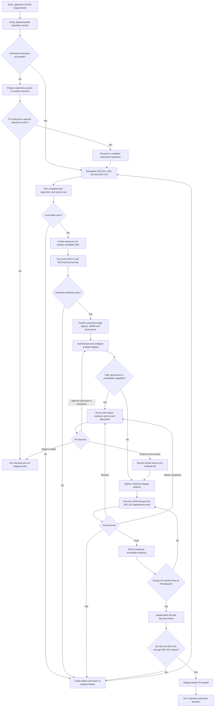

# US-004 — Staging-control wireframes

US-004 adds no host-facing product screen. The operator interface remains the versioned
checklist, machine-readable evidence, GitHub Actions and provider consoles. These
low-fidelity frames define their information hierarchy and state contract; they do not
require a bespoke dashboard.

Visual board:
[US-004 staging-control Canvas](C:/Users/olatu/.cursor/projects/c-Users-olatu-OneDrive-Desktop-wambe/canvases/us-004-staging-controls.canvas.tsx)

## User flow



The flow has three safe exits: unresolved repository access, rejected/deferred provider
decision, or a completed staging-readiness handoff. None authorizes production.

## Information architecture and screen/state inventory

- **OV-01 — Readiness overview**
  - Goal: identify environment, exact release SHA, selected blocker count, 42-control
    progress, waivers and first safe action.
  - Content: `STAGING ONLY`, candidate SHA/digests, five selected findings, seven
    checklist groups, decision dependencies and disabled/enabled review action.
  - Supports: BR-001–BR-003, FR-001–FR-004, FR-016–FR-017, AC-001–AC-003,
    AC-008 and AC-015–AC-018.
- **FIND-01 — Selected-finding closure**
  - Goal: distinguish implementation evidence from independent QA/Security closure.
  - Content: finding ID/severity, owner, expected proof, implementation result, deployed
    result, reviewer, status and safe return path.
  - Supports: BR-006, FR-005–FR-008, AC-004–AC-007 and AC-018.
- **CTRL-01 — Checklist group and control list**
  - Goal: execute exactly 42 controls without losing prerequisite or ownership context.
  - Content: stable control IDs, group counts, status text, prerequisite, owner, latest
    evidence and next safe action.
  - Supports: FR-009–FR-017 and AC-008–AC-015.
- **EVID-01 — Evidence detail**
  - Goal: understand why one control has its displayed status.
  - Content: control ID, status, timestamp, reviewer, redacted references, safe outcome,
    candidate/deployment identity and validation errors.
  - Supports: BR-008, FR-016, NFR-003–NFR-006 and AC-015–AC-016.
- **DEC-01 — Focused PO decision**
  - Goal: stop before a repository, paid, destructive, scope or waiver decision.
  - Content: exact decision, affected control, impact, provider/current-cost evidence,
    no-cost alternative, residual risk and non-preselected actions.
  - Supports: BR-003–BR-005, AC-001, AC-015–AC-016.
- **FAIL-01 — Defect/retest return**
  - Goal: move a failed result to the correct owner without mislabeling it complete.
  - Content: expected versus actual, safe error/request ID, severity, owner, affected
    controls and retest prerequisite.
  - Supports: BR-006, FR-017 and AC-018.
- **FINAL-01 — Staging-readiness summary**
  - Goal: give the PO a bounded decision input.
  - Content: exact SHA/digests/deployments, `PASS` and `WAIVED` totals, five finding
    dispositions, residual findings, independent reviewers and production-unavailable
    statement.
  - Supports: BR-001–BR-003, FR-015–FR-017 and AC-015–AC-018.

`NOT_RUN` is the intentional initial control state, not a blank screen. It must state the
unmet prerequisite and owner. Loading applies only while evidence is being read or a
provider action is executing; it must not erase the last known status.

## Low-fidelity wireframes

### OV-01 — Desktop readiness overview

```text
┌──────────────────────────────────────────────────────────────────────────────┐
│ US-004 · STAGING ONLY         Candidate: unavailable      [Record evidence]  │
├────────────────┬─────────────────────────────────────────────────────────────┤
│ OVERVIEW       │ Readiness: NOT READY · 5 selected blockers                 │
│ Findings       │ ┌──────────────┐ ┌──────────────┐ ┌──────────────┐          │
│ 42 controls    │ │ 0 / 42       │ │ 0 / 5        │ │ 4 decision   │          │
│ Decisions      │ │ pass/waived  │ │ blockers shut│ │ dependencies │          │
│ Evidence       │ └──────────────┘ └──────────────┘ └──────────────┘          │
│                │                                                             │
│                │ RELEASE BASELINE + FINDINGS   CONTROL GROUPS                │
│                │ QA-001 SHA ...... BLOCKED     Build ........ 0 / 5          │
│                │ SEC-011 CVE ..... OPEN        Security/Auth  0 / 11         │
│                │ SEC-012 IAM ..... BLOCKED     Media/Sharing  0 / 12         │
│                │ SEC-013 Profiles  OPEN        Recovery/Ops   0 / 14         │
│                │ SEC-014 Gitleaks  OPEN                                      │
│                │                                                             │
│                │ FIRST SAFE ACTION                                           │
│                │ Verify authorized access to yabdev/wambe. If unavailable,   │
│                │ pause for an explicit repository decision.                  │
│                │ [Open blocker]                                               │
│                │                                                             │
│                │ [Export redacted evidence] [Request review — disabled]      │
├────────────────┴─────────────────────────────────────────────────────────────┤
│ Production promotion is outside US-004 and remains unavailable.              │
└──────────────────────────────────────────────────────────────────────────────┘
```

The overview places the first release-sequencing blocker before provider work. Counts
never treat `FAIL`, `BLOCKED`, `NOT_RUN` or `IN_PROGRESS` as complete.

### OV-01M — Mobile status and first blocker

```text
┌──────────────────────────────────┐
│ US-004 · STAGING ONLY            │
│ NOT READY · 5 blockers           │
├──────────────────────────────────┤
│ Pass or waived          0 / 42   │
│ Selected closures        0 / 5   │
│ Candidate SHA       unavailable  │
├──────────────────────────────────┤
│ FIRST SAFE ACTION                │
│ Verify access to yabdev/wambe.   │
│ Current identity cannot resolve  │
│ the configured remote.           │
│ [Open blocker details]           │
├──────────────────────────────────┤
│ Findings                         │
│ Control groups                   │
│ Decisions                        │
│ Evidence                         │
├──────────────────────────────────┤
│ [Review disabled: 42 incomplete] │
│ [Production unavailable]         │
└──────────────────────────────────┘
```

Mobile uses one ordered flow: summary, blocker, groups, evidence, then actions. It omits
no control, waiver or residual-risk content.

### FIND-01 — Selected-finding detail

```text
┌────────────────────────────────────────────────────────────────────┐
│ ← Selected findings        SEC-012 · Medium              BLOCKED   │
├────────────────────────────────────────────────────────────────────┤
│ Scanner IAM and exact-audience identity                            │
│ Owners: Security + Operations · Supports AC-007 / MEDIA-006        │
│                                                                    │
│ REQUIRED PROOF                                                     │
│ Internal ingress ............................. NOT PROVEN          │
│ No allUsers invoker .......................... NOT PROVEN          │
│ Exact API service-account invoker ............ NOT PROVEN          │
│ Private route + exact-audience ID token/HMAC . NOT RUN             │
│                                                                    │
│ Templates/unit tests cannot close this finding.                    │
│ Evidence: redacted effective IAM + positive/negative calls.        │
│                                                                    │
│ [Return to controls]                      [Mark pass — disabled]    │
└────────────────────────────────────────────────────────────────────┘
```

The closure action becomes available only to the independent owning reviewer after all
required evidence exists. Implementation authors may attach evidence but not self-close.

### CTRL-01 / EVID-01 — Control list and material states

```text
┌────────────────────────────────────────────────────────────────────┐
│ Storage and malware · 0 / 7 complete                               │
├────────────────────────────────────────────────────────────────────┤
│ MEDIA-001  Signed quarantine upload       NOT RUN                  │
│            Prerequisite: Supabase staging storage · Owner: Ops     │
│ MEDIA-002  Clean image/PDF activation     IN PROGRESS              │
│            Started 14:10 UTC · safe progress only                  │
│ MEDIA-003  EICAR rejected                 PASS                     │
│            Evidence: test run 104 · 14:18 UTC · QA reviewer        │
│ MEDIA-004  Malformed/replay/path cases    FAIL                     │
│            Expected/actual + safe request ID · [Create defect]     │
│ MEDIA-005  HMAC + allowed destinations    BLOCKED                  │
│            Missing rotated secret · [Open dependency]              │
│ MEDIA-006  Internal IAM + ID token        BLOCKED                  │
│            SEC-012 deployment proof required                       │
│ MEDIA-007  Aged/deleted object cleanup    WAIVED                   │
│            PO decision, reason, residual risk, actor and date      │
└────────────────────────────────────────────────────────────────────┘
```

The example intentionally shows all six material states:

- `NOT_RUN`: prerequisite and owner are visible.
- `IN_PROGRESS`: start time and non-sensitive progress are visible.
- `PASS`: immutable evidence, timestamp and reviewer are visible.
- `FAIL`: expected/actual and defect/retest path are visible.
- `BLOCKED`: missing dependency or decision and impact are visible.
- `WAIVED`: exact PO decision, reason, residual risk and date are visible.

Status text is mandatory; colour, icon and position may reinforce but never replace it.

### DEC-01 — Focused PO decision

```text
┌────────────────────────────────────────────────────────────────────┐
│ PRODUCT OWNER DECISION REQUIRED                                    │
├────────────────────────────────────────────────────────────────────┤
│ Control: RECOVERY-007 · Supabase restore drill                     │
│ Status: BLOCKED                                                    │
│                                                                    │
│ Provider evidence                                                  │
│ Restore/PITR is unavailable on the selected free tier.             │
│                                                                    │
│ Impact                                                             │
│ US-004 cannot reach 42/42 or staging-ready while unresolved.       │
│                                                                    │
│ Options                                                            │
│ • Keep blocked and stop readiness work                             │
│ • Review documented paid capability and current cost               │
│ • Explicitly waive RECOVERY-007 with residual risk                 │
│                                                                    │
│ [Keep blocked] [Review purchase] [Record explicit waiver]          │
└────────────────────────────────────────────────────────────────────┘
```

No approval or waiver is preselected. Repository, paid, destructive and scope decisions
use the same structure but never combine unrelated controls into one waiver.

### FAIL-01 — Failed control return

```text
┌────────────────────────────────────────────────────────────────────┐
│ MEDIA-004 · FAIL                                     Severity: High │
├────────────────────────────────────────────────────────────────────┤
│ Expected: replayed callback rejected without state change           │
│ Actual: terminal state changed on replay                            │
│ Safe reference: request 7A3… · no body or signed URL                │
│ Affects: AC-011, MEDIA-004, staging-readiness                       │
│ Owner: Backend implementation · Retest: QA + Security               │
│                                                                    │
│ [Create defect and return]                  [Do not mark complete]   │
└────────────────────────────────────────────────────────────────────┘
```

The failure view never offers `Done`. A specific waiver, if requested later, uses DEC-01
and preserves this failure evidence.

### FINAL-01 — Staging-ready summary

```text
┌────────────────────────────────────────────────────────────────────┐
│ US-004 STAGING-READINESS REVIEW                                    │
├────────────────────────────────────────────────────────────────────┤
│ Release SHA ............ 8f3…                                      │
│ API / scanner digests .. sha256:… / sha256:…                       │
│ Vercel deployment ...... deployment-safe-id                        │
│ Controls ............... 39 PASS + 3 PO-WAIVED = 42 / 42           │
│ Selected blockers ...... QA-001 + SEC-011–014 CLOSED               │
│ Critical / High ........ 0 open                                    │
│ Residual risks ......... 3 linked waivers + carried findings       │
│ Independent review ..... QA signed · Security signed               │
│                                                                    │
│ [Export evidence] [Request PO staging-ready decision]              │
├────────────────────────────────────────────────────────────────────┤
│ This is not production approval. Production remains a separate     │
│ governed decision and no promotion action is available here.       │
└────────────────────────────────────────────────────────────────────┘
```

The numbers are an illustrative completed state, not current evidence. Real values must
come from the validated evidence record.

## Interaction and content annotations

- Use direct status labels: `Pass`, `Fail`, `Blocked`, `Waived`, `Not run`,
  `In progress`, `Open` and `Closed`.
- Never label a disposition as `Done`; only `PASS` and explicit PO-`WAIVED` count toward
  42/42.
- The exact release SHA is the primary evidence key and stays visible in every detail
  context once it exists.
- Evidence links use control ID, date and safe artifact name. They do not expose
  secret-bearing provider URLs, tokens, signed URLs or request bodies.
- A status update validates required metadata before saving. Missing reviewer,
  timestamp, evidence or waiver reference produces an inline message and error summary;
  the previous valid status remains visible.
- A running provider action exposes owner, start time, cancellation/return behavior and
  redacted progress. Timeout changes the result to `BLOCKED` or `FAIL`, never `PASS`.
- Opening finding, evidence or decision detail moves focus to its heading; closing
  returns focus to the originating row.
- `FAIL` creates a defect/retest path. `BLOCKED` requests the exact missing dependency.
  A waiver is recorded only after the governed PO command exists.
- The review action explains every incomplete control and remains disabled until the
  validated record contains exactly 42 `PASS`/`WAIVED` results and the selected findings
  are independently closed.
- Confirmation copy always says `staging-ready`, never `production-approved`.
- English is the MVP operator language. Use short sentences, stable control IDs and UTC
  timestamps; show local time secondarily when a provider supplies it.

## Responsive behavior

- **Mobile, 320–767 CSS px:** one ordered column; summary and first blocker precede
  group links; control metadata wraps below status; actions are full width and at least
  48 CSS px high.
- **Tablet, 768–1023 CSS px:** one main column with a compact persistent group index
  when space permits; evidence and decision details remain in document order.
- **Desktop, 1024 CSS px and above:** persistent group navigation plus main evidence
  region; summary statistics may use three columns; finding/control details may sit
  beside decision context.
- At 200% zoom, the experience becomes the mobile reading order without horizontal
  scrolling. No status, waiver, blocker or production-boundary text is removed.
- Provider console layouts are external and may not be responsive or accessible. The
  durable Markdown/evidence record must remain usable without screenshots.

## Accessibility annotations

- One H1 names `US-004`, environment and readiness. H2 sections follow the release
  sequence; control IDs remain in labels.
- A skip link targets the first `FAIL`, `BLOCKED` or incomplete selected finding.
- Navigation has a labelled current location. Group counts are read as text, not only
  visual badges.
- Keyboard order is summary → first blocker/failure → control groups → evidence →
  decision → review action.
- Status changes use a polite live region. A failed deployment, secret exposure or
  destructive-operation warning uses an assertive alert once.
- Error summaries link to missing metadata; focus moves to the summary, then the first
  invalid field.
- Modal decision detail uses an accessible name/description, starts on the safe action,
  traps focus, closes with Escape when no operation is running and restores trigger
  focus.
- Disabled review/production actions have adjacent explanatory text and are not the sole
  way to discover why they are unavailable.
- Status must remain understandable in forced-colours mode and without colour. Text and
  controls meet WCAG 2.2 AA contrast and visible-focus requirements.
- Touch targets are at least 24×24 CSS px with sufficient spacing; primary mobile
  actions use the existing 48 CSS px button height.
- No motion is necessary. Existing reduced-motion behavior removes transitions without
  losing status or progress information.

## Design-system mapping and developer handoff

- Prefer the versioned Markdown checklist, evidence JSON, GitHub Actions summaries and
  provider-native patterns. Do not build a custom dashboard solely to reproduce these
  conceptual frames.
- If the PO later approves a custom viewer, reuse the existing Wambe global tokens:
  `--canvas`, `--surface`, `--surface-soft`, `--ink`, `--muted`, `--line`, `--coral`,
  `--gold`, `--green`, `--danger`, `--warning` and the existing radius/spacing
  conventions.
- Reuse `.container`, `.card`, `.button`, `.alert`, `.sr-only`, `.skip-link` and the
  current `:focus-visible`, forced-colours and reduced-motion behavior.
- Preserve the existing AppShell pattern: desktop side navigation, sticky mobile header
  and a minimum supported width of 320 CSS px.
- Represent control and finding status as typed enums; derive labels, counts and allowed
  actions from state. Never infer `PASS` from an evidence link's existence.
- Keep redacted display metadata separate from secret-bearing provider values.
- No host-facing route, component, maintenance screen or error-copy change is specified.
  Existing authentication, editor, media, sharing and lifecycle UI receives regression
  testing only.
- Automated UX checks, if a viewer is approved, cover text statuses, count semantics,
  disabled-action rationale, focus return, error-summary links, mobile reflow,
  forced-colours and production-boundary copy.

## Usability validation and success signals

Run one lightweight founder/operator desk check before architecture handoff or as its
first validation activity. Using a mixed-state evidence fixture, the operator should
answer within one minute:

1. Is this staging or production?
2. Which release SHA is under review?
3. What is the first blocker and who owns it?
4. How many controls are `PASS`, `WAIVED` and incomplete?
5. What evidence exists for one selected finding?
6. Does the next action require a PO decision?

QA should later exercise `NOT_RUN`, `IN_PROGRESS`, `PASS`, `FAIL`, `BLOCKED`, `WAIVED`
and mixed-state scenarios on desktop and a 320 CSS px viewport using keyboard and a
screen reader.

UX success means zero ambiguous statuses, correct 42-control counting, discovery of the
first blocker without scanning raw logs, no accidental production action, no restricted
value rendered, and no host-flow accessibility regression. These are design-quality
signals, not staging or production evidence.

## Assumptions and open Product Owner decisions

- Approved requirements validate the operator, state model, 42 controls and production
  boundary. No founder research session, support analytics or live staging behavior
  exists; the information hierarchy remains an assumption pending the desk check.
- No custom dashboard is required. If architecture proposes one, it adds authentication,
  authorization, maintenance and implementation scope and must return to UX/PO.
- Repository identity/visibility, provider projects, canonical domain, region and
  provider-console wording are unresolved operational configuration, not UX inventions.
- The backup operator remains unknown. `OPS-007` requires an out-of-repository contact
  or explicit PO waiver; the wireframe never displays private contact details.
- Any maintenance mode, changed host error copy, rollout UI or production control is a
  scope change requiring PO and UX review.
