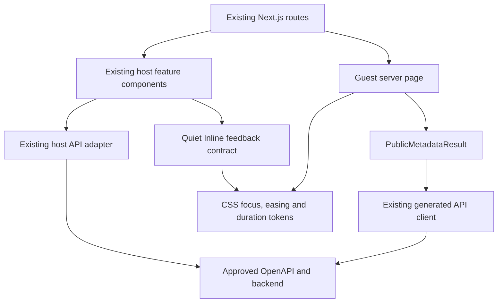

# US-005 — Polish Wambe frontend interactions and motion

## Intake

### Problem

The existing Wambe frontend implements the approved host and guest journeys, but the
Product Owner identifies its interaction quality as unfinished and inconsistent. That
can reduce trust and make state changes, feedback, and next actions less clear even when
the underlying feature works.

The current baseline is the implemented Next.js application and approved US-002 UX:
hosts use a four-step create/publish flow and guests open a shared event page. The app
has automated lint, type, unit, browser, and accessibility checks and can run locally
with synthetic demo data. It has no authenticated staging environment, production
analytics baseline, or completed usability study, so the size of the trust or clarity
problem is not yet quantified.

### Target users and stakeholders

- **Primary users:** Event hosts creating and publishing a Wambe on mobile or desktop,
  and guests viewing the resulting shared-event page.
- **Product stakeholders:** Product Owner/founder, product design, frontend engineering,
  QA, accessibility reviewers, and pilot-support staff.
- **Operational stakeholders:** The US-004 staging/release owners, because frontend
  polish must not weaken release controls or be represented as deployed evidence.

### Desired outcome and success measures

The critical host and guest journeys should feel coherent, responsive, trustworthy, and
purposeful while retaining their approved information architecture, functionality, and
accessibility.

Candidate measures to ratify during requirements:

- **Primary candidate KPI:** At least 80% of a proposed minimum of five host-profile and
  five guest-profile opt-in usability participants complete the representative task
  without moderator intervention.
- **Experience measure:** Median post-task trust/quality rating of at least 4 out of 5,
  with observed hesitation and unclear-feedback moments recorded by task and state.
- **Existing product guardrail:** The eligible first-time host creation-to-publication
  target remains under 180 seconds; polish must not add task steps or measurable delay.
- **Quality guardrails:** Existing functional tests remain green; critical journeys
  produce no serious automated accessibility violations; reduced-motion behavior is
  supported; and no approved high-severity design-engineering finding remains unresolved
  without an explicit Product Owner decision.
- **Evidence and monitoring:** Compare before/after local sessions using synthetic event
  data, Playwright/accessibility results, focused performance measurements, and
  de-identified observation notes. Review findings at UX, QA, and post-implementation
  checkpoints rather than adding product telemetry in this story.

These measures cannot establish production conversion impact. The small opt-in sample,
local demo behavior, evaluator subjectivity, device mix, and synthetic content limit
generalization; usability results must report participant profile, device, task, and
moderator assistance.

### Scope, constraints, dependencies, and priority

- **Priority:** P1. Prepare this work while US-004 release activity is paused; do not
  reinterpret it as completion of the blocked staging controls.
- **First-priority surfaces:** The host create/publish journey and the guest
  shared-event page. Related existing components may receive consistent tokens and
  behavior where necessary, but every expansion must support those journeys.
- **In scope at intake:** Audit existing interaction and motion behavior; identify
  clarity, feedback, cohesion, accessibility, and performance opportunities; create
  isolated prototypes for materially different choices; obtain Product Owner selection;
  and apply approved polish without changing feature semantics.
- **Out of scope:** New product features, backend or API-contract changes, navigation or
  information-architecture redesign, production/staging deployment, new behavioral
  tracking, and changes made only for decorative novelty.
- **Design constraints:** Preserve approved US-002 flows, content meaning, responsive
  behavior, WCAG 2.2 AA obligations, keyboard and screen-reader operation, and
  reduced-motion support. Prototype before production changes and avoid animation where
  frequency, performance, or clarity argues against it.
- **Data and privacy:** Use synthetic event content and opt-in, de-identified usability
  notes only. Do not collect names, event details, contact data, recordings, or new
  interaction telemetry as part of this story.
- **Dependencies:** The implemented `apps/web` baseline, approved US-002 UX artifacts,
  local demo environment, existing browser/accessibility tests, installed Emil Kowalski
  design-engineering skills, Product Owner prototype choices, and access to representative
  usability participants or clearly labelled proxies.

### Open questions

- Confirm during requirements whether the proposed five-host/five-guest sample and
  80%/4-of-5 thresholds are proportionate for this pre-staging P1 story.
- Decide whether proxy participants are acceptable when representative hosts or guests
  are unavailable, and label resulting evidence accordingly.
- Define the focused frontend performance budget and measurement device/network profile
  before implementation.

## Requirements

### User story and business value

**Primary host story:** As an event host, I want the create-and-publish journey to
respond clearly and consistently so that I can trust every save, validation, upload,
publish, and share action without slowing down or learning a changed workflow.

**Primary guest story:** As a guest, I want the shared-event page and its loading,
access, content, and sharing states to feel clear and trustworthy so that I can
understand the event without uncertainty or distracting motion.

**Business value:** Higher perceived quality and clearer feedback protect confidence in
Wambe's core acquisition and sharing loop. This story improves that experience without
adding feature, backend, analytics, or release-infrastructure scope.

**Current process:** Hosts and guests use the implemented US-002 journeys. Existing
automated tests verify behavior and accessibility, but there is no systematic
design-engineering audit, measured motion baseline, authenticated staging evidence, or
structured usability baseline.

**Proposed process:**

1. Capture a repeatable synthetic baseline for the two critical journeys.
2. Audit existing interaction, visual-feedback, motion, accessibility, and performance
   behavior using the approved design-engineering guidance.
3. Prioritize findings by user impact and frequency; explicitly recommend no animation
   where motion would add delay or noise.
4. Prototype materially different choices in an isolated surface without modifying
   production components.
5. Obtain Product Owner selection before promoting a prototype.
6. Implement only selected changes, run automated regression and performance checks,
   and then conduct the approved opt-in usability sessions.
7. Record results and unresolved risks without representing local evidence as staging or
   production validation.

### In scope / out of scope

**In scope**

- The host dashboard entry point, four-step create/publish editor, publication success,
  and immediate share actions required for the critical host journey.
- The guest shared-event page's loading, accessible-content, visibility/access-denied,
  error, and share states required for the critical guest journey.
- State feedback for navigation, saving, validation, map confirmation, media
  upload/scanning, publishing, copying, sharing, retrying, and destructive
  confirmations where those states already exist.
- Motion and transition decisions, reduced-motion equivalents, interaction timing,
  focus behavior, and small component-level refinements to spacing, elevation, borders,
  active states, and feedback presentation.
- Reuse or refinement of existing design tokens and components when needed for
  consistency across the scoped journeys.
- Isolated prototypes, synthetic baseline evidence, automated checks, and structured
  opt-in usability sessions.

**Out of scope**

- New product features, fields, event types, visibility modes, user roles, or workflow
  steps.
- Navigation, information architecture, brand identity, or broad typography/colour
  redesign.
- Backend, database, OpenAPI, generated-client, authentication, storage, scanner, or
  analytics-contract changes.
- New behavioral telemetry, participant recordings, personal event content, or
  production-data collection.
- Staging/production deployment or evidence for the separate US-004 release controls.
- Decorative animation without a documented clarity, feedback, spatial, or rare-delight
  purpose.

### Functional and non-functional requirements

**Functional requirements**

- **US5-FR-001 — Baseline inventory:** Record every screen and material state in the
  critical host and guest journeys before proposing changes, including viewport,
  input method, motion preference, and synthetic scenario.  
  **Value/measure:** Prevents hidden scope and enables before/after comparison; measured
  by complete traceability to the approved journey inventory.
- **US5-FR-002 — Design-engineering audit:** Review each inventoried interaction for
  purpose, frequency, feedback clarity, easing/duration, physical origin,
  interruptibility, rendering cost, accessibility, and cohesion. Findings must include
  evidence, severity, and a keep/change/remove recommendation.  
  **Value/measure:** Focuses effort on trust and clarity; measured by no unaudited
  interaction in the critical inventory.
- **US5-FR-003 — Prototype-first decisions:** Materially different interaction or
  presentation choices must be built as up to three functional, isolated variants using
  realistic synthetic content. Production code may be changed only after the Product
  Owner selects a variant or explicitly accepts a single justified direction.  
  **Value/measure:** Reduces subjective rework; measured by a recorded choice for each
  material change.
- **US5-FR-004 — Host feedback:** Existing step changes, autosave, validation, map,
  upload/scan, publish, copy, share, retry, and confirmation operations must communicate
  initiation, progress, success, and recoverable failure without losing entered data or
  adding a workflow step.  
  **Value/measure:** Improves host confidence; measured by state coverage and the host
  task-completion evidence.
- **US5-FR-005 — Guest feedback:** Existing shared-event loading, content, restricted,
  unavailable, and share states must have clear hierarchy and feedback without exposing
  protected event information or changing visibility semantics.  
  **Value/measure:** Improves guest trust while preserving privacy; measured by state
  coverage and the guest task-completion evidence.
- **US5-FR-006 — Motion restraint:** Every retained or added animation must have a
  documented purpose and frequency classification. High-frequency and
  keyboard-initiated actions must remain immediate unless UX records a specific
  accessibility-supported exception.  
  **Value/measure:** Prevents polish from feeling slow; measured by the approved motion
  inventory and review.
- **US5-FR-007 — Product Owner selection:** Prototype choices and any request to leave a
  high-severity finding unresolved require an explicit Product Owner decision recorded
  in the story artifacts.  
  **Value/measure:** Preserves product authority; measured by decision traceability.
- **US5-FR-008 — Usability evidence:** Execute the approved representative tasks with at
  least five host-profile and five guest-profile opt-in participants after
  implementation. Record task completion, moderator assistance, hesitation points, and
  a 1–5 trust/quality rating using de-identified notes.  
  **Value/measure:** Tests whether polish is perceptible and useful; measured by the
  thresholds in US5-AC-009.

**Non-functional requirements**

- **US5-NFR-001 — Accessibility:** Preserve WCAG 2.2 AA, keyboard operation, logical
  focus movement, screen-reader status communication, forced-colour support, 200% text
  zoom, 44×44 CSS-pixel touch targets, and a complete `prefers-reduced-motion`
  alternative.  
  **Value/measure:** Prevents exclusion and regression; measured by automated and manual
  checks in US5-AC-007.
- **US5-NFR-002 — Performance:** On one architecture/QA-recorded repeatable mobile
  Chromium profile, the critical pages must meet LCP ≤2.5 seconds, INP ≤200 ms, and
  CLS ≤0.1 and must not regress any measured metric by more than 10% from the baseline.
  Identical tooling, build mode, device, network, and sample method must be used for the
  comparison.  
  **Value/measure:** Keeps polish responsive; measured by retained before/after results.
- **US5-NFR-003 — Functional stability:** Existing lint, type, unit, browser,
  accessibility, and production-build checks must pass; approved event semantics and
  stored demo data must remain compatible.  
  **Value/measure:** Protects the completed product; measured by the verification suite.
- **US5-NFR-004 — Privacy:** Use synthetic event data and de-identified, opt-in
  participant notes. Add no tracking and retain no names, contact details, recordings,
  real event content, tokens, or signed URLs.  
  **Value/measure:** Minimizes privacy risk; measured by evidence review.
- **US5-NFR-005 — Responsive compatibility:** Preserve the existing mobile-first flow
  from 320 CSS pixels through desktop layouts, including touch, mouse, keyboard, long
  labels, and platform text scaling.  
  **Value/measure:** Keeps both target audiences supported; measured by the responsive
  test matrix.
- **US5-NFR-006 — Maintainability and cost:** Prefer existing CSS and components. A new
  UI or motion dependency requires architecture approval, a documented need that cannot
  be met safely with the existing stack, current maintenance/licence evidence, and no
  paid service.  
  **Value/measure:** Avoids unnecessary supply-chain and operating cost; measured by
  dependency-diff review.

### Business rules and dependencies

- Approved US-002 functionality, information architecture, content meaning, visibility
  semantics, API contracts, and accessibility requirements are immutable inputs. A
  conflict must be raised as a blocker rather than silently rewritten.
- The Product Owner owns prototype selection and product trade-offs. UX owns the
  interaction specification; architecture owns performance methodology and dependency
  decisions; frontend implementation owns only the approved production changes; QA owns
  independent acceptance evidence.
- Use the Emil Kowalski skills as advisory inputs, not as authority over approved Wambe
  requirements. Repository governance, accessibility, security, and measured product
  needs take precedence.
- Clearly labelled proxy participants are permitted only when representative users are
  unavailable. Proxy results must be reported separately and cannot be described as
  representative-user validation.
- The host usability task is to start a new synthetic event, complete the existing
  required steps, publish it, and reach a successful share action. Authentication time,
  resumed drafts, and staff assistance remain excluded from the 180-second guardrail.
- The guest usability task is to open a synthetic shared-event link, identify the
  essential event details and access state, and complete the existing share action where
  permitted.
- No participant session may use personal accounts, real event data, or staging/production
  credentials. Consent may be recorded as a session identifier and yes/no status without
  identity data.
- The performance baseline must be captured before implementation from a production
  build, and the same profile must be rerun after implementation. If local noise makes a
  10% comparison inconclusive, QA records repeated samples and reports the median rather
  than selecting a favourable run.
- US-004 remains a separate release gate. US-005 may prepare and validate locally but
  cannot claim deployed readiness or complete any of its 42 staging controls.

### Acceptance criteria

- **US5-AC-001 — Scope preservation**  
  **Given** the approved US-002 host and guest journeys, **when** the US-005 design is
  compared with them, **then** screens, workflow steps, feature semantics, visibility
  rules, API contracts, and navigation remain unchanged, except for approved
  component-level presentation and feedback refinements.
- **US5-AC-002 — Complete baseline and audit**  
  **Given** the critical host and guest inventories, **when** the design-engineering
  audit is handed off, **then** every material state and interaction traces to
  US5-FR-001/002 with evidence, frequency, purpose, accessibility/performance impact,
  severity, and a keep/change/remove recommendation.
- **US5-AC-003 — Prototype before promotion**  
  **Given** a material interaction or visual choice, **when** production implementation
  begins, **then** an isolated functional prototype or justified single direction exists
  and the Product Owner's selection is recorded; no prototype code is imported into
  production merely because it was explored.
- **US5-AC-004 — Host journey clarity**  
  **Given** each existing host operation named in US5-FR-004, **when** it is idle,
  initiated, pending, successful, invalid, or recoverably failed as applicable, **then**
  the state and next action are perceivable without colour alone, input is preserved,
  focus/status behavior is appropriate, and no new workflow step is introduced.
- **US5-AC-005 — Guest journey clarity and privacy**  
  **Given** synthetic public and restricted guest links, **when** loading, available,
  unavailable, denied, or shareable states occur, **then** the hierarchy and action are
  clear while protected event content and ownership remain undisclosed.
- **US5-AC-006 — Purposeful, interruptible motion**  
  **Given** an approved animation, **when** it enters, exits, is interrupted, repeats
  frequently, or runs with reduced motion enabled, **then** it follows its documented
  purpose and timing, does not delay keyboard/high-frequency work, uses compositor-safe
  properties where feasible, and has an equivalent non-motion state.
- **US5-AC-007 — Accessibility guardrail**  
  **Given** the scoped journeys at mobile and desktop widths, **when** automated axe
  checks and manual keyboard, focus, screen-reader-status, zoom, target-size,
  forced-colour, and reduced-motion checks run, **then** there are no serious or critical
  violations and no regression from the approved baseline.
- **US5-AC-008 — Performance budget**  
  **Given** the recorded mobile production-build profile and baseline, **when** the same
  measurements run after implementation, **then** LCP is ≤2.5 seconds, INP is ≤200 ms,
  CLS is ≤0.1, and no metric regresses by more than 10%; otherwise the gate remains
  blocked pending remediation or an explicit Product Owner decision.
- **US5-AC-009 — Usability threshold**  
  **Given** at least five host-profile and five guest-profile opt-in sessions, **when**
  the representative tasks are completed, **then** at least 80% in each profile finish
  without moderator intervention and each profile's median trust/quality rating is at
  least 4 out of 5. Proxy results are reported separately and do not satisfy this
  criterion unless the Product Owner explicitly accepts the limitation.
- **US5-AC-010 — Regression verification**  
  **Given** the selected implementation, **when** lint, type checking, unit tests,
  browser/accessibility tests, and the production build run, **then** all pass and the
  synthetic host and guest smoke journeys retain their existing outcomes.
- **US5-AC-011 — Privacy and evidence hygiene**  
  **Given** audit, prototype, performance, and usability evidence, **when** it is
  retained, **then** it contains only synthetic content, de-identified session IDs,
  consent status, measurements, and redacted observations—never credentials, signed
  URLs, personal details, recordings, or real events.
- **US5-AC-012 — Dependency and release separation**  
  **Given** the final diff and story claims, **when** architecture and QA review them,
  **then** there are no backend/API/analytics changes, every new frontend dependency has
  prior architecture approval, no paid service is introduced, and no US-004 staging
  control is claimed complete.

### Open questions

None requiring a Product Owner decision at requirements handoff. UX and architecture
must still specify the exact inventory, prototype candidates, performance tool/profile,
baseline capture procedure, and representative synthetic scenarios within these
approved boundaries.

## UX

### User journey and flows

**Evidence status:** The implemented host dashboard, desktop/mobile editor, and guest
page were inspected locally with synthetic demo data. Routes, components, CSS, and tests
were reviewed against the approved US-002 UX. No representative-user study,
authenticated staging run, production analytics, or performance baseline exists, so the
polish direction remains a testable design hypothesis.

**Host journey**

1. Open `My Wambes`; receive a stable loading, actionable failure, empty, or populated
   state.
2. Create or resume a draft without changing the existing navigation.
3. Complete the existing four steps—Basics, Venue, Invitation and style, then Privacy
   and publish—with autosave and one primary action per step.
4. Receive clear, persistent, data-preserving feedback for save, map, upload/scan,
   validation, offline, and publish states.
5. Publish, then use the existing host Copy link or WhatsApp action when eligible;
   protected modes retain the current share-blocked explanation.
6. Exit to `My Wambes`; when work is unsaved, use a safe leave confirmation.

**Guest journey**

1. Open a shared event link and see a stable invitation-shaped loading shell.
2. If public metadata is available, read the existing title, Lagos-local date/time,
   permitted venue, and Wambe attribution.
3. If the link is restricted, unpublished, deleted, or unknown, receive one neutral
   unavailable state that discloses no protected event or ownership information.
4. If the frontend can distinguish a transient failure without changing the API
   contract, receive neutral Retry and Return actions.
5. Exit after reading the metadata or access state.

The Product Owner clarified on 2026-07-31 that the implemented metadata-only guest page
does not gain a guest-side Copy or Share action. Host publication sharing remains
unchanged.

### Screens, components, content, and states

The complete traceable inventory and labelled low-fidelity frames are in
[WIREFRAMES.md](WIREFRAMES.md). It covers:

- Dashboard loading, failure, empty, draft, and published states.
- Editor opening/unavailable; all four steps; autosave dirty/saving/saved/failed;
  offline; unsaved Exit; validation summary; publishing/failure; success/copy/share
  eligible/share blocked.
- Existing published-management and confirmation-dialog adjacency where feedback
  consistency is affected.
- Guest loading, available metadata, neutral unavailable, recoverable error, and
  reduced-motion/forced-colour variants.
- Mobile, tablet, desktop, keyboard, pointer/touch, and motion-preference annotations.

**Verified current gaps to address without changing flow or contracts**

- Editor, management, and success loading states use inconsistent or incomplete status
  semantics; failed fetches can leave indefinite loading.
- Publication success currently nests a second `main` landmark inside the host shell.
- Save failure has low-prominence Retry feedback, and in-app Exit lacks the approved
  unsaved-work confirmation.
- The guest route has no stable loading shell or branded neutral unavailable/retry
  presentation; demo mode cannot reproduce non-available outcomes.
- Guest, reduced-motion, 320 px, dialog accessibility, and most intermediate feedback
  states lack automated browser coverage.
- Venue pin controls reference an undefined `--focus` token.

**Content and hierarchy**

- Preserve the premium editorial, warm celebratory direction, existing navigation, and
  approved labels/visibility meaning.
- Use human status language such as `In progress`, `All changes saved`, `Save failed`,
  `Your draft is still here`, and one explicit next action.
- Keep errors local when recovery is local; use a focused summary only for cross-step
  publish validation.
- Guest unavailable copy never uses `private`, `deleted`, `owner`, or event-identifying
  content.
- Invitation artwork remains the visual focus; component-level spacing, borders,
  elevation, active states, and feedback presentation may be refined without a brand
  redesign.

**Feedback-pattern prototype directions**

- **Quiet Inline:** Routine status remains in the header and failures sit beside the
  affected control. Lowest visual weight; cross-step failures may be easier to miss.
- **Guided Rail:** One bounded rail between content and actions names the operation,
  consequence, and next action. Strongest cross-state consistency; uses more mobile
  vertical space.
- **Focused Action:** The action zone expands around the primary decision while an
  operation is pending or failed. Strong proximity; produces a denser footer.

These directions differ by interaction model, not colour. `UX-DEC-001` requires the
Product Owner to select one or explicitly authorize a documented hybrid before
architecture.

**Motion decisions**

- Do not animate keyboard-initiated or high-frequency interactions.
- Pointer/touch press feedback may use `scale(0.97–0.98)` for 100–160 ms.
- Necessary status insertion may use opacity plus no more than 4 px translation for
  150–180 ms with `cubic-bezier(0.23, 1, 0.32, 1)`.
- Retain a 200–240 ms progress-width transition; step content and focus change
  immediately.
- Dialogs may use a centered 200–240 ms opacity/scale entrance from at least 0.96.
- Rare publish success may use one non-blocking entrance under 300 ms; never loop it.
- Use named `transform`/`opacity` properties, not `transition: all`; no `ease-in` UI
  entrances and no animation from `scale(0)`.
- Reduced motion renders the final static state with identical content, feedback, focus,
  and completion timing.

### Responsive and accessibility requirements

**Responsive**

- At 320–767 CSS px, use one column, 12–16 px gutters, full-width inputs, textual step
  progress, full-width map/media, and an action area that does not cover focused fields.
- At 768–1023 px, retain the same task order in a centered editor up to 42 rem; dashboard
  cards may use two columns.
- At 1024–1179 px, show persistent host navigation while preserving one readable task
  column.
- At 1180 px and above, add the existing sticky contextual preview beside the task
  column. It remains supplementary and contains no required-only information.
- The guest invitation keeps a centered reading width and must not clip at 200% zoom or
  rely on fixed viewport height.

**Accessibility**

- Meet WCAG 2.2 AA with one `main` landmark and one descriptive `h1` per page.
- Keep the skip link, visible focus, logical heading hierarchy, persistent labels,
  associated help/errors, native radio semantics, and 44×44 CSS-pixel actions.
- Focus each editor step heading after navigation; focus the linked validation summary
  after a publish attempt; restore dialog trigger focus.
- Use a single restrained polite live region for routine save/progress states. The first
  blocking failure is persistent and actionable; repeated updates do not spam
  announcements.
- Loading regions have an accessible name and busy state; motion is never the only
  indication.
- Dialogs have accessible names/descriptions, safe-action initial focus, contained
  focus, Escape support, and trigger-focus restoration.
- Verify keyboard-only use, screen-reader status, 200% text/browser zoom, forced colours,
  platform scaling, long Nigerian names/diacritics, and `prefers-reduced-motion`.
- Neutral guest errors disclose no protected metadata or ownership information.

### Wireframes or prototype links

Durable wireframes: [WIREFRAMES.md](WIREFRAMES.md)

Visual Canvas board:
[US-005 frontend polish wireframes](C:/Users/olatu/.cursor/projects/c-Users-olatu-OneDrive-Desktop-wambe/canvases/us-005-frontend-polish-wireframes.canvas.tsx)

The Canvas shows connected host/guest flows, mobile and desktop editor frames, guest
states, and an interactive selector for the three actionable-feedback directions. It is
an isolated design artifact and does not import from or modify production UI code.

**Validation plan**

- Capture before/after synthetic states at 320×568, 412×915, and 1280×800 using the same
  production build and scenario identifiers.
- Extend the existing host happy-path reference with design evidence for save failure,
  offline, upload/scan, protected-mode sharing, publish failure, dialogs, and guest
  states.
- Check default/reduced motion, keyboard focus, forced colours, 200% zoom, target size,
  and automated accessibility at each critical surface.
- After implementation, run the approved five host-profile and five guest-profile
  opt-in sessions. Target at least 80% unassisted completion per profile and a median
  trust/quality rating of at least 4/5.
- Use synthetic content and de-identified session IDs/notes only. Report proxies
  separately and never retain recordings, names, credentials, signed URLs, or real
  events.

### Risks and open decisions

- **UX-DEC-001 — Product Owner selection required:** `Quiet Inline`, `Guided Rail`,
  `Focused Action`, or an explicitly authorized hybrid.
- Guest unavailable/retry frames are requirements-derived. The current demo always
  returns metadata and the production client collapses failures to `notFound`;
  architecture must decide which neutral states can be distinguished without changing
  the API contract or leaking protected information.
- A consistent loading shell and status contract can reduce perceived uncertainty but
  must still meet the architecture-owned Core Web Vitals baseline and ≤10% regression
  rule.
- The current evidence is local and synthetic. UX approval confirms the design
  specification, not usability success, performance compliance, staging readiness, or
  completion of any US-004 control.
- Representative participant availability remains a later QA dependency; proxy evidence
  cannot silently satisfy US5-AC-009.

## Architecture

### Context and selected approach

**Impact level:** Moderate frontend-only change. The route map, user flows, backend,
OpenAPI, generated-client source, persistence, authentication, visibility semantics, and
deployment topology remain unchanged. The affected risk is concentrated in client-side
state feedback, server-rendered guest outcome classification, accessibility, and
performance.

**Selected approach:** Add a small presentation-layer feedback contract around the
existing feature components:

1. Keep routine host save status in the existing editor header and place recoverable
   failures beside the affected operation, implementing the Product Owner-selected
   **Quiet Inline** direction.
2. Add stable loading/error completion to existing host surfaces without replacing
   their API adapters or flow orchestration.
3. Replace the guest adapter's `metadata | null` collapse with a private frontend
   discriminated union that safely distinguishes available, neutral-unavailable, and
   retryable outcomes while keeping 404, 410, restricted, unpublished, deleted, and
   unknown cases visually indistinguishable.
4. Use CSS custom properties and existing CSS modules for the approved motion contract;
   add no runtime UI or motion dependency.
5. Capture a production-build performance baseline before source implementation, then
   rerun the identical profile after implementation.



This is the simplest design that meets the approved scope. It does not introduce a
design-system framework, generalized state library, client-side guest SPA, feature flag,
new telemetry, paid service, or backend change.

### Components, interfaces, and data

**Affected host boundaries**

- `EventDashboard` retains ownership of list loading/events/error and gains a Retry
  completion plus human-readable status copy.
- `EventEditor` remains the orchestration owner for draft creation/load, the four steps,
  autosave generations, conflict reconciliation, publish idempotency, navigation, and
  focus. Small presentational helpers may be extracted for the editor header, inline
  failure, unsaved-exit dialog, and validation summary; API calls and generation refs
  stay in `EventEditor`.
- `VenuePicker` and `MediaUploader` retain local operation state and expose their
  existing failures inline. They consume the shared focus/motion tokens but do not move
  their state into a global store.
- `PublishSuccess` gains explicit loading/error completion, removes its nested `main`
  landmark, and keeps visible plus screen-reader copy confirmation.
- `EventManager` gains explicit load error/Retry and complete native-dialog focus
  behavior; unpublish/delete semantics remain unchanged.
- `AppShell` and route navigation remain unchanged.

**Affected guest boundaries**

- `public-api.ts` owns transport/status classification and exports only the safe
  `PublicMetadataResult`.
- `app/e/[slug]/page.tsx` remains a server component and renders available,
  neutral-unavailable, or retryable content. It never receives raw status/error details.
- `generateMetadata` uses the same request-cached resolver as the page: available emits
  current canonical/OG data; all other outcomes emit generic no-index metadata without
  title, event description, canonical URL, or preview.
- `loading.tsx` supplies a static invitation-shaped shell. A minimal client Retry control
  may call `router.refresh()` for `retryable`; it stores no event or error data.
- Guest unavailable/retry presentation reuses the invitation frame and current page CSS;
  there is no guest-side Copy or Share action.

**Shared presentation**

- Add semantic CSS tokens for focus, strong ease-out, press, status, progress, dialog,
  and rare-success durations in `globals.css`.
- Retain existing global reduced-motion behavior and add component-specific final-state
  rules where a blanket near-zero duration would leave a spinner or shimmer misleading.
- Prefer local components over a broad feedback framework. A reusable inline failure is
  allowed only if at least two scoped surfaces require identical semantics.

**Data**

- No database, migration, stored event, analytics, or backend DTO change.
- Demo-only guest slugs may deterministically produce unavailable/retryable outcomes for
  synthetic tests. This behavior is compiled only behind the existing demo-mode branch.
- No error body, request ID, HTTP status, slug-derived protected detail, or participant
  data is stored on the guest surface.

### API, event, and integration contracts

**Frozen external contracts**

- `openapi-v1.yaml` remains version `1.0.0`.
- `GET /public/events/{slug}/metadata` keeps current `200`, `404`, and `410` behavior.
- Generated `@wambe/api-client` files are not manually edited.
- Host save/publish idempotency, version-conflict handling, visibility, and canonical URL
  semantics remain unchanged.
- No event, telemetry, or backend integration contract is added.

**Architecture-owned internal contract**

```typescript
type PublicMetadataResult =
  | { kind: "available"; metadata: PublicEventMetadata }
  | { kind: "unavailable" }
  | { kind: "retryable" };
```

Classification rules:

- Valid `200` metadata becomes `available`.
- `404` and `410` both become `unavailable`; the UI never distinguishes missing,
  restricted, unpublished, deleted, or unknown.
- Network failure, timeout, `429`, `5xx`, malformed success payload, and unexpected
  status become `retryable`; public UI receives no status or error envelope.
- Missing deployed API configuration remains fail-closed as `unavailable`.
- Demo mode returns `available` normally and reserves documented synthetic suffixes for
  unavailable/retryable test fixtures.

The generated client is configured with a ten-second abort signal and no-store server
fetch. There is one request attempt per render—no hidden automatic retry. A React
request cache deduplicates `generateMetadata` and page resolution for the same slug.
User Retry performs a fresh server render.

The `available` branch validates the generated model's required shape and a finite event
date before rendering. Invalid data is `retryable`, never a partial invitation.

**Host state contracts**

- Existing `SavePhase` values remain `idle`, `dirty`, `saving`, `saved`, `failed`, and
  `offline`; copy is aligned to `All changes saved`, `Save failed`, and
  `Your draft is still here`.
- Unsaved Exit is derived from `dirty | saving | failed | offline`; it does not introduce
  a persistence state or change `beforeunload`.
- Load surfaces use local `loading | ready | error` state. Do not create a repository-wide
  async-state abstraction.
- Publish retains local idle/publishing/failure plus the existing validation summary and
  idempotency key.

### Quality attributes, resilience, security, cost, and observability

**Accessibility**

- One main landmark and one page `h1`; remove the nested success landmark.
- Loading regions expose text, name, and busy/status semantics.
- Routine autosave uses one restrained polite live region. Save/offline/publish failure
  is persistent, visible, and colocated with recovery without duplicate announcements.
- Validation focuses the linked summary; step changes focus the step heading.
- Native dialogs receive names/descriptions, safe-action initial focus, Escape, contained
  focus, and trigger-focus restoration.
- Preserve 44×44 targets, forced-colour behavior, 200% zoom, keyboard operation, and
  static reduced-motion equivalents.

**Motion and rendering**

- No new motion dependency.
- Tokens: press 120 ms, status 160 ms, progress 220 ms, dialog 220 ms, rare success
  280 ms, and `cubic-bezier(0.23, 1, 0.32, 1)` strong ease-out.
- Pointer/touch press feedback uses `scale(0.98)`; keyboard interactions remain
  immediate.
- Status uses only opacity and at most 4 px translation; dialogs use opacity/scale from
  at least 0.96; no `transition: all`, `ease-in` entrance, layout animation, or looped
  celebration.
- Reduced motion renders the final state without delay. Dashboard/loading skeletons are
  static rather than continuously shimmering.

**Performance profile and budget**

- Baseline must be captured before `[FE-01]` source changes from a production Next.js
  build served locally.
- Record browser/OS/build commit, viewport 412×915, device scale, four-times CPU
  slowdown, simulated mobile network profile, cache state, scenario, and tool version.
- Measure `/events`, a stable synthetic editor URL, publication success, and one
  available guest URL. Run three cold samples per surface and compare medians.
- LCP and CLS use navigation/PerformanceObserver evidence. The representative scripted
  host interactions also collect Event Timing entries; the largest interaction candidate
  must remain ≤200 ms.
- Because the story prohibits new tracking and has no production traffic, the local
  Event Timing value is a **lab interaction-latency proxy**, not field INP. Evidence must
  not claim production Core Web Vitals validation.
- Gate targets remain LCP ≤2.5 s, CLS ≤0.1, lab interaction candidate ≤200 ms, and no
  measured median regression above 10%.

**Resilience and consistency**

- Guest fetch has a ten-second timeout and user-triggered Retry only.
- Host generation guards, in-flight save deduplication, version reconciliation,
  `flushLatest`, and publish idempotency remain unchanged.
- In-app Exit confirmation complements rather than replaces browser `beforeunload`.
- Saved/idle exits remain immediate. Dirty/saving/failed/offline exits require a safe
  confirmation and truthful copy; leaving does not promise an unfinished save.
- A rejected host fetch transitions to actionable error, never indefinite loading.

**Security and privacy**

- 404/410/restricted outcomes share identical neutral guest copy to avoid existence,
  deletion, ownership, or visibility disclosure.
- Guest errors never render backend messages, request IDs, slugs, tokens, signed URLs,
  or response bodies.
- Demo and test evidence uses synthetic events only.
- Usability notes remain opt-in and de-identified; this architecture adds no analytics
  or recording.

**Cost, scalability, and observability**

- No paid service, hosted dependency, runtime package, new endpoint, or database load.
- Request deduplication avoids the current duplicate guest fetch per document render.
- No product telemetry is added. Verification evidence consists of deterministic tests,
  redacted local performance artifacts, and later de-identified usability results.

### Migration, rollout, rollback, and validation plan

**Migration and compatibility**

- No data/schema/API migration.
- Existing demo localStorage remains readable.
- External URLs and route shapes remain stable.
- CSS and component changes are backward-compatible presentation changes.

**Rollout**

1. `[INT-00]` Capture and retain the pre-change production-build visual/performance
   baseline before editing source.
2. Implement the frontend slices in order, keeping each slice independently testable.
3. Run lint, type checking, unit tests, Playwright desktop/mobile/320 px checks, axe,
   reduced-motion/keyboard checks, and production build.
4. Rerun the identical performance profile and compare medians.
5. Conduct the approved representative usability sessions only after automated and
   manual regression checks pass.
6. Treat all evidence as local; do not claim US-004 staging readiness.

**Rollback**

- Revert the US-005 frontend diff and demo fixtures as one release unit or slice by
  slice.
- No database rollback, generated-client regeneration, feature-flag cleanup, or backend
  revision is required.
- If the internal guest outcome adapter regresses, restore the prior neutral
  `metadata | null` collapse while preserving the OpenAPI/backend unchanged.

**Validation ownership**

- Frontend implementation owns component/unit/browser checks and baseline capture.
- QA independently reruns acceptance, accessibility, performance comparison, and
  usability traceability.
- Security verifies neutral guest failure behavior and evidence hygiene.
- Operations confirms no new deployment/runtime dependency and keeps US-004 release
  claims separate.

### Alternatives, risks, and ADRs

**ADR-US5-001 — Quiet Inline feedback**

- **Decision:** Routine status stays in the editor header; recovery appears beside the
  affected operation; cross-step validation retains a focused summary.
- **Alternatives:** Guided Rail and Focused Action.
- **Rationale:** Explicit Product Owner selection after prototype review.
- **Consequence:** Lowest visual weight, but implementation and QA must ensure
  cross-step failures are not too easy to miss.

**ADR-US5-002 — CSS-only motion**

- **Decision:** Existing CSS modules plus semantic tokens.
- **Alternative:** Motion/animation library.
- **Rationale:** Current interactions do not require gesture physics; CSS meets the
  approved timing/reduced-motion contract with no bundle or supply-chain increase.

**ADR-US5-003 — Private guest outcome union**

- **Decision:** `available | unavailable | retryable` inside `apps/web`.
- **Alternatives:** Keep `metadata | null`; change backend error schema; client-side
  refetch SPA.
- **Rationale:** Adds safe recovery and stable SSR states while preserving frozen
  contracts and metadata rendering.

**ADR-US5-004 — Collapse unavailable semantics**

- **Decision:** 404 and 410 have identical guest presentation.
- **Alternative:** Tell guests an event was deleted.
- **Rationale:** Distinct copy would reveal prior event existence and weaken the neutral
  privacy boundary.

**ADR-US5-005 — Server-rendered guest page**

- **Decision:** Retain the server component, add `loading.tsx`, request deduplication,
  and a minimal Retry control.
- **Alternative:** Convert to a client-fetching page.
- **Rationale:** Preserves SEO/canonical behavior, reduces JavaScript, and avoids a new
  client state surface.

**ADR-US5-006 — Native dialogs**

- **Decision:** Use the existing native `<dialog>` approach for unsaved Exit and repair
  management-dialog semantics/focus.
- **Alternative:** Add a modal library or custom focus trap.
- **Rationale:** Smallest accessible approach with no dependency when implemented and
  tested correctly.

**Key risks and assumptions**

- The approved requirements still contain guest-share wording superseded by the recorded
  Product Owner clarification. Implementation and QA follow the clarification: no
  guest-side share action.
- Demo fixtures cannot prove production provider behavior; they only make frontend states
  deterministic.
- True field INP and conversion impact remain unavailable without production traffic or
  telemetry; the lab interaction candidate is explicitly limited evidence.
- Representative participant availability can block US5-AC-009 later.
- The current dev server is not a performance baseline; `[INT-00]` must use a clean
  production build before source changes.
- The internal guest client must verify generated runtime error classes rather than
  parse backend error text.

### Implementation profile, order, and `[FE]` / `[BE]` / `[INT]` slices

**Profile:** `frontend-only`  
**Order:** `frontend-first`

Backend implementation is not required because all changes are confined to Next.js
presentation, internal frontend result types, demo fixtures, and tests. After
architecture approval, `implementation_backend` should be `WAIVED` and
`implementation_frontend` should become `READY`.

Architecture-owned internal contracts:

- `PublicMetadataResult` discriminated union and classification rules.
- Existing `SavePhase` plus derived unsaved-exit policy.
- Local `loading | ready | error` host resource-state convention.
- CSS focus, easing, duration, and reduced-motion token contract.
- Recorded production-build performance profile and lab interaction limitation.

**`[INT-00]` Freeze pre-change baseline**

- Record commit, environment/tool versions, synthetic scenarios, desktop/mobile
  screenshots, and three-run median performance results before source edits.
- No application source change.

**`[FE-01]` Feedback and motion foundation**

- Add semantic focus/easing/duration tokens and pointer-only press feedback.
- Fix the undefined VenuePicker focus token.
- Align save/status copy and static reduced-motion/loading behavior.
- Add no dependency.

**`[FE-02]` Guest metadata outcome and states**

- Implement `PublicMetadataResult`, timeout, request deduplication, and privacy-safe
  classification.
- Add stable guest loading, available, neutral unavailable, and retryable states plus
  generic no-index metadata.
- Add deterministic demo fixtures and no guest share action.

**`[FE-03]` Host loading and dashboard completion**

- Add actionable dashboard, editor-opening, management, and publication-success
  failure/Retry completion.
- Humanize status badges and keep navigation unchanged.

**`[FE-04]` Quiet Inline editor feedback**

- Keep routine autosave in the header.
- Add persistent inline save/offline recovery with no duplicate live announcements.
- Add unsaved in-app Exit confirmation while preserving `beforeunload`.
- Keep venue/media errors local and preserve autosave generation/concurrency behavior.

**`[FE-05]` Publish and dialog accessibility**

- Separate cross-step validation summary from API publish failure near the action.
- Link validation summary items to their step/field and preserve focus behavior.
- Remove the nested success landmark, make copy confirmation persistent until another
  relevant action, and complete native-dialog naming/focus restoration.
- Apply only the approved one-shot success/dialog motion.

**`[INT-01]` Frontend regression matrix**

- Extend unit/browser coverage for guest outcomes, loading/error completion, offline/save
  Retry, dirty/saved Exit, publish failure, dialog focus, copy feedback, reduced motion,
  forced colours, axe, and 320 px.
- Keep existing desktop/mobile host smoke tests green.

**`[INT-02]` Performance and evidence comparison**

- Rerun the exact `[INT-00]` profile and retain median comparison.
- Verify LCP, CLS, lab interaction candidate, and ≤10% regression.
- Retain only synthetic/redacted evidence; document that results are not field CWV or
  staging proof.

**`[BE-01]` Waived**

- No Java, database, migration, OpenAPI, generated-client, storage, scanner, or
  authentication change.

## Implementation — Backend

### Changed files and completed backend/integration slices

### API, data, migration, and compatibility notes

### Tests and verification evidence

### Observability, limitations, risks, and rollback notes

## Implementation — Frontend

### Changed files and completed frontend/integration slices

- **`[INT-00]` baseline complete:** captured the pre-change production-build profile at
  commit `6276d63` before the first frontend source edit. The repeatable profile used
  Chromium, Slow 4G, 4× CPU slowdown, a 412×915 mobile viewport at 2.625 DPR, light
  colour scheme, synthetic demo data, and three samples per scenario.
- **`[FE-01]` feedback and motion foundation complete:** added the missing focus token
  and bounded press/status/progress/dialog/success motion tokens in `globals.css`.
  Pointer hover/press behavior is input-capability scoped, and reduced motion flattens
  all new transitions and spinner motion without removing state information.
- **`[FE-02]` guest outcomes complete:** `public-api.ts` now exposes the architecture-owned
  `PublicMetadataResult` union, request deduplication, a ten-second timeout, `no-store`
  fetching, generated `ResponseError` classification, runtime metadata validation, and
  deterministic demo outcomes. The server-rendered guest route now has stable loading,
  available, neutral unavailable, and retryable completion states in
  `apps/web/src/app/e/[slug]/`, with no guest-side Copy or Share action.
- **`[FE-03]` host completion complete:** `EventDashboard`, `EventManager`, and
  `PublishSuccess` now finish loading failures with clear Retry actions and human-readable
  status labels. Skeleton motion is static, copy feedback remains visible, and the
  publication-success surface no longer creates a nested `main` landmark.
- **`[FE-04]` Quiet Inline editor feedback complete:** `EventEditor` keeps routine save
  status in the header while colocating offline/save failure recovery with the task.
  Offline state takes precedence over stale failure state, reconnect resumes autosave,
  and dirty/saving/failed/offline Exit attempts use a native confirmation dialog while
  `beforeunload` remains intact.
- **`[FE-05]` publish and dialog accessibility complete:** cross-step validation links
  back to the relevant step/control; API and flush failures stay beside Publish; native
  dialogs have names, descriptions, safe initial focus, Escape behavior, and trigger
  focus restoration. The Exit dialog is mounted only when requested so routine editor
  input retains the pre-change render shape.
- **`[INT-01]` regression matrix complete:** expanded
  `e2e/create-publish.spec.ts`, added `e2e/guest-page.spec.ts`, added guest loading and
  public-adapter unit tests, updated autosave reducer tests, and pinned Playwright demo
  origins. Coverage includes dirty/saved Exit, offline/failure precedence, publish
  failure, copy persistence, lifecycle dialogs, host loading failure, neutral guest
  outcomes, reduced motion, forced colours, axe, and host/guest 320 px layouts.
- No package, backend, Java, database, migration, OpenAPI, generated-client,
  authentication, storage, scanner, or analytics change was made for US-005.

### Components, states, accessibility, and responsive behavior

- Guest outcome mapping is privacy-safe: `404` and `410` collapse to the same unavailable
  page; transport, timeout, malformed success payload, and server failures use generic
  retry copy; missing API configuration fails closed; non-available metadata is
  `noindex`; backend messages and ownership state are never rendered.
- Loading regions expose visible text, accessible names/status, and busy semantics.
  Retry controls remain user initiated and do not poll or loop automatically.
- The editor uses one polite routine save live region. Blocking offline/failure surfaces
  suppress duplicate routine announcements, remain persistent, and expose an actionable
  recovery only when that action can work.
- Validation summary links move to and focus Event type, title, date/time, venue, media,
  or privacy. Publish failures focus the adjacent recovery region without replacing
  validation semantics.
- Dashboard, editor, manager, success, and guest error states end in content or an
  action; no indefinite shimmer or motion-only completion remains.
- Existing mobile-first flow and navigation are preserved. Automated coverage exercises
  320 px, Pixel 7, and desktop layouts; manual mobile inspection used 412×915. Touch
  controls remain at least 44 CSS pixels, long content wraps, and no checked journey
  introduced horizontal overflow.
- Motion is limited to transform/opacity and short state transitions. All new surfaces
  have a static `prefers-reduced-motion` equivalent and forced-colour borders remain
  visible.

### Tests and verification evidence

- `npm run lint` — passed.
- `npm run typecheck` — passed.
- `npm run test` — passed: 8 files and 75 tests.
- `npm run test:e2e` — passed: 30 Playwright tests across desktop Chromium and mobile
  Chromium.
- `npm run build` with the approved demo/site/API origins — passed as an optimized
  Next.js 16.2.10 production build.
- Axe checks passed on the scoped dashboard, host validation/lifecycle, and guest
  available/unavailable/retry journeys. Browser checks also passed for keyboard focus
  restoration, 320 px overflow, reduced motion, forced colours, and hostile auth-return
  rejection.
- An independent implementation review found no remaining actionable architecture,
  privacy, React/Next.js, race-condition, accessibility, or test-coverage defect after
  the offline-save race and host matrix findings were corrected.

### Contract assumptions, performance, limitations, risks, and rollback notes

- **Performance result — PASS for US5-AC-008.** Recorded three-run medians:
  - dashboard LCP: `1,903 ms` before → `1,041 ms` after (`-45.3%`);
  - guest LCP: `953 ms` before → `959 ms` after (`+0.6%`);
  - editor LCP: `2,061 ms` before → `1,986 ms` after (`-3.6%`);
  - editor lab Event Timing interaction candidate: `57 ms` before → `59 ms` after
    (`+3.5%`);
  - CLS remained `0.00` in every recorded scenario.
- Final editor samples were LCP `1,944 / 2,020 / 1,986 ms` and interaction
  `53 / 59 / 64 ms`. All absolute limits are met and no scoped median regressed by more
  than ten percent. A detached `6276d63` comparison rerun produced a `90 ms` interaction
  median versus the final `59 ms`, confirming that earlier high outliers were local
  profiler noise rather than a retained regression.
- These are local synthetic production-build measurements, not field Core Web Vitals,
  authenticated staging proof, or conversion evidence. No CrUX data exists for the
  local origins. No-navigation trace summaries occasionally retained the prior route
  label; interaction samples were accepted only when the selected editor textbox and
  keypress breakdown were verified.
- US5-AC-009 remains open for QA: at least five representative host-profile and five
  representative guest-profile opt-in sessions are still required. Proxy evidence must
  remain separate unless the Product Owner explicitly accepts a limitation.
- The approved Product Owner clarification remains authoritative: guest pages expose
  metadata only and add no guest Copy or Share action. Host publication sharing is
  unchanged.
- Rollback is frontend-only: revert the listed `apps/web` source/test changes and rebuild.
  There is no schema, data, generated-client, dependency, or provider rollback.
- The workspace also contains pre-existing unrelated uncommitted files outside this
  story, including media-scanner and local agent/skill files; they are not US-005
  implementation evidence and must not be bundled into a US-005 commit accidentally.

## QA

### Acceptance-criteria traceability

### Test matrix and execution evidence

### Defects and regression risk

### Release recommendation

## Security

### Scope and threat scenarios

### Checks and evidence

### Findings and remediation

### Residual risk

## Operations

### CI/CD and environment readiness

### Deployment and rollback

### Monitoring, alerts, and runbooks

### Support ownership and post-release checks

## Final Product Owner Notes
