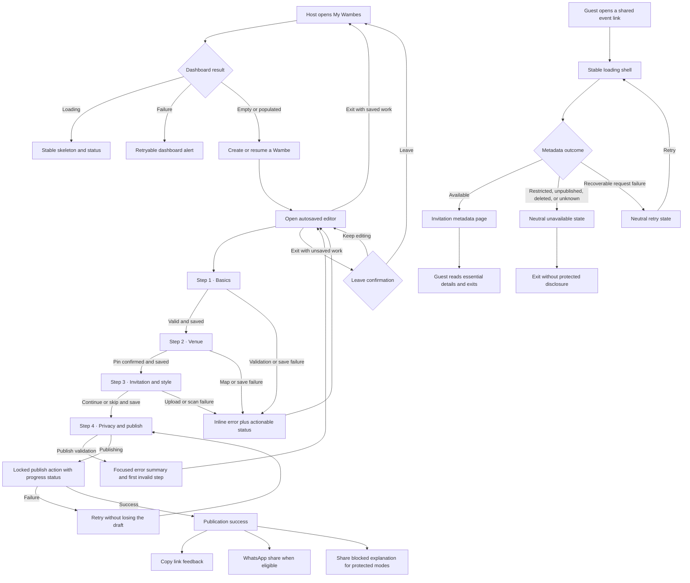

# US-005 — UX Wireframes

## Scope and evidence status

These low-fidelity wireframes preserve the implemented US-002 host flow and the
implemented metadata-only guest page. They add state-feedback, accessibility, and
motion annotations without adding navigation, workflow steps, backend behavior, or API
contracts.

Evidence used:

- Approved US-002 requirements, UX flow, responsive rules, content, and accessibility.
- Static review of the current Next.js routes, components, CSS, and tests.
- Local demo-mode inspection of the host dashboard, desktop/mobile editor, and guest
  event page using synthetic content on 2026-07-31.
- No representative-user study, production analytics, or authenticated staging evidence
  exists yet.

Product Owner clarification on 2026-07-31: the guest page remains metadata-only and
does not gain a guest-side Copy or Share action in US-005. Host sharing remains part of
the publication-success flow.

## User flow



## Screen and material-state inventory

### Host journey

- **HOST-01 — Dashboard:** loading, load failure, empty, populated with drafts, and
  populated with published events. Supports US5-AC-001/002/004/007.
- **HOST-02 — Editor opening:** stable opening status and neutral unavailable state.
  Supports US5-AC-002/004/007.
- **HOST-03 — Editor shell:** Exit, autosave status, textual step progress, current
  task, persistent action area, and desktop preview. Supports US5-AC-001/004/006/007.
- **HOST-04 — Basics:** default, selected event type, field validation, and save-blocked
  continuation. Supports US5-AC-004/007.
- **HOST-05 — Venue:** address entry, map/pin pending, confirmed venue, map failure,
  and keyboard pin controls. Supports US5-AC-004/007.
- **HOST-06 — Invitation and style:** empty/optional, uploading, scanning, active,
  rejected, removal, and skip. Supports US5-AC-004/006/007.
- **HOST-07 — Privacy and review:** public/private-link choice, protected-mode warning,
  review, publish validation summary, and edit links. Supports US5-AC-001/004/005/007.
- **HOST-08 — Save and connectivity:** dirty, saving, saved, failed with Retry, offline,
  and unsaved Exit confirmation. Supports US5-AC-004/006/007.
- **HOST-09 — Publication:** publishing, publish failure, success, link copied,
  WhatsApp-eligible, and protected-mode share blocked. Supports
  US5-AC-004/006/007.
- **HOST-10 — Existing management adjacency:** published summary plus current unpublish
  and delete confirmations. Polish may align feedback but cannot change lifecycle
  behavior. Supports US5-AC-001/004/007.

### Guest journey

- **GUEST-01 — Loading:** stable invitation-shaped shell with polite busy status.
  Supports US5-AC-005/006/007.
- **GUEST-02 — Available metadata:** invitation eyebrow, title, Lagos-local date/time,
  venue only when supplied by the existing public metadata, and Wambe attribution.
  Supports US5-AC-001/005/007.
- **GUEST-03 — Neutral unavailable:** one non-disclosing presentation for restricted,
  unpublished, deleted, or unknown links when the existing client cannot distinguish
  them safely. Supports US5-AC-005/011.
- **GUEST-04 — Recoverable error:** neutral request-failure copy and Retry only when the
  frontend can distinguish a transient failure without an API-contract change.
  Supports US5-AC-005/007/011.
- **GUEST-05 — Alternate preferences:** reduced-motion, forced-colour, 200% zoom, and
  narrow-mobile variants for GUEST-01 through GUEST-04. Supports US5-AC-006/007.

## Low-fidelity wireframes

### HOST-01 — Dashboard

```text
MOBILE · empty / populated / failure variants
┌────────────────────────────────────┐
│ Wambe                         Create│
├────────────────────────────────────┤
│ YOUR CELEBRATIONS                  │
│ My Wambes                          │
│ Pick up a draft or manage…         │
│                                    │
│ [Load failure: message + Retry]    │  failure only
│ [Stable event-card skeletons]      │  loading only
│                                    │
│ [Empty explanation]                │  empty only
│ [Create a Wambe]                   │
│                                    │
│ In progress                        │  populated only
│ [Draft card · Continue]            │
│ Published                          │
│ [Published card · Manage]          │
└────────────────────────────────────┘

DESKTOP
┌──────────────┬───────────────────────────────────────────────────┐
│ Host nav     │ YOUR CELEBRATIONS                   [Create]      │
│ My Wambes    │ My Wambes                                         │
│ Create       │ Supporting copy                                   │
│              │                                                   │
│ Gathering    │ [state-specific message or card grid]             │
│ note         │                                                   │
└──────────────┴───────────────────────────────────────────────────┘
```

Interaction notes:

- Loading is static under reduced motion; do not shimmer continuously.
- A load error receives `role="alert"` and keeps a 44×44 Retry action.
- Event status copy is human-readable (`In progress`, `Published`), not a raw enum.

### HOST-02 / HOST-03 — Opening and editor shell

```text
MOBILE
┌────────────────────────────────────┐
│ ← Exit                 ● Saved     │
├────────────────────────────────────┤
│ Step 2 of 4                 Venue  │
│ ███████████░░░░░░░░░░░░░░░░       │
├────────────────────────────────────┤
│ Where will everyone gather?        │
│                                    │
│ [Current step content]             │
│                                    │
│ [Contextual status / error region] │
├────────────────────────────────────┤
│ [Back]                  [Continue] │
└────────────────────────────────────┘

DESKTOP
┌──────────────┬───────────────────────────────┬───────────────────┐
│ Host nav     │ ← Exit            ● Saved    │ Event preview     │
│              │ Step 2 of 4 · Venue           │                   │
│              │ █████████░░░░░░░░             │ [Invitation]      │
│              │                               │                   │
│              │ [Current step content]        │ [Date / venue]    │
│              │                               │                   │
│              │ [Back]             [Continue] │ LIVE PREVIEW      │
└──────────────┴───────────────────────────────┴───────────────────┘
```

Opening state replaces current content with the same bounded editor frame and
`Opening your Wambe…`; unavailable state uses a neutral alert and a return action. The
editor never leaves an indefinite spinner after a rejected request.

### HOST-04 — Basics

```text
┌────────────────────────────────────┐
│ Tell us about the celebration.     │
│                                    │
│ What are you celebrating?          │
│ [Wedding] [Birthday]               │
│ [Naming]  [Anniversary]            │
│ [Graduation] [Housewarming]        │
│ [Other]                            │
│                                    │
│ Event title                        │
│ [Ada & Tunde's Wedding________]    │
│ [field error, when invalid]        │
│                                    │
│ Date and time                      │
│ [date/time control____________]    │
│ Shown in Africa/Lagos time.        │
└────────────────────────────────────┘
```

Selection feedback is immediate and static. Button/card press feedback may use a subtle
100–160 ms transform for pointer/touch input; keyboard selection receives no delayed
animation.

### HOST-05 — Venue

```text
┌────────────────────────────────────┐
│ Where will everyone gather?        │
│ Venue address                      │
│ [Start typing an address_______]   │
│                                    │
│ ┌────────────────────────────────┐ │
│ │ Map / fallback preview         │ │
│ │ [pin and plain-language state] │ │
│ └────────────────────────────────┘ │
│ [Place sample pin]                 │ demo only
│                                    │
│ Choose the celebration venue       │
│ Find the address or tap the map…   │
│ [Confirm this pin]                 │
│ [Map error + Retry]                │ failure only
└────────────────────────────────────┘
```

Typing an address after confirmation clears the confirmed-pin state. Plain-language
nudge controls remain keyboard reachable. Focus indicators use the approved focus token;
coordinates are never the sole confirmation.

### HOST-06 — Invitation and style

```text
┌────────────────────────────────────┐
│ Add the invitation and Aso-Ebi.    │
│ Optional                           │
│                                    │
│ Invitation                        │
│ [Choose JPG/PNG/WebP/PDF ≤10 MB]   │
│ [Uploading 42%]                    │ upload only
│ [Scanning safely…]                 │ scan only
│ [Ready · preview · Remove]         │ success only
│ [Rejected reason · Try another]    │ failure only
│                                    │
│ Aso-Ebi / dress code               │
│ [same state pattern]               │
│ [Notes_________________________]   │
│                                    │
│ [Skip for now]                     │
└────────────────────────────────────┘
```

Status progresses through named stages rather than movement alone. One failed file does
not remove the draft or successful uploads.

### HOST-07 — Privacy, review, and validation

```text
┌────────────────────────────────────┐
│ Who can see this event?            │
│ ( ) Public                         │
│ ( ) Private link                   │
│ ( ) Invite-only                    │
│ ( ) Hidden location                │
│                                    │
│ [Protected-mode capability note]   │
│                                    │
│ Review                             │
│ Basics                       [Edit]│
│ Venue                        [Edit]│
│ Invitation                  [Edit]│
│                                    │
│ [Focused validation summary]       │ error only
│ • Event title is required          │
│ • Confirm a venue pin              │
└────────────────────────────────────┘
```

Visibility cards retain native single-select semantics. On publish failure, focus moves
to the linked summary and each link returns focus to the corresponding field.

### HOST-08 — Save, offline, and Exit

```text
NORMAL STATUS                     ACTIONABLE FAILURE
┌──────────────────────────┐      ┌──────────────────────────┐
│ ● Saving…                │      │ Save failed              │
│ ● All changes saved      │      │ Your draft is still here.│
└──────────────────────────┘      │ [Retry save]             │
                                  └──────────────────────────┘

OFFLINE                            UNSAVED EXIT DIALOG
┌──────────────────────────┐      ┌──────────────────────────┐
│ You are offline.         │      │ Leave this Wambe?       │
│ Changes are not saved.   │      │ Unsaved changes remain. │
│ [Retry when online]      │      │ [Keep editing] [Leave]  │
└──────────────────────────┘      └──────────────────────────┘
```

Routine `Saving…` and `Saved` remain quiet and polite. The first failure or offline
transition is persistent and actionable; repeated retries do not spam announcements.
Dialog initial focus is `Keep editing`; Escape returns to the editor; close restores
focus to Exit.

### HOST-09 — Publishing and success

```text
PUBLISHING / FAILURE
┌────────────────────────────────────┐
│ Privacy and publish                │
│ [review remains visible]           │
│                                    │
│ [Publishing Wambe…]                │
│ [Publish failed. Draft preserved.] │ failure only
│ [Try publishing again]             │
└────────────────────────────────────┘

SUCCESS / HOST SHARE
┌────────────────────────────────────┐
│ YOUR WAMBE IS LIVE                 │
│ Your celebration has a digital     │
│ home.                              │
│                                    │
│ [canonical event link]             │
│ [Copy link / Copied]               │
│ [Share on WhatsApp]                │ eligible only
│ [Protected-mode sharing blocked]   │ blocked only
│                                    │
│ [View event] [Manage event]        │
└────────────────────────────────────┘
```

Success may use one brief, non-blocking entrance under 300 ms. Reduced motion receives
the final static composition. Copy feedback persists until another relevant action or
route exit rather than relying only on a short timer.

### HOST-10 — Existing management confirmations

```text
┌────────────────────────────────────┐
│ Manage published Wambe             │
│ [View] [Edit] [Share]              │
│ [Unpublish] [Delete]               │
└────────────────────────────────────┘

┌────────────────────────────────────┐
│ Delete “Ada & Tunde's Wedding”?    │
│ Removes it now; storage purge may  │
│ take up to 30 days.                │
│ [Cancel]                  [Delete] │
└────────────────────────────────────┘
```

Native dialog semantics include an accessible name/description, contained focus,
Escape, safe-action initial focus, and trigger-focus restoration.

### GUEST-01 / GUEST-02 — Loading and available metadata

```text
LOADING                            AVAILABLE
┌──────────────────────────┐      ┌──────────────────────────┐
│ YOU’RE INVITED           │      │ YOU’RE INVITED           │
│                          │      │                          │
│ [stable title lines]     │      │ Demo Celebration         │
│                          │      │                          │
│ [date line]              │      │ Friday, 7 August 2026    │
│                          │      │ at 18:00 · Africa/Lagos   │
│ Celebrated with Wambe    │      │ [venue if permitted]     │
└──────────────────────────┘      │                          │
                                  │ Celebrated with Wambe    │
                                  └──────────────────────────┘
```

The loading shell reserves the final title/date regions to limit layout shift and has a
polite busy label. It is static under reduced motion. The available page preserves the
invitation as the visual focus and adds no guest-side share control.

### GUEST-03 / GUEST-04 — Unavailable and retry

```text
NEUTRAL UNAVAILABLE               RECOVERABLE ERROR
┌──────────────────────────┐      ┌──────────────────────────┐
│ Event unavailable        │      │ We couldn’t open this    │
│ This link may no longer  │      │ event right now.         │
│ be available.            │      │                          │
│                          │      │ [Try again]               │
│ [Return to Wambe]        │      │ [Return to Wambe]        │
└──────────────────────────┘      └──────────────────────────┘
```

Unavailable copy never confirms whether an event exists, who owns it, which visibility
mode applies, or whether it was deleted. Retry appears only for a safely distinguishable
transient request failure.

## Feedback-pattern prototype directions

The accompanying Canvas presents one direction at a time for the highest-leverage
material choice: where actionable host operation feedback lives in the editor.

- **Quiet Inline:** Routine status stays in the header; failures appear directly beside
  the affected control. Lowest visual weight, but cross-step failures can be easier to
  miss.
- **Guided Rail:** A bounded status rail sits between step content and actions and names
  the state plus next action. Strongest consistency across save, map, upload, and
  publish; costs vertical space on mobile.
- **Focused Action:** The action area expands around the primary button while an
  operation is pending or failed. Keeps feedback at the decision point; can make the
  footer denser.

These are interaction-model alternatives, not colour variations. The Product Owner must
select one direction, or explicitly authorize a documented hybrid, before architecture.

## Interaction and motion annotations

- **High-frequency or keyboard actions:** step changes, tabbing, typing, radio selection,
  and prototype switching are immediate. Do not animate them.
- **Button press feedback:** pointer/touch-only `scale(0.97–0.98)` for 100–160 ms with
  strong ease-out; never scale from zero.
- **Status entrance:** only when preventing a jarring insertion, use opacity plus no
  more than 4 px translation for 150–180 ms with
  `cubic-bezier(0.23, 1, 0.32, 1)`.
- **Progress bar:** retain a 200–240 ms width transition for occasional step changes;
  step content itself swaps immediately after focus management.
- **Dialogs:** optional 200–240 ms opacity/scale from at least 0.96, centered origin;
  closing remains interruptible.
- **Publish success:** one rare, non-blocking entrance may run under 300 ms. No looping
  celebration.
- **Loading:** spinners retain text context; skeleton shimmer is removed or becomes
  static with reduced motion.
- **Implementation rules:** animate named `transform`/`opacity` properties, never
  `transition: all`; use ease-out for enter/feedback and ease-in-out only for visible
  on-screen movement; do not use ease-in for UI entrances.
- **Reduced motion:** replace movement with the final static state, retain all text and
  status cues, disable smooth scrolling, and never delay focus or completion.

## Accessibility annotations

- One `main` landmark per page; retain the skip link and remove nested duplicate main
  landmarks from host success content.
- Each page has one descriptive `h1`; editor step headings receive programmatic focus on
  step change without scrolling beneath sticky controls.
- Inputs keep persistent labels, help, required/optional state, and associated errors.
- Autosave and non-urgent progress use one restrained polite live region. The first
  blocking failure uses an alert or focused summary; repeated state updates are not
  re-announced unnecessarily.
- Loading regions expose an accessible name and `aria-busy`; spinners are not the only
  indication.
- Validation summaries link to fields and receive focus only after the publish attempt.
- Radio cards expose group name, selected state, and descriptions without relying on
  border colour.
- All actions are at least 44×44 CSS pixels; focus remains visible in normal and
  forced-colour modes.
- Dialogs have accessible names/descriptions, safe-action initial focus, contained focus,
  Escape support, and trigger-focus restoration.
- Copy confirmation is visible text plus a polite announcement.
- Guest unavailable/error pages disclose no protected metadata or ownership signal.
- Support keyboard-only use, 200% zoom, platform text scaling, long Nigerian names and
  diacritics, and `prefers-reduced-motion`.

## Responsive behavior

- **320–767 px:** Single column, 12–16 px gutters, full-width fields, reachable action
  area that does not cover focused controls, textual step progress, full-width map/media,
  and stacked failure actions where necessary.
- **768–1023 px:** Constrained editor up to 42 rem; same field order and states; wider
  map/media; dashboard may use two columns.
- **1024–1179 px:** Persistent host navigation; single main task column remains readable.
- **1180 px and above:** Host navigation, task column up to 42 rem, and sticky contextual
  preview. Preview is supplementary and never owns required information.
- Guest pages preserve a centered invitation reading width at every breakpoint and do
  not use viewport height in a way that clips zoomed content.

## Content guidance

- Preserve the warm, direct, celebratory voice and approved US-002 field/visibility
  meaning.
- Use `In progress`, not raw `draft`; use `All changes saved`, `Save failed`, and
  `Your draft is still here` to reduce ambiguity.
- Error copy states what happened, confirms preserved data where true, and gives one
  next action.
- Use unambiguous month names and `Africa/Lagos`; preserve punctuation and diacritics.
- Guest neutral states avoid `private`, `deleted`, `owner`, and event-identifying copy.

## Design-system mapping

- Preserve current ivory canvas, warm surface, deep ink, coral action, restrained gold,
  green success, warning, and danger semantics.
- Retain Georgia for short display headings and Inter/system sans for controls and body
  copy.
- Consolidate semantic focus, motion-duration, and easing tokens; the existing undefined
  VenuePicker `--focus` reference must resolve to the approved focus token.
- Prefer existing card, button, field, alert, spinner, and screen-reader utility
  patterns. Do not add a motion library unless architecture proves a required
  interruptible interaction cannot be implemented safely with the current stack.
- Small component-level spacing, border, elevation, active-state, and feedback
  refinements are permitted; navigation, brand identity, and information architecture
  are not.

## Usability validation

- **Host task:** Create a synthetic event, complete required steps, publish, and reach a
  successful host share action. Record completion, assistance, hesitation, and 1–5
  trust/quality rating.
- **Guest task:** Open a synthetic shared link, identify essential event details and
  access state, then finish. No guest-side share action is included.
- Run at least five representative host-profile and five representative guest-profile
  opt-in sessions; target at least 80% unassisted completion per profile and median
  rating of at least 4/5.
- Report proxy participants separately. Use synthetic content, anonymous session IDs,
  consent yes/no, and de-identified notes only; no recordings or personal data.
- Before/after checks cover 320×568, 412×915, and 1280×800; keyboard, reduced motion,
  forced colours, 200% zoom, and the recorded architecture performance profile.

## Assumptions, risks, and open Product Owner decisions

- **UX-DEC-001:** Select `Quiet Inline`, `Guided Rail`, `Focused Action`, or explicitly
  authorize a documented hybrid for actionable host feedback.
- Guest states beyond the available demo page are requirements-derived. The current demo
  client always returns metadata and the production client collapses failures to
  `notFound`; architecture must preserve the API contract and determine which neutral
  states can be distinguished without leakage.
- Current automated browser coverage is host-heavy and has no guest-page, reduced-motion,
  320 px, or visual-regression baseline. QA must add evidence later; UX does not claim
  these checks have passed.
- No representative-user study or authenticated staging baseline exists. The wireframes
  remain a design hypothesis until the required sessions run.
